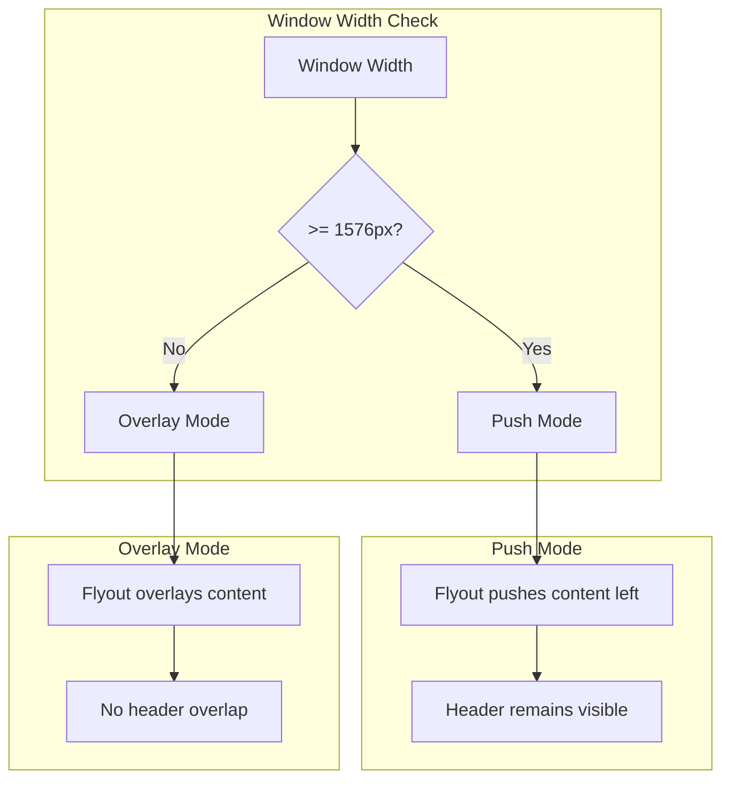

---
tags:
  - domain/geo
  - component/dashboards
  - dashboards
---
# Dashboards Maps Bugfix

## Summary

This bugfix prevents the layers configuration flyout panel from overlapping the new application header in OpenSearch Dashboards Maps plugin. The fix adjusts the responsive breakpoint for the flyout's push behavior to accommodate the new header design.

## Details

### What's New in v2.18.0

The Maps plugin's layer configuration panel was designed with the older fixed-height header in mind. With the introduction of the new application header (TriNeo project), the flyout panel started overlapping the header at certain window widths. This fix introduces a new breakpoint to force the flyout into overlay mode before it creates visual conflicts.

### Technical Changes

#### Problem

The `EuiFlyout` component with `type="push"` was pushing page content to the left, but the new page header is no longer fixed height, causing the flyout to overlap the header at narrower window widths.

#### Solution

Added `pushMinBreakpoint={1576}` to the `EuiFlyout` component. Below this breakpoint (previously 992), the flyout switches to overlay mode instead of push mode, preventing the overlap issue.



#### Code Change

```typescript
// public/components/layer_config/layer_config_panel.tsx
<EuiFlyout
  type="push"
  size="s"
  onClose={onClose}
  hideCloseButton={true}
  className="layerConfigPanel"
  // Flyout starts to overlap app header under this breakpoint, likely need
  // to convert this to a panel considering the new layout.
  pushMinBreakpoint={1576}
>
```

### Migration Notes

No migration required. This is a visual bug fix that takes effect automatically.

## Limitations

- This is a short-term fix; ideally the flyout should be converted to a panel component for better compatibility with the new layout system
- The breakpoint value (1576px) is specific to the current header implementation and may need adjustment if the header design changes

## References

### Documentation
- [Maps Documentation](https://docs.opensearch.org/2.18/dashboards/visualize/maps/): Official Maps plugin documentation
- [EuiFlyout Documentation](https://eui.elastic.co/#/layout/flyout): Elastic UI Flyout component reference

### Pull Requests
| PR | Description |
|----|-------------|
| [#680](https://github.com/opensearch-project/dashboards-maps/pull/680) | Fix: prevent overlay from overlapping new application header |

## Related Feature Report

- Full feature documentation
