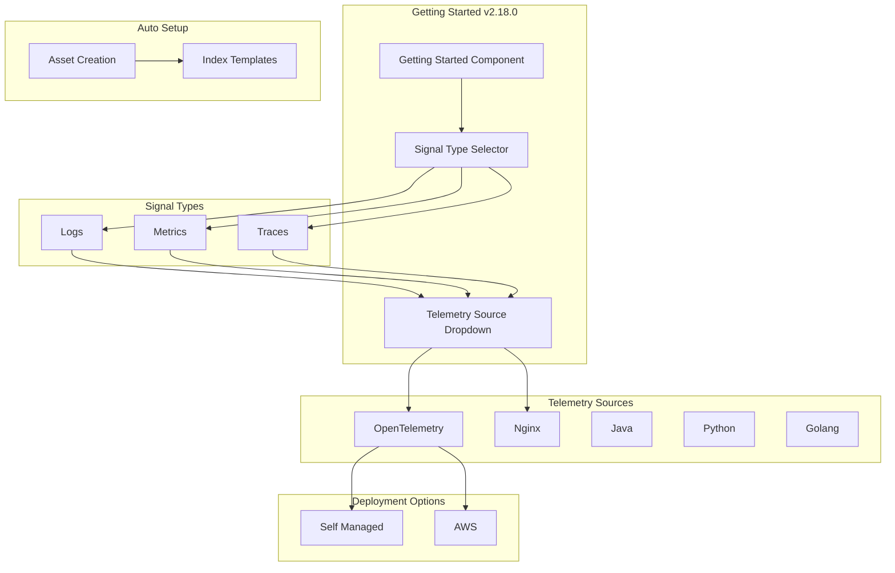

---
tags:
  - dashboards
  - indexing
  - observability
---

# Observability Get Started

## Summary

The Getting Started experience in OpenSearch Dashboards Observability was significantly restructured in v2.18.0. The workflow is now organized around three signal types (Logs, Metrics, Traces) with improved UI polish and automatic index template creation during asset setup.

## Details

### What's New in v2.18.0

1. **Signal-based Organization**: Getting Started is now structured around Logs, Metrics, and Traces instead of data source types
2. **Telemetry Source Selection**: New dropdown with icons for OpenTelemetry, Nginx, Java, Python, and Golang
3. **Self-Managed vs AWS Tabs**: OTEL workflows now separate self-managed and AWS deployment options
4. **Auto Schema Setup**: Index templates are automatically created when observability assets are created
5. **UI Polish**: Consistent capitalization, improved spacing, fixed breadcrumb/header navigation

### Technical Changes

#### Architecture Changes

#### New Components

| Component | Description |
|-----------|-------------|
| `getting_started_routes.ts` | Defines TutorialId types and component/version/signal maps |
| Signal Type Tabs | UI tabs for Logs, Metrics, Traces navigation |
| Telemetry Source Dropdown | Dropdown with icons for selecting data source |
| `createAllTemplatesSettled` | Server-side function for batch index template creation |
| `createIndexTemplate` | Server-side function for individual index template creation |

#### Removed Components

| Component | Reason |
|-----------|--------|
| `getting_started_queryAndAnalyze.tsx` | Workflow simplified |
| `getting_started_integrationCards.tsx` | Replaced by signal-based navigation |
| CSV file upload workflow | Removed in favor of telemetry-focused workflows |

#### New Configuration

| Setting | Description | Default |
|---------|-------------|---------|
| Signal Type | Primary data type selection | Logs |
| Telemetry Source | Data source for the signal | OpenTelemetry |
| Deployment Mode | Self-managed or AWS | Self Managed |

### Usage Example

1. Navigate to **Observability** > **Getting Started**
2. Select signal type: **Logs**, **Metrics**, or **Traces**
3. Choose telemetry source from dropdown (e.g., OpenTelemetry, Nginx)
4. For OTEL: Select **Self Managed** or **AWS** tab
5. Follow setup instructions - index templates are created automatically

### Migration Notes

- The CSV file upload workflow has been removed
- Users should migrate to signal-based workflows (Logs/Metrics/Traces)
- Existing dashboards and index patterns remain functional

## Limitations

- Telemetry source options vary by signal type
- AWS deployment option only available for OpenTelemetry workflows

## References

### Documentation
- [Observability Documentation](https://docs.opensearch.org/2.18/observing-your-data/)

### Pull Requests
| PR | Description |
|----|-------------|
| [#2194](https://github.com/opensearch-project/dashboards-observability/pull/2194) | GettingStarted Rework - major restructure |
| [#2205](https://github.com/opensearch-project/dashboards-observability/pull/2205) | GettingStarted Fit and Finish - UI polish |
| [#2200](https://github.com/opensearch-project/dashboards-observability/pull/2200) | Auto trigger schema setup |

### Issues (Design / RFC)
- [GitHub Issue #564](https://github.com/tkykenmt/opensearch-feature-explorer/issues/564): Enhancement tracking

## Related Feature Report

- [Full feature documentation](../../../features/dashboards-observability/dashboards-observability-getting-started-workflows.md)
