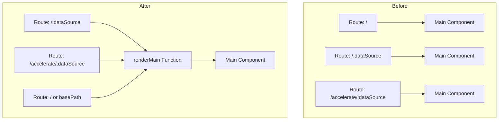

# Query Workbench Bugfixes

## Summary

This release includes bug fixes for the Query Workbench plugin in OpenSearch Dashboards, addressing modal mounting issues for Dev Tools integration and improving error handling for API calls in Multi Data Source (MDS) environments.

## Details

### What's New in v2.18.0

Two key bug fixes improve the stability and usability of Query Workbench:

1. **Modal Mounting Support**: Fixed workbench routes to properly support modal mounting, enabling Query Workbench to be rendered as a modal overlay from Dev Tools.

2. **MDS Error Handling**: Added proper error handling for API calls to prevent false "OK" responses when errors occur in Multi Data Source plugin environments.

### Technical Changes

#### Route Refactoring (PR #401)

The routing logic was refactored to support modal mounting scenarios:



Key changes:
- Extracted common rendering logic into `renderMain()` helper function
- Reordered routes to prioritize specific paths over catch-all routes
- Fixed modal loading for workbench via Dev Tools modal

#### API Error Handling (PR #408)

Added proper HTTP status code propagation for API errors:

| Endpoint | Change |
|----------|--------|
| `/api/sql/query` | Return actual error status instead of 200 |
| `/api/sql/csv` | Return actual error status instead of 200 |
| `/api/ppl/csv` | Return actual error status instead of 200 |
| `/api/sql/json` | Return actual error status instead of 200 |
| `/api/ppl/json` | Return actual error status instead of 200 |
| `/api/sql/text` | Return actual error status instead of 200 |
| `/api/ppl/text` | Return actual error status instead of 200 |
| `/api/sql/async` | Return actual error status instead of 200 |
| `/api/sql/async/:id` | Return actual error status instead of 200 |
| `/api/datasources` | Return actual error status instead of 200 |

The fix ensures that when an API call fails, the response includes:
- Proper HTTP status code (e.g., 400, 500)
- Error body with details
- Correct `ok: false` flag in response data

### Usage Example

Before the fix, error responses would return HTTP 200:
```json
// HTTP 200 OK (incorrect)
{
  "data": {
    "ok": false,
    "resp": "Error message",
    "body": { "error": "details" }
  }
}
```

After the fix, error responses return appropriate status codes:
```json
// HTTP 400 Bad Request (correct)
{
  "error": "details",
  "statusCode": 400
}
```

## Limitations

- PR #112 listed in the issue is a version increment PR (v1.3.13.0), not a bugfix
- These fixes are specific to the Dashboards Query Workbench plugin

## Related PRs

| PR | Description |
|----|-------------|
| [#401](https://github.com/opensearch-project/dashboards-query-workbench/pull/401) | Fix workbench routes to support modal mounting |
| [#408](https://github.com/opensearch-project/dashboards-query-workbench/pull/408) | Added error handling for API calls |

## References

- [Query Workbench Documentation](https://docs.opensearch.org/2.18/dashboards/query-workbench/)
- [Multi Data Source Documentation](https://docs.opensearch.org/2.18/dashboards/data-sources/configuring-and-using-multiple-data-sources/)

## Related Feature Report

- [Full feature documentation](../../../../features/dashboards-query-workbench/query-workbench.md)
