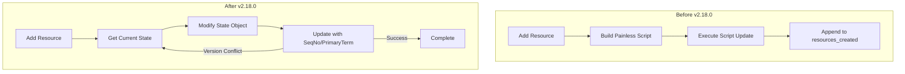

---
tags:
  - domain/ml
  - component/server
  - ml
---
# Flow Framework Workflow State

## Summary

This bugfix removes the use of Painless scripts for workflow state updates in the Flow Framework plugin. The change improves portability, enables incremental resource tracking during deprovisioning, and provides better concurrency control using optimistic locking with sequence numbers and primary terms.

## Details

### What's New in v2.18.0

The workflow state update mechanism has been refactored to eliminate Painless script dependencies:

- **Removed Painless scripts**: The `updateFlowFrameworkSystemIndexDocWithScript()` method that used inline Painless scripts has been removed
- **Optimistic locking**: Updates now use `ifSeqNo()` and `ifPrimaryTerm()` for strong consistency with automatic retries on version conflicts
- **Full document updates**: Added new `updateFlowFrameworkSystemIndexDoc()` overload that accepts a complete `ToXContentObject` for full document replacement
- **Improved error handling**: Better error messages and retry logic for concurrent update scenarios

### Technical Changes

#### Architecture Changes



#### Key Code Changes

| Component | Change |
|-----------|--------|
| `FlowFrameworkIndicesHandler` | Removed `updateFlowFrameworkSystemIndexDocWithScript()`, added optimistic locking |
| `addResourceToStateIndex()` | Now uses get-modify-update pattern with retries |
| `ReprovisionWorkflowTransportAction` | Uses `WorkflowState.builder()` instead of Painless script to clear error field |

#### New Update Flow

The new `getAndUpdateResourceInStateDocumentWithRetries()` method implements:

1. **GET**: Fetch current workflow state document with sequence number and primary term
2. **MODIFY**: Add new resource to the `resources_created` list
3. **UPDATE**: Submit update with `setIfSeqNo()` and `setIfPrimaryTerm()` for optimistic locking
4. **RETRY**: On `VersionConflictEngineException`, retry up to 5 times

### Configuration

| Setting | Description | Default |
|---------|-------------|---------|
| `RETRIES` | Maximum retry attempts on version conflicts | `5` |

### Usage Example

The change is transparent to API users. Workflow state updates continue to work the same way:

```bash
# Provision workflow - resources are tracked automatically
POST /_plugins/_flow_framework/workflow/<id>/_provision

# Check workflow status - resources_created list is maintained
GET /_plugins/_flow_framework/workflow/<id>/_status
```

```json
{
  "workflow_id": "abc123",
  "state": "COMPLETED",
  "resources_created": [
    {
      "workflow_step_name": "create_connector",
      "workflow_step_id": "step1",
      "resource_type": "connector_id",
      "resource_id": "conn_xyz"
    }
  ]
}
```

### Migration Notes

No migration required. This is an internal implementation change that maintains API compatibility.

## Limitations

- Maximum 5 retries on concurrent update conflicts (configurable via code constant)
- Higher latency for concurrent updates due to get-modify-update pattern vs. atomic script updates

## References

### Documentation
- [Workflow State API](https://docs.opensearch.org/2.18/automating-configurations/api/search-workflow-state/): Search workflow state documentation

### Pull Requests
| PR | Description |
|----|-------------|
| [#894](https://github.com/opensearch-project/flow-framework/pull/894) | Update workflow state without using painless script |

### Issues (Design / RFC)
- [Issue #779](https://github.com/opensearch-project/flow-framework/issues/779): [REFACTOR] Improve Workflow State Resource updates
- [Issue #780](https://github.com/opensearch-project/flow-framework/issues/780): Related deprovisioning improvements

## Related Feature Report

- Full feature documentation
