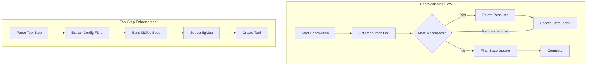

---
tags:
  - domain/ml
  - component/server
  - indexing
  - ml
---
# Flow Framework

## Summary

OpenSearch 2.18.0 introduces two key enhancements to the Flow Framework plugin: an optional `config` field for tool steps and incremental resource removal during deprovisioning. These changes improve workflow flexibility for AI/ML tool configuration and provide better reliability during workflow cleanup operations.

## Details

### What's New in v2.18.0

#### 1. Optional Config Field for Tool Step

PR #899 adds support for an optional `config` map in the `ToolStep` workflow step. This allows users to configure static parameters for ML tools that persist during tool execution.

**Key Changes:**
- Added `CONFIG_FIELD` constant to `CommonValue.java`
- Modified `ToolStep.java` to accept and process the `config` field
- The config map is passed to `MLToolSpec.builder().configMap(config)`

**Use Case:** Configure tool-specific settings that remain constant throughout execution, such as API endpoints, default parameters, or behavior flags.

#### 2. Incremental Resource Removal During Deprovisioning

PR #898 improves the deprovisioning workflow by incrementally removing resources from the workflow state as they are deleted, rather than updating the state only at the end.

**Key Changes:**
- Added `deleteResourceFromStateIndex()` method to `FlowFrameworkIndicesHandler`
- Modified `DeprovisionWorkflowTransportAction` to call incremental deletion after each successful resource removal
- Maintains a backup full-list update at the end for redundancy

### Technical Changes

#### Architecture Changes



#### New Components

| Component | Description |
|-----------|-------------|
| `CONFIG_FIELD` | New constant for the `config` field in tool steps |
| `deleteResourceFromStateIndex()` | Method to incrementally remove resources from workflow state |
| `ToolStep.OPTIONAL_INPUTS` | Updated to include `CONFIG_FIELD` |

#### New Configuration

| Setting | Description | Default |
|---------|-------------|---------|
| `config` (Tool Step) | Optional map of static configuration parameters for tools | Empty map |

### Usage Example

#### Tool Step with Config Field

```yaml
workflows:
  provision:
    nodes:
      - id: create_tool
        type: create_tool
        user_inputs:
          type: VectorDBTool
          name: my_vector_tool
          description: Vector search tool
          parameters:
            index: my-index
            source_field: text
          config:
            max_results: "10"
            include_metadata: "true"
```

#### Deprovisioning Behavior

```bash
# Deprovision workflow - resources are now removed incrementally
POST /_plugins/_flow_framework/workflow/<id>/_deprovision

# Check status during deprovisioning - resources_created shrinks incrementally
GET /_plugins/_flow_framework/workflow/<id>/_status
```

### Migration Notes

No migration required. Both changes are backward compatible:
- The `config` field is optional; existing workflows continue to work
- Incremental deprovisioning is transparent to API users

## Limitations

- The `config` field only accepts `Map<String, String>` values
- Incremental state updates have a 1-second timeout; failures are logged but don't block deprovisioning
- The backup full-list update at the end ensures consistency even if incremental updates fail

## References

### Documentation
- [Deprovision Workflow API](https://docs.opensearch.org/2.18/automating-configurations/api/deprovision-workflow/): Official documentation
- [ML-Commons PR #2977](https://github.com/opensearch-project/ml-commons/pull/2977): Related ML-Commons change for config field

### Pull Requests
| PR | Description |
|----|-------------|
| [#899](https://github.com/opensearch-project/flow-framework/pull/899) | Add optional config field to tool step |
| [#898](https://github.com/opensearch-project/flow-framework/pull/898) | Incrementally remove resources from workflow state during deprovisioning |

### Issues (Design / RFC)
- [Issue #878](https://github.com/opensearch-project/flow-framework/issues/878): ML-commons introducing new optional field "config" in MLToolSpec
- [Issue #780](https://github.com/opensearch-project/flow-framework/issues/780): Update WorkflowState resources during deprovisioning
- [Issue #691](https://github.com/opensearch-project/flow-framework/issues/691): Handle successful deprovision with failure in workflow state update

## Related Feature Report

- Full feature documentation
