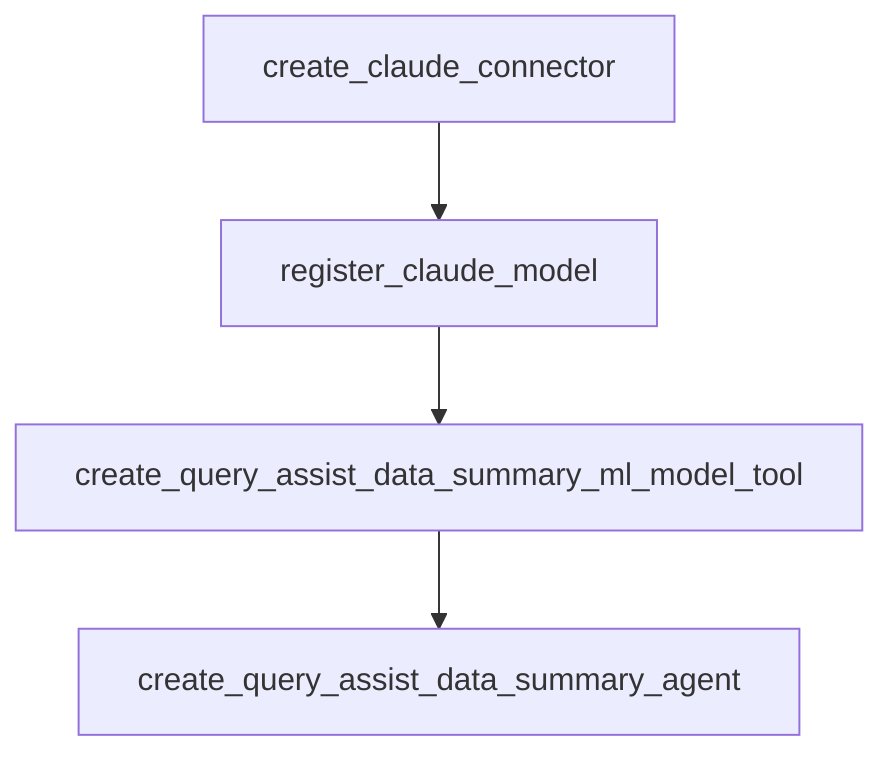

---
tags:
  - domain/ml
  - component/server
  - dashboards
  - indexing
  - ml
  - search
  - sql
---
# Query Assist Data Summary Agent Template

## Summary

This bugfix adds a sample template for the Query Assist Data Summary Agent to the Flow Framework plugin. The template provides a ready-to-use workflow for deploying a data summarization agent that works with the Query Assist feature in OpenSearch Dashboards, enabling users to get AI-generated summaries of their query results.

## Details

### What's New in v2.18.0

A new sample template has been added to help users quickly set up the Query Assist Data Summary Agent. This agent summarizes data returned from PPL queries and provides insights based on user questions.

### Technical Changes

#### New Sample Templates

Two new template files were added to the `sample-templates/` directory:

| File | Format | Description |
|------|--------|-------------|
| `query-assist-data-summary-agent-claude-tested.json` | JSON | Data summary agent template using Claude on Bedrock |
| `query-assist-data-summary-agent-claude-tested.yml` | YAML | Same template in YAML format |

#### Template Workflow

The template creates a complete workflow with four nodes:



| Node | Type | Description |
|------|------|-------------|
| `create_claude_connector` | create_connector | Creates AWS Bedrock connector for Claude model |
| `register_claude_model` | register_remote_model | Registers and deploys the Claude model |
| `create_query_assist_data_summary_ml_model_tool` | create_tool | Creates MLModelTool with summarization prompt |
| `create_query_assist_data_summary_agent` | register_agent | Registers the flow agent |

#### Agent Prompt

The agent uses a specialized prompt for data summarization:

```
Human: You are an assistant that helps to summarize the data and provide data insights.
The data are queried from OpenSearch index through user's question which was translated into PPL query.
Here is a sample PPL query: `source=<index> | where <field> = <value>`.
Now you are given ${parameters.sample_count} sample data out of ${parameters.total_count} total data.
The user's question is `${parameters.question}`, the translated PPL query is `${parameters.ppl}` and sample data are:
```
${parameters.sample_data}
```
Could you help provide a summary of the sample data and provide some useful insights with precise wording and in plain text format, do not use markdown format.
You don't need to echo my requirements in response.

Assistant:
```

#### Connector Configuration

The template configures a Bedrock connector with:

| Parameter | Value | Description |
|-----------|-------|-------------|
| `protocol` | `aws_sigv4` | AWS Signature V4 authentication |
| `model` | `anthropic.claude-instant-v1` | Claude Instant model on Bedrock |
| `region` | `us-west-2` | AWS region (configurable) |
| `max_tokens_to_sample` | `8000` | Maximum response tokens |
| `temperature` | `0.0001` | Low temperature for consistent outputs |

### Usage Example

Deploy the template using the Flow Framework API:

```bash
POST /_plugins/_flow_framework/workflow?provision=true
# Use contents from query-assist-data-summary-agent-claude-tested.json
# Replace credential placeholders with actual AWS credentials
```

After deployment, configure the root agent:

```bash
POST /.plugins-ml-config/_doc/os_data2summary
{
  "type": "os_root_agent",
  "configuration": {
    "agent_id": "<DATA_SUMMARY_AGENT_ID>"
  }
}
```

### Version Compatibility

The template specifies compatibility with:
- OpenSearch 2.17.0
- OpenSearch 3.0.0

## Limitations

- Requires AWS credentials with Bedrock access
- Template uses Claude Instant model; users may need to modify for other models
- Credentials must be manually replaced in the template before use

## References

### Documentation
- [Data Summary Documentation](https://docs.opensearch.org/2.18/dashboards/dashboards-assistant/data-summary/)
- [OpenSearch Assistant Toolkit](https://docs.opensearch.org/2.18/ml-commons-plugin/opensearch-assistant/)
- [Flow Framework Sample Templates](https://github.com/opensearch-project/flow-framework/tree/2.x/sample-templates)

### Pull Requests
| PR | Description |
|----|-------------|
| [#875](https://github.com/opensearch-project/flow-framework/pull/875) | Add query assist data summary agent template |

## Related Feature Report

- Full feature documentation
