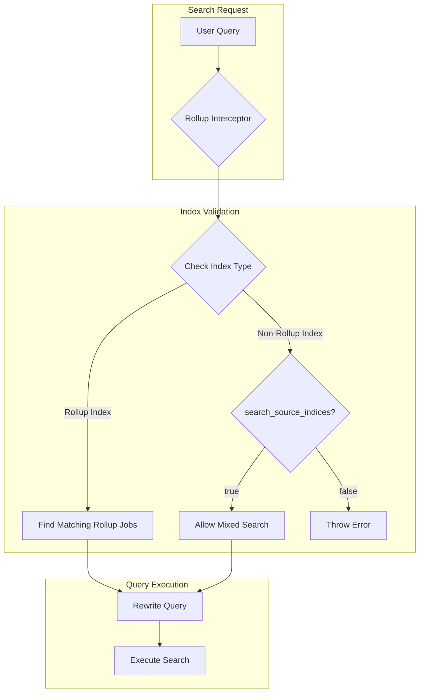

# Index Management Enhancements

## Summary

OpenSearch v2.18.0 introduces several enhancements to the Index Management plugin, including the ability to search non-rollup and rollup indices together, UX improvements in the Dashboards plugin, and input validation for transform APIs. These changes improve usability and flexibility for managing index rollups and transforms.

## Details

### What's New in v2.18.0

This release includes four key enhancements across the index-management and index-management-dashboards-plugin repositories:

1. **Mixed Rollup/Non-Rollup Index Search**: A new cluster setting allows searching across both raw data indices and rollup indices together
2. **Fit and Finish UX Changes**: UI improvements including refresh buttons, spacing fixes, and notification modal enhancements
3. **Section Header Styling**: Replaced `EuiText` with `EuiTitle` for consistent section headers
4. **Transform API Validation**: Added input validation for transform preview and sample data APIs

### Technical Changes

#### New Configuration

| Setting | Description | Default |
|---------|-------------|---------|
| `plugins.rollup.search.search_source_indices` | When set to `true`, allows searching non-rollup and rollup indices together in the same query | `false` |

#### Architecture Changes



#### API Validation Changes

The transform APIs now include validation for:

- **Index names**: Must be lowercase, cannot start with `_` or `-`, and cannot contain invalid characters (`\s,:"*+/\\|?#><`)
- **Data source ID**: Maximum length of 100,000 characters

Affected endpoints:
- `/api/ism/transforms/_preview`
- `/api/ism/_searchSampleData/{index}`

### Usage Example

To enable mixed rollup/non-rollup index search:

```json
PUT _cluster/settings
{
  "persistent": {
    "plugins.rollup.search.search_source_indices": true
  }
}
```

Then search across both index types:

```json
POST /raw_index,rollup_target_index/_search
{
  "size": 0,
  "aggs": {
    "sum_field": {
      "sum": {
        "field": "my_field"
      }
    }
  }
}
```

### UX Improvements

The Dashboards plugin includes several fit-and-finish improvements:

- Added refresh button with tooltip to Transform Jobs page
- Fixed refresh button functionality in Indexes and Policy Managed Indices pages
- Improved spacing between tabs and content (set to medium)
- Removed extra spacing between checkbox and policy column
- Updated notification modal layout
- Replaced `EuiText` with `EuiTitle` for section headers in content areas for consistent styling

## Limitations

- The `search_source_indices` setting is disabled by default for backward compatibility
- When searching mixed indices, results from overlapping time periods may be counted twice (once from raw data, once from rollup)
- Index name validation may reject previously valid names that don't conform to the new stricter rules

## Related PRs

| PR | Repository | Description |
|----|------------|-------------|
| [#1268](https://github.com/opensearch-project/index-management/pull/1268) | index-management | Allow non-rollup and rollup indices to be searched together |
| [#1179](https://github.com/opensearch-project/index-management-dashboards-plugin/pull/1179) | index-management-dashboards-plugin | Fit and Finish UX changes |
| [#1182](https://github.com/opensearch-project/index-management-dashboards-plugin/pull/1182) | index-management-dashboards-plugin | Replace EuiText with EuiTitle for section headers |
| [#1191](https://github.com/opensearch-project/index-management-dashboards-plugin/pull/1191) | index-management-dashboards-plugin | Setting validation for transform APIs |

## References

- [Issue #1213](https://github.com/opensearch-project/index-management/issues/1213): Feature request for mixed rollup/non-rollup search
- [Index Rollups Documentation](https://docs.opensearch.org/2.18/im-plugin/index-rollups/index/): Official documentation
- [Index Transforms Documentation](https://docs.opensearch.org/2.18/im-plugin/index-transforms/index/): Official documentation

## Related Feature Report

- [Full feature documentation](../../../../features/index-management/index-management.md)
