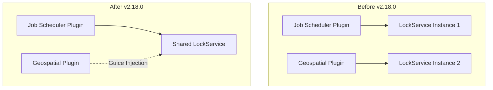

---
tags:
  - domain/data
  - component/server
  - indexing
  - security
---
# Job Scheduler

## Summary

This bugfix makes the `LockService` instance injectable via Guice by returning it from `JobSchedulerPlugin.createComponents()`. This enables plugins that depend on Job Scheduler's SPI to use dependency injection for the LockService instead of creating their own instances.

## Details

### What's New in v2.18.0

The `LockService` is now returned as a component from `createComponents()`, making it available for Guice injection to dependent plugins.

### Technical Changes

#### Code Change

The change is minimal but impactful - a single line modification in `JobSchedulerPlugin.java`:

```java
// Before
return Collections.emptyList();

// After
return List.of(this.lockService);
```

#### Architecture Impact



### Why This Matters

This change is part of a larger effort to strengthen system index protection in the OpenSearch plugin ecosystem ([security#4439](https://github.com/opensearch-project/security/issues/4439)). Key benefits:

1. **Proper System Index Access**: Plugins like Geospatial can now use Job Scheduler's LockService (which has permission to Job Scheduler's system indices) instead of creating their own instance
2. **Reduced ThreadContext Stashing**: Plugins no longer need to stash the ThreadContext to access lock-related system indices
3. **Security Improvement**: Supports the initiative to restrict what plugins can do when ThreadContext is stashed

### Migration Notes

Plugins that currently instantiate their own `LockService` can now inject it via Guice:

```java
// Before: Creating own LockService instance
public class MyPlugin implements Plugin {
    @Override
    public Collection<Object> createComponents(...) {
        LockService lockService = new LockService(client, clusterService);
        // ...
    }
}

// After: Inject shared LockService from Job Scheduler
public class MyPlugin implements Plugin, ClusterPlugin {
    @Inject
    public MyPlugin(LockService lockService) {
        // Use injected lockService
    }
}
```

## Limitations

- Plugins must be converted to `ClusterPlugin` to use Guice injection
- Requires Job Scheduler plugin to be installed

## References

### Documentation
- [Documentation](https://docs.opensearch.org/2.18/monitoring-your-cluster/job-scheduler/index/): Job Scheduler official docs
- [Geospatial PR #677](https://github.com/opensearch-project/geospatial/pull/677): Companion PR making Geospatial a ClusterPlugin

### Pull Requests
| PR | Description |
|----|-------------|
| [#670](https://github.com/opensearch-project/job-scheduler/pull/670) | Return instance of LockService from createComponents |

### Issues (Design / RFC)
- [Issue #4439](https://github.com/opensearch-project/security/issues/4439): RFC - Strengthen System Index Protection in the Plugin Ecosystem
- [Issue #238](https://github.com/opensearch-project/opensearch-plugins/issues/238): Remove usages of ThreadContext.stashContext across plugins

## Related Feature Report

- [Full feature documentation](../../../../features/job-scheduler/job-scheduler.md)
