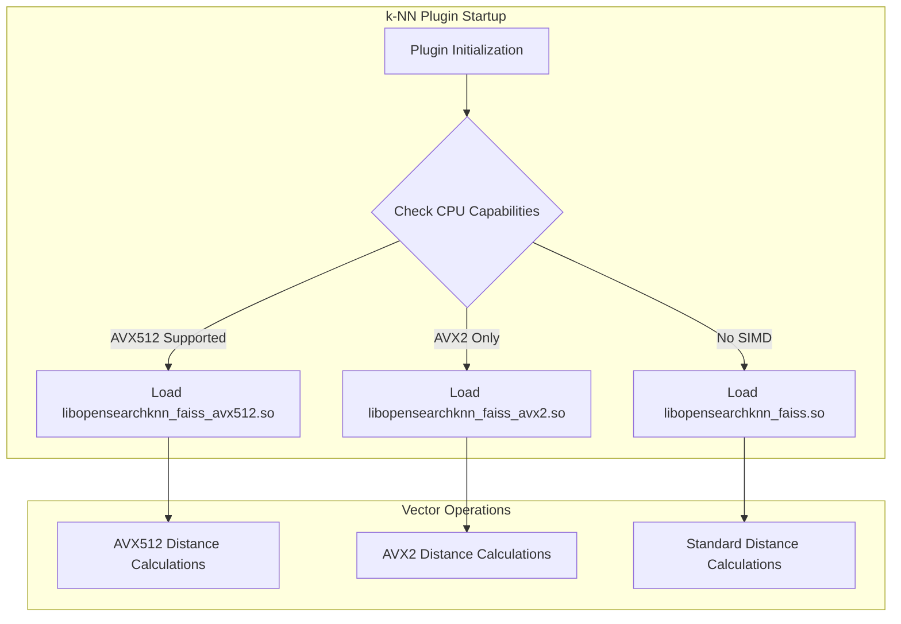

# k-NN AVX512 Support

## Summary

OpenSearch v2.18.0 adds AVX512 SIMD (Single Instruction Multiple Data) support to the k-NN plugin for the Faiss engine. This enhancement accelerates vector search and indexing operations on x64 processors that support AVX512 instructions, providing significant performance improvements over AVX2 for compatible hardware.

## Details

### What's New in v2.18.0

- Added AVX512 SIMD instruction support for the Faiss library
- Introduced a new native library `libopensearchknn_faiss_avx512.so` optimized for AVX512
- Added automatic runtime detection and loading of the appropriate SIMD-optimized library
- New cluster setting `knn.faiss.avx512.disabled` to control AVX512 usage
- Updated build system to support AVX512 compilation flags

### Technical Changes

#### Architecture Changes



#### New Components

| Component | Description |
|-----------|-------------|
| `libopensearchknn_faiss_avx512.so` | Faiss library compiled with AVX512 SIMD instructions |
| AVX512 CPU detection | Runtime detection of AVX512 instruction set support |
| Build flags | New `-Davx512.enabled` and `-DAVX512_ENABLED` cmake flags |

#### New Configuration

| Setting | Description | Default |
|---------|-------------|---------|
| `knn.faiss.avx512.disabled` | Static setting to disable AVX512 library loading | `false` |
| `knn.faiss.avx2.disabled` | Static setting to disable AVX2 library loading | `false` |

### Library Selection Logic

The k-NN plugin automatically selects the best available library at runtime:

1. If AVX512 is supported and not disabled → `libopensearchknn_faiss_avx512.so`
2. If AVX2 is supported and AVX512 unavailable/disabled → `libopensearchknn_faiss_avx2.so`
3. Otherwise → `libopensearchknn_faiss.so` (non-optimized)

### Usage Example

AVX512 support is enabled by default. To disable it, add to `opensearch.yml`:

```yaml
knn.faiss.avx512.disabled: true
```

For building with AVX512 support:

```bash
# Build with AVX512 enabled
./gradlew build -Davx2.enabled=true -Davx512.enabled=true

# Build JNI libraries with AVX512
cd jni
cmake . -DAVX2_ENABLED=true -DAVX512_ENABLED=true
```

### Performance Benefits

SIMD optimization is applicable when the vector dimension is a multiple of 8. Performance ranking:

**AVX512 > AVX2 > No optimization**

The AVX512 instructions process 512 bits (16 floats) per operation compared to AVX2's 256 bits (8 floats), potentially doubling throughput for distance calculations.

### Migration Notes

- No migration required - AVX512 is automatically used when available
- Existing indexes work without modification
- To disable AVX512 on specific nodes, set `knn.faiss.avx512.disabled: true` in `opensearch.yml` before starting the cluster

## Limitations

- AVX512 support is only available on Linux (not Windows or macOS)
- Requires x64 processors with AVX512 instruction set support
- SIMD optimization only applies when vector dimensions are multiples of 8
- Static setting requires cluster restart to change

## References

### Documentation
- [k-NN Index Documentation](https://docs.opensearch.org/2.18/search-plugins/knn/knn-index/): SIMD optimization for the Faiss engine
- [k-NN Settings Documentation](https://docs.opensearch.org/2.18/search-plugins/knn/settings/): AVX512 configuration settings

### Blog Posts
- [Blog: Boosting k-NN exact search performance](https://opensearch.org/blog/boosting-k-nn-exact-search/): Performance improvements with SIMD

### Pull Requests
| PR | Description |
|----|-------------|
| [#2110](https://github.com/opensearch-project/k-NN/pull/2110) | Add changes for AVX-512 support in k-NN |

### Issues (Design / RFC)
- [Issue #2056](https://github.com/opensearch-project/k-NN/issues/2056): Feature request for FAISS AVX512 support

## Related Feature Report

- [Full feature documentation](../../../../features/k-nn/k-nn-avx512-support.md)
