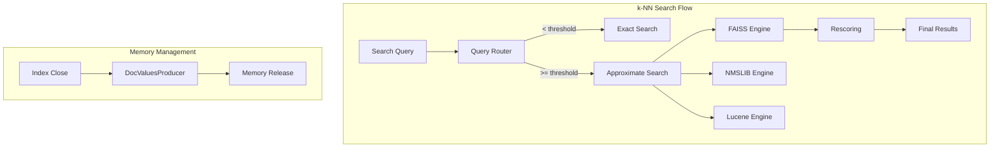

# k-NN Performance & Engine

## Summary

OpenSearch 2.18.0 introduces significant performance improvements and engine changes to the k-NN plugin. The most notable change is switching the default engine from NMSLIB to FAISS, along with various optimizations for indexing, search, and memory management. These changes improve indexing throughput, reduce search latency, and provide better memory utilization.

## Details

### What's New in v2.18.0

#### Default Engine Change to FAISS

The default k-NN engine has been changed from NMSLIB to FAISS. FAISS offers better indexing throughput and supports more advanced features like binary quantization and product quantization. Existing indexes using NMSLIB will continue to work, but new indexes will use FAISS by default unless explicitly specified.

#### Approximate Threshold Update

The `index.knn.advanced.approximate_threshold` setting has been updated to 15,000 documents (from the previous default). This threshold determines when the k-NN plugin switches from exact search to approximate search, balancing indexing performance with search accuracy.

#### Rescoring Improvements

Multiple improvements to the rescoring mechanism:

| Setting | Description | Default |
|---------|-------------|---------|
| `index.knn.advanced.shard_level_rescoring_disabled` | Enable/disable shard-level rescoring | `false` |
| Oversampling factor (dim < 768) | Applied for smaller vector spaces | 3.0x |
| Oversampling factor (768 ≤ dim ≤ 1000) | Balanced recall and performance | 2.0x |
| Oversampling factor (dim > 1000) | No oversampling for large dimensions | 1.0x |

#### Memory Management Improvements

- **DocValuesProducers**: Added `KNN80DocValuesProducer` for proper memory release when closing indexes
- **FileWatcher Removal**: Removed FileWatcher dependency, relying on DocValuesProducers for memory cleanup
- **FSDirectory Removal**: Removed FSDirectory dependency from native engine construction for cleaner architecture

### Technical Changes

#### Architecture Changes



#### New/Updated Components

| Component | Description |
|-----------|-------------|
| `KNN80DocValuesProducer` | Handles memory release when segment reader closes |
| `RescoreContext` | Updated to support dimension-based oversampling |
| `KNNIterators` | Refactored to support both filtered and unfiltered iteration |
| `ResultUtil.reduceToTopK` | Optimized by removing pre-filling and reducing peek calls |

#### Configuration Changes

| Setting | Description | Default |
|---------|-------------|---------|
| `knn.default.engine` | Default engine for new indexes | `faiss` |
| `index.knn.advanced.approximate_threshold` | Document threshold for approximate search | `15000` |
| `index.knn.advanced.shard_level_rescoring_disabled` | Disable shard-level rescoring | `false` |

### Usage Example

```json
PUT /my-knn-index
{
  "settings": {
    "index": {
      "knn": true,
      "knn.advanced.approximate_threshold": 15000
    }
  },
  "mappings": {
    "properties": {
      "my_vector": {
        "type": "knn_vector",
        "dimension": 768,
        "method": {
          "name": "hnsw",
          "engine": "faiss",
          "space_type": "l2",
          "parameters": {
            "ef_construction": 256,
            "m": 16
          }
        }
      }
    }
  }
}
```

### Migration Notes

1. **Engine Migration**: New indexes will use FAISS by default. To continue using NMSLIB, explicitly specify `"engine": "nmslib"` in the mapping.
2. **Threshold Adjustment**: If you previously relied on the default approximate threshold, review your workload to ensure the new 15K threshold is appropriate.
3. **Rescoring Behavior**: Shard-level rescoring is enabled by default. For multi-segment scenarios with recall issues, consider disabling it.

## Limitations

- Binary quantized vectors use Hamming distance; ensure your use case is compatible
- Compression levels above 32x are capped at 32x for oversampling calculations
- SIMD optimization for FAISS is only supported on Linux

## Related PRs

| PR | Description |
|----|-------------|
| [#2221](https://github.com/opensearch-project/k-NN/pull/2221) | Update default engine to FAISS |
| [#2229](https://github.com/opensearch-project/k-NN/pull/2229) | Update approximate_threshold to 15K documents |
| [#2172](https://github.com/opensearch-project/k-NN/pull/2172) | Enable/disable shard-level rescoring and update oversampling factor |
| [#2149](https://github.com/opensearch-project/k-NN/pull/2149) | Update default rescore context based on dimension |
| [#2059](https://github.com/opensearch-project/k-NN/pull/2059) | Add short circuit if no live docs in segments |
| [#2146](https://github.com/opensearch-project/k-NN/pull/2146) | Optimize reduceToTopK in ResultUtil |
| [#2155](https://github.com/opensearch-project/k-NN/pull/2155) | KNNIterators support with and without filters |
| [#2200](https://github.com/opensearch-project/k-NN/pull/2200) | Add CompressionLevel calculation for PQ |
| [#2182](https://github.com/opensearch-project/k-NN/pull/2182) | Remove FSDirectory dependency from native engine |
| [#1946](https://github.com/opensearch-project/k-NN/pull/1946) | Add DocValuesProducers for memory release |
| [#2147](https://github.com/opensearch-project/k-NN/pull/2147) | KNN80DocValues for BinaryDocValues fields only |
| [#2183](https://github.com/opensearch-project/k-NN/pull/2183) | Score fix for binary quantized vectors |

## References

- [k-NN Performance Tuning](https://docs.opensearch.org/2.18/search-plugins/knn/performance-tuning/): Official performance tuning guide
- [k-NN Index](https://docs.opensearch.org/2.18/search-plugins/knn/knn-index/): Index configuration documentation
- [Issue #2163](https://github.com/opensearch-project/k-NN/issues/2163): Default engine change discussion
- [Issue #1885](https://github.com/opensearch-project/k-NN/issues/1885): Memory release improvements

## Related Feature Report

- [Full feature documentation](../../../features/k-nn/k-nn-performance-engine.md)
