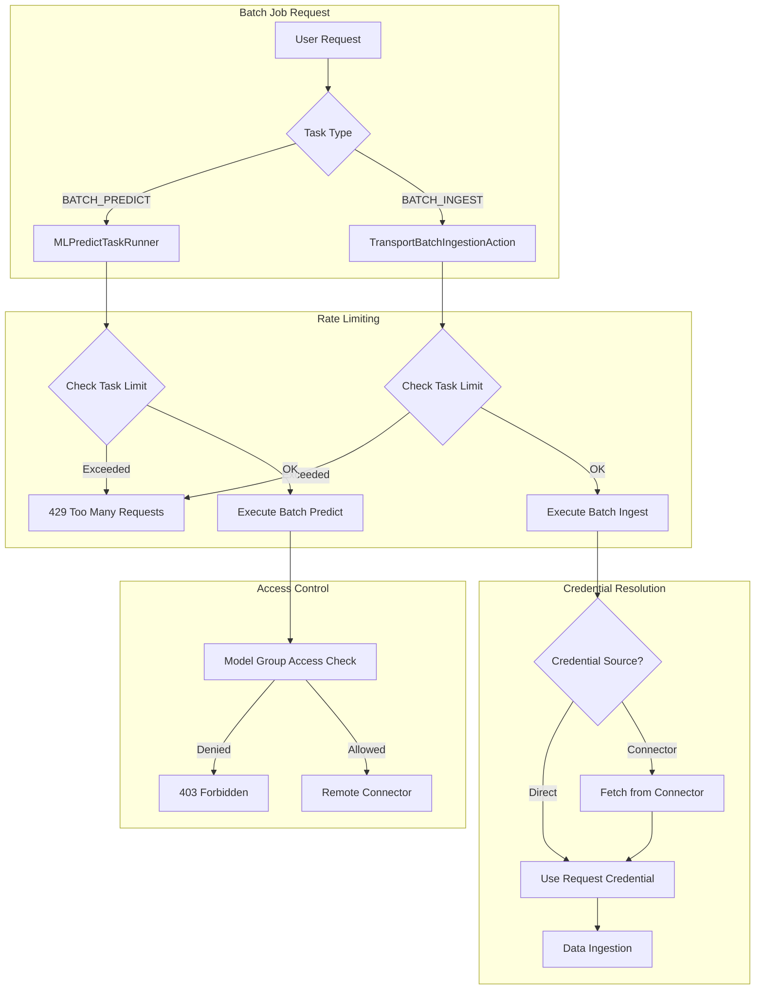

---
tags:
  - domain/ml
  - component/server
  - ml
  - security
---
# ML Commons Batch Jobs

## Summary

OpenSearch v2.18.0 enhances the ML Commons batch job functionality with improved task management, security controls, rate limiting, and credential handling. These changes make batch inference and batch ingestion more robust, secure, and easier to manage in production environments.

## Details

### What's New in v2.18.0

This release introduces four key enhancements to batch job operations:

1. **Default Action Types for Task Management** - Automatic generation of batch job status and cancel actions for supported remote servers
2. **Connector Credential Support** - Use connector credentials for batch ingestion authentication
3. **Model Group Access Control** - Changed access control from connector-based to model group-based for batch job APIs
4. **Rate Limiting** - Added configurable limits for concurrent batch inference and ingestion tasks

### Technical Changes

#### Architecture Changes



#### New Components

| Component | Description |
|-----------|-------------|
| `ConnectorUtils.createConnectorAction()` | Generates default batch status/cancel actions for SageMaker, OpenAI, Bedrock, Cohere |
| `MLModelManager.checkMaxBatchJobTask()` | Validates batch job task limits before execution |
| `MLTaskManager.checkMaxBatchJobTask()` | Queries task index to count active batch jobs |
| `MLModelManager.getConnectorCredential()` | Retrieves and decrypts credentials from a connector |

#### New Configuration

| Setting | Description | Default |
|---------|-------------|---------|
| `plugins.ml_commons.max_batch_inference_tasks` | Maximum concurrent batch inference tasks | 10 |
| `plugins.ml_commons.max_batch_ingestion_tasks` | Maximum concurrent batch ingestion tasks | 10 |
| `plugins.ml_commons.batch_ingestion_bulk_size` | Documents per bulk request in batch ingestion | 500 |

#### API Changes

**Batch Ingestion Request** - New `connector_id` parameter:

```json
POST /_plugins/_ml/_batch_ingestion
{
  "index_name": "my-nlp-index-openai",
  "field_map": {
    "question": "source[1].$.body.input[0]",
    "question_embedding": "source[0].$.response.body.data[0].embedding"
  },
  "connector_id": "your_connector_id",
  "data_source": {
    "type": "openAI",
    "source": ["file-output-id", "file-input-id"]
  }
}
```

When `connector_id` is provided without `credential`, the system automatically fetches and decrypts credentials from the specified connector.

**Rate Limit Error Response**:

```json
{
  "error": {
    "root_cause": [{
      "type": "m_l_limit_exceeded_exception",
      "reason": "Exceeded maximum limit for BATCH_INGEST tasks. To increase the limit, update the plugins.ml_commons.max_batch_ingestion_tasks setting."
    }],
    "type": "m_l_limit_exceeded_exception",
    "reason": "Exceeded maximum limit for BATCH_INGEST tasks..."
  },
  "status": 429
}
```

### Usage Example

#### Configure Rate Limits

```json
PUT _cluster/settings
{
  "persistent": {
    "plugins.ml_commons.offline_batch_inference_enabled": true,
    "plugins.ml_commons.offline_batch_ingestion_enabled": true,
    "plugins.ml_commons.max_batch_inference_tasks": 2,
    "plugins.ml_commons.max_batch_ingestion_tasks": 1,
    "plugins.ml_commons.batch_ingestion_bulk_size": 500
  }
}
```

#### Batch Ingestion with Connector Credentials

```json
POST /_plugins/_ml/_batch_ingestion
{
  "index_name": "my-nlp-index",
  "field_map": {
    "question": "source[1].$.body.input[0]",
    "answer": "source[1].$.body.input[1]",
    "question_embedding": "source[0].$.response.body.data[0].embedding",
    "answer_embedding": "source[0].$.response.body.data[1].embedding",
    "_id": ["source[0].$.custom_id", "source[1].$.custom_id"]
  },
  "connector_id": "openai_connector_id",
  "data_source": {
    "type": "openAI",
    "source": ["output_file_id", "input_file_id"]
  }
}
```

### Migration Notes

- **Access Control Change**: Batch job task APIs (get status, cancel) now use model group access control instead of connector access control. Users must have access to the model group associated with the batch job's model.
- **Default Actions**: For SageMaker, OpenAI, Bedrock, and Cohere connectors, you no longer need to explicitly configure `BATCH_PREDICT_STATUS` and `CANCEL_BATCH_PREDICT` actions - they are generated automatically.

## Limitations

- Rate limiting counts are cluster-wide, querying the task index for active tasks
- Connector credential feature requires the connector to have PREDICT action configured
- Default action generation only supports SageMaker, OpenAI, Bedrock, and Cohere remote servers

## References

### Documentation
- [Asynchronous Batch Ingestion Documentation](https://docs.opensearch.org/2.18/ml-commons-plugin/remote-models/async-batch-ingestion/): Official documentation
- [Asynchronous Batch Ingestion API](https://docs.opensearch.org/2.18/ml-commons-plugin/api/async-batch-ingest/): API reference
- [Batch Predict API](https://docs.opensearch.org/2.18/ml-commons-plugin/api/model-apis/batch-predict/): Batch prediction API
- [ML Commons Cluster Settings](https://docs.opensearch.org/2.18/ml-commons-plugin/cluster-settings/): Configuration settings

### Pull Requests
| PR | Description |
|----|-------------|
| [#3080](https://github.com/opensearch-project/ml-commons/pull/3080) | Enhance batch job task management by adding default action types |
| [#2989](https://github.com/opensearch-project/ml-commons/pull/2989) | Use connector credential in offline batch ingestion |
| [#3098](https://github.com/opensearch-project/ml-commons/pull/3098) | Change to model group access for batch job task APIs |
| [#3116](https://github.com/opensearch-project/ml-commons/pull/3116) | Add rate limiting for offline batch jobs, set default bulk size to 500 |

## Related Feature Report

- Full feature documentation
