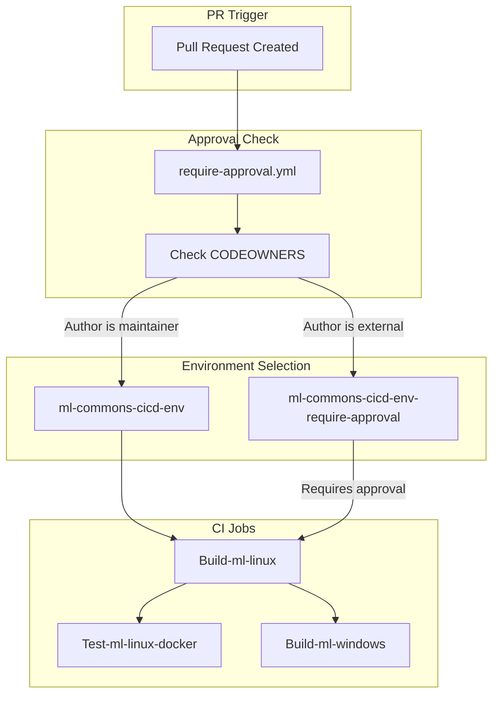

# ML Commons CI/CD

## Summary

This release includes CI/CD infrastructure improvements for the ML Commons plugin, focusing on workflow security, artifact handling, and developer documentation updates.

## Details

### What's New in v2.18.0

Four PRs improve the CI/CD pipeline:

1. **Workflow Approval System** - New approval workflow for external contributors
2. **Artifact Actions Upgrade** - Updated upload/download artifact actions to v4
3. **Developer Guide Update** - Documentation for the new approval process

### Technical Changes

#### Workflow Architecture



#### New Components

| Component | Description |
|-----------|-------------|
| `require-approval.yml` | Reusable workflow to check if PR author is in CODEOWNERS |
| `Get-Require-Approval` job | New job in CI-workflow.yml that determines environment |

#### Workflow Logic

The approval workflow checks:
1. If event is `push` → No approval needed (uses `ml-commons-cicd-env`)
2. If PR author is in `.github/CODEOWNERS` → No approval needed
3. If PR author is external → Requires maintainer approval (uses `ml-commons-cicd-env-require-approval`)

#### Artifact Actions Updates

| Action | Old Version | New Version |
|--------|-------------|-------------|
| `actions/upload-artifact` | v3 | v4 |
| `actions/download-artifact` | v3 | v4.1.7 |

### Usage Example

External contributors will see their CI workflow pending approval:

```yaml
# CI workflow waits for maintainer approval
environment: ml-commons-cicd-env-require-approval
```

Maintainers can approve the workflow from the GitHub Actions UI.

### Migration Notes

- External contributors must wait for maintainer approval before CI runs
- Maintainers listed in CODEOWNERS bypass the approval requirement
- Push events (merges) do not require approval

## Limitations

- Approval is required per PR, not per commit
- External contributors may experience delays waiting for approval

## References

### Documentation
- [MAINTAINERS.md](https://github.com/opensearch-project/ml-commons/blob/main/MAINTAINERS.md): List of maintainers
- [DEVELOPER_GUIDE.md](https://github.com/opensearch-project/ml-commons/blob/main/DEVELOPER_GUIDE.md): Developer guide with approval info

### Pull Requests
| PR | Description |
|----|-------------|
| [#3005](https://github.com/opensearch-project/ml-commons/pull/3005) | Add Test Env Require Approval Action |
| [#3162](https://github.com/opensearch-project/ml-commons/pull/3162) | Upgrading upload artifact to v4 |
| [#2881](https://github.com/opensearch-project/ml-commons/pull/2881) | Bump actions/download-artifact from 3 to 4.1.7 |
| [#3062](https://github.com/opensearch-project/ml-commons/pull/3062) | Updates dev guide to inform the workflow approval step |

## Related Feature Report

- [Full feature documentation](../../../../features/ml-commons/ml-commons-ci-cd.md)
