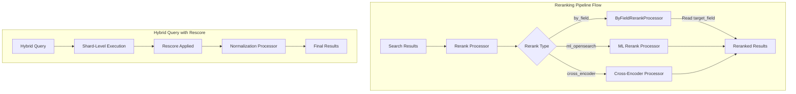

---
tags:
  - domain/search
  - component/server
  - indexing
  - ml
  - neural-search
  - search
---
# Neural Search Reranking

## Summary

OpenSearch v2.18.0 introduces two significant reranking enhancements for neural search: the ByFieldRerankProcessor for second-level reranking based on document fields, and hybrid query rescorer support that enables standard OpenSearch rescore functionality within hybrid queries. These features provide more flexible relevance tuning options for neural search applications.

## Details

### What's New in v2.18.0

#### ByFieldRerankProcessor

A new rerank type `by_field` allows reranking search results based on a numeric field value stored in the document's `_source`. This is useful when:
- An ML model has already computed relevance scores stored in document fields
- A previous search response processor has aggregated scores that should be used for final ranking
- Business logic requires reordering results by a specific field value

#### Hybrid Query Rescorer

The hybrid query now supports OpenSearch's standard rescore functionality. Previously, rescore queries were ignored when used with hybrid queries. This fix enables applying rescorers at the shard level before score normalization occurs.

### Technical Changes

#### Architecture Changes



#### New Components

| Component | Description |
|-----------|-------------|
| `ByFieldRerankProcessor` | Search response processor that reranks results by a document field value |
| `ProcessorUtils` | Utility class for processor operations |
| `RerankType.BY_FIELD` | New enum value for by_field rerank type |

#### New Configuration

| Setting | Description | Default |
|---------|-------------|---------|
| `target_field` | Dot-path to the numeric field used for reranking (e.g., `reviews.stars`) | Required |
| `remove_target_field` | Whether to remove the target field from results after reranking | `false` |
| `keep_previous_score` | Whether to preserve the original score alongside the new score | `false` |

### Usage Example

#### ByFieldRerankProcessor Pipeline

```json
PUT /_search/pipeline/rerank_byfield_pipeline
{
  "response_processors": [
    {
      "rerank": {
        "by_field": {
          "target_field": "ml_score.relevance",
          "keep_previous_score": true,
          "remove_target_field": false
        }
      }
    }
  ]
}
```

#### Search with ByField Reranking

```json
GET /my-index/_search?search_pipeline=rerank_byfield_pipeline
{
  "query": {
    "match": {
      "content": "search query"
    }
  }
}
```

#### Hybrid Query with Rescore

```json
GET /my-index/_search
{
  "query": {
    "hybrid": {
      "queries": [
        { "match": { "text": "search terms" } },
        { "neural": { "embedding": { "query_text": "semantic query", "model_id": "model-id", "k": 10 } } }
      ]
    }
  },
  "rescore": {
    "window_size": 100,
    "query": {
      "rescore_query": {
        "match_phrase": { "text": { "query": "exact phrase", "slop": 2 } }
      },
      "query_weight": 0.7,
      "rescore_query_weight": 1.2
    }
  }
}
```

### Migration Notes

- The `by_field` rerank type is a new addition; existing rerank pipelines using `ml_opensearch` continue to work unchanged
- Hybrid query rescore is automatically available; no configuration changes needed
- Rescore scores are applied at shard level before normalization, so final scores will be in the normalized range (typically 0-1)

## Limitations

- `by_field` reranking requires the target field to exist in `_source` and contain a numeric value
- Nested field paths must use dot notation (e.g., `parent.child.score`)
- Hybrid query rescore does not work with sorting (same as traditional query behavior)
- Rescore window size affects performance; larger windows increase latency

## References

### Documentation
- [Rerank Processor Documentation](https://docs.opensearch.org/2.18/search-plugins/search-pipelines/rerank-processor/): Official rerank processor reference
- [Reranking by Field Documentation](https://docs.opensearch.org/2.18/search-plugins/search-relevance/rerank-by-field/): Official by_field reranking guide
- [Reranking Search Results](https://docs.opensearch.org/2.18/search-plugins/search-relevance/reranking-search-results/): Overview of reranking capabilities

### Pull Requests
| PR | Description |
|----|-------------|
| [#932](https://github.com/opensearch-project/neural-search/pull/932) | ByFieldRerankProcessor for second level reranking |
| [#917](https://github.com/opensearch-project/neural-search/pull/917) | Added rescorer in hybrid query |

### Issues (Design / RFC)
- [Issue #926](https://github.com/opensearch-project/neural-search/issues/926): Feature request for ByFieldRerankProcessor
- [Issue #914](https://github.com/opensearch-project/neural-search/issues/914): Bug report - rescore queries didn't modify scores with hybrid query

## Related Feature Report

- [Full feature documentation](../../../../features/neural-search/neural-search-reranking.md)
