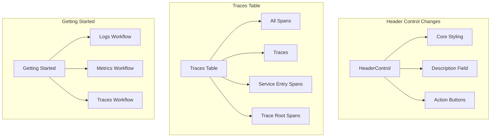

# Observability UI Improvements

## Summary

OpenSearch Dashboards Observability plugin received multiple UI/UX improvements in v2.18.0, including fixes for the Services data picker, header control styling updates, custom traces table enhancements with new filtering options, overview page typography improvements, Getting Started workflow restructuring, and CI/CD build cache optimizations.

## Details

### What's New in v2.18.0

This release focuses on UI polish and usability improvements across the Observability plugin:

1. **Services Data Picker Fix** - Fixed duplicate data picker declaration causing rendering issues after closing flyout
2. **Header Control Updates** - Updated plugin header control to use core styling functionality
3. **Custom Traces Table** - Added new filtering options for trace data views
4. **Overview Page** - Typography improvements and navigation-aware title changes
5. **Getting Started Rework** - Restructured workflow for Logs, Metrics, and Traces
6. **Build Cache Optimization** - Switched to real build cache for faster CI workflows

### Technical Changes

#### UI Component Updates



#### Services Data Picker Fix

| Issue | Fix |
|-------|-----|
| Duplicate data picker declaration | Removed duplicate, single declaration |
| Data source reset on flyout close | Fixed state persistence |
| Navigation data source change | Fixed flyout navigation handling |

#### Custom Traces Table Filters

| Filter | Description |
|--------|-------------|
| All Spans | All spans from all traces |
| Traces | Aggregates all spans by traceId |
| Service Entry Spans | SPAN_KIND_SERVER spans marking server-side processing start |
| Trace Root Spans | Root spans representing trace starting points |

#### Getting Started Restructure

| Before | After |
|--------|-------|
| Dashboard creation workflow | Removed |
| Query and analyze panel | Integrated into workflow |
| Quickstart workflow | Replaced with "Self Managed" and "AWS" tabs |
| File upload workflow | Removed |
| OTEL workflow | Split into Logs, Metrics, Traces/Services |

### Usage Example

The custom traces table now supports session-persisted filter mode:

```typescript
// Filter mode stored in session storage
sessionStorage.setItem('traceTableMode', 'all_spans');

// Available modes:
// - 'all_spans': All spans from all traces
// - 'traces': Aggregated by traceId
// - 'service_entry': SPAN_KIND_SERVER spans
// - 'trace_root': Root spans only
```

### Migration Notes

- Header control styling now uses core functionality - custom styles may need adjustment
- Getting Started workflow has been restructured - existing bookmarks may need updating
- Traces table defaults to "All Spans" view instead of trace root spans

## Limitations

- Sorting and pagination push-down not included in traces table update
- Integration redirect only available for Nginx currently

## Related PRs

| PR | Description |
|----|-------------|
| [#2177](https://github.com/opensearch-project/dashboards-observability/pull/2177) | Services data picker fix, metrics refresh button, overview page title, URL redirection |
| [#2171](https://github.com/opensearch-project/dashboards-observability/pull/2171) | Header control styling, integrations UI updates, Cypress testing updates |
| [#2178](https://github.com/opensearch-project/dashboards-observability/pull/2178) | Custom traces table with filters (All Spans, Traces, Service Entry, Trace Root) |
| [#2186](https://github.com/opensearch-project/dashboards-observability/pull/2186) | Overview page typography and navigation-aware title |
| [#2194](https://github.com/opensearch-project/dashboards-observability/pull/2194) | Getting Started rework - Logs/Metrics/Traces structure |
| [#2196](https://github.com/opensearch-project/dashboards-observability/pull/2196) | CI workflow build cache optimization |

## References

- [Observability Documentation](https://docs.opensearch.org/2.18/observing-your-data/): Official OpenSearch Observability docs
- [Trace Analytics](https://docs.opensearch.org/2.18/observing-your-data/trace/ta-dashboards/): Trace Analytics plugin documentation

## Related Feature Report

- [Full feature documentation](../../../features/dashboards-observability/observability-ui.md)
