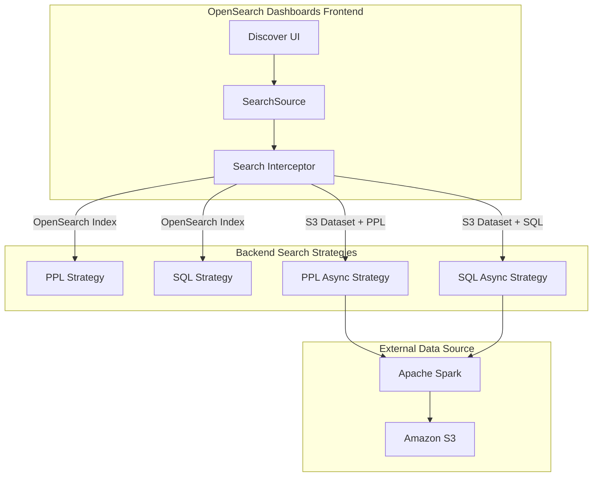
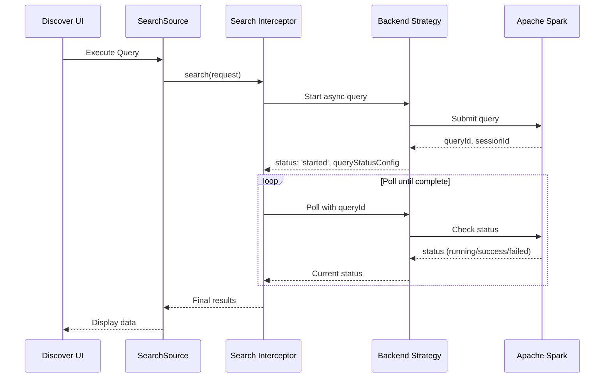

---
tags:
  - dashboards
  - indexing
  - search
  - sql
---

# Async Query

## Summary

OpenSearch Dashboards v2.18.0 introduces async query support for Discover, enabling frontend polling for long-running queries against external data sources like Amazon S3. This enhancement prevents frontend timeouts during async search operations and adds PPL (Piped Processing Language) support for S3 datasets.

## Details

### What's New in v2.18.0

This release adds two key capabilities:

1. **Frontend Polling for Async Search**: Previously, async queries relied on the search strategy to poll for results, causing frontend timeouts for queries taking 1-2 minutes. The new implementation moves polling logic to the frontend, allowing queries to complete without timeout issues.

2. **Async PPL Support for Discover**: S3 datasets now support PPL queries in addition to SQL, with a new `pplasync` search strategy that enables asynchronous PPL execution.

### Technical Changes

#### Architecture Changes



#### New Components

| Component | Description |
|-----------|-------------|
| `ppl_async_search_strategy.ts` | Server-side PPL async search strategy for S3 datasets |
| `handleQueryResults` helper | Frontend utility for polling query status until completion |
| `IDataFramePollingResponse` | New response type for polling-based async queries |
| `QueryStatusConfig` | Configuration for tracking async query state |

#### New Configuration

| Setting | Description | Default |
|---------|-------------|---------|
| `SEARCH_STRATEGY.PPL_ASYNC` | Search strategy identifier for async PPL | `pplasync` |
| `API.PPL_ASYNC_SEARCH` | API endpoint for async PPL search | `/api/enhancements/search/pplasync` |

#### Data Flow



### Usage Example

When querying S3 data with PPL in Discover, the default query format is now:

```
source = ${dataset.title} | head 10
```

The system automatically:
1. Detects S3 dataset type
2. Routes to `pplasync` search strategy
3. Initiates query and receives `queryId`
4. Polls for results at 5-second intervals
5. Returns data when query completes

### API Changes

The search request body now supports polling parameters:

```typescript
interface PollQueryResultsParams {
  queryId?: string;
  sessionId?: string;
}
```

Response types include new polling status:

```typescript
type IDataFramePollingResponse = {
  type: DATA_FRAME_TYPES.POLLING;
} & (FetchStatusResponse | QueryStartedResponse);
```

## Limitations

- Polling interval is fixed at 5 seconds
- Time filter support for async PPL queries is pending (noted as TODO)
- Only S3 datasets use async strategies; OpenSearch indexes use synchronous strategies

## References

### Documentation
- [Scheduled Query Acceleration](https://docs.opensearch.org/2.18/dashboards/management/scheduled-query-acceleration/): SQA documentation
- [SQL and PPL](https://docs.opensearch.org/2.18/search-plugins/sql/index/): SQL/PPL plugin documentation
- [Query Workbench](https://docs.opensearch.org/2.18/dashboards/query-workbench/): Query Workbench documentation

### Pull Requests
| PR | Description |
|----|-------------|
| [#8481](https://github.com/opensearch-project/OpenSearch-Dashboards/pull/8481) | Add logic to poll for async query result |
| [#8706](https://github.com/opensearch-project/OpenSearch-Dashboards/pull/8706) | Add support for async PPL to Discover |

## Related Feature Report

- [Full feature documentation](../../../../features/opensearch-dashboards/async-query.md)
