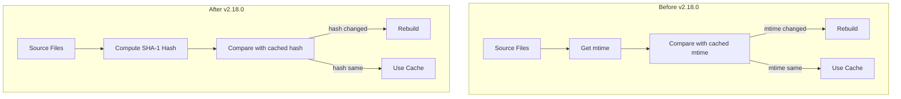

---
tags:
  - dashboards
  - performance
---

# CI/CD & Build Improvements (Dashboards)

## Summary

This release improves the OSD Optimizer build cache by switching from file modification time (`mtime`) tracking to content-based hashing. This change enables effective build caching in CI environments where file timestamps are unreliable due to code checkout operations.

## Details

### What's New in v2.18.0

The OSD Optimizer previously determined whether to rebuild files based on last-modified time (`mtime`). This approach failed in CI environments because pulling code always updates file timestamps, causing the cache to be invalidated on every run.

The fix refactors the cache system to use SHA-1 content hashes instead of modification times, enabling proper cache hits even when files are moved between machines or checked out fresh.

### Technical Changes

#### Architecture Changes



#### Modified Components

| Component | Change |
|-----------|--------|
| `get_hashes.ts` | New file (renamed from `get_mtimes.ts`) - computes SHA-1 hashes of file contents |
| `bundle.ts` | `createCacheKey()` now accepts hashes instead of mtimes |
| `cache.ts` | Database schema changed from `mtimes` to `hashes` |
| `cache_keys.ts` | `OptimizerCacheKey` interface uses `fileHashes` instead of `modifiedTimes` |
| `bundle_cache.ts` | Uses `getHashes()` instead of `getMtimes()` |
| `run_compilers.ts` | Async hash computation for cache updates |
| `node_auto_tranpilation.ts` | Uses file hash for transpilation cache |

#### Cache Key Format Change

**Before:**
```json
{
  "cacheKey": {
    "mtimes": {
      "/path/to/file.ts": 1689369687625
    }
  }
}
```

**After:**
```json
{
  "cacheKey": {
    "hashes": {
      "/path/to/file.ts": "OwCtruddjWkB6ROdbLRM0NnWOhs="
    }
  }
}
```

### Usage Example

No configuration changes required. The optimizer automatically uses content hashing.

To clear the cache if migrating from an older version:
```bash
yarn osd clean
```

### Migration Notes

- Existing cache will be invalidated on first run after upgrade (full recompilation)
- No manual intervention required after initial rebuild
- Use `yarn osd clean` if any cache-related issues occur

## Limitations

- Initial build after upgrade requires full recompilation
- Hash computation adds minor overhead compared to mtime checks (offset by cache hit benefits in CI)

## References

### Pull Requests
| PR | Description |
|----|-------------|
| [#8472](https://github.com/opensearch-project/OpenSearch-Dashboards/pull/8472) | Switch OSD Optimizer to rely on file hashes instead of mtimes |

### Issues (Design / RFC)
- [Issue #8428](https://github.com/opensearch-project/OpenSearch-Dashboards/issues/8428): OSD Optimizer: Improve strategy for detecting stale compilation targets
- [Issue #2188](https://github.com/opensearch-project/dashboards-observability/issues/2188): Related discussion on caching build artifacts

## Related Feature Report

- [Full feature documentation](../../../../features/opensearch-dashboards/opensearch-dashboards-osd-optimizer-cache.md)
