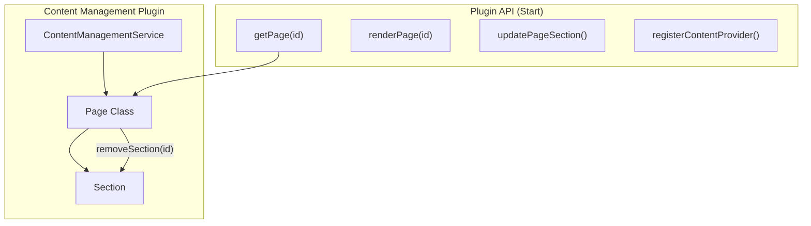

---
tags:
  - dashboards
---

# Content Management

## Summary

This release adds a new Page API to the Content Management plugin that allows programmatic removal of sections from dynamically rendered pages. Additionally, it includes a UI fix that removes unnecessary spacing when card section titles are not displayed.

## Details

### What's New in v2.18.0

The Content Management plugin receives two enhancements:

1. **New `getPage` API**: Exposes the Page object to allow plugins to access and manipulate page sections directly
2. **New `removeSection` method**: Enables removal of sections from a page by section ID
3. **UI improvement**: Removes unnecessary `<EuiSpacer />` component when card section title is not shown

### Technical Changes

#### Architecture Changes



#### New API Methods

| Method | Description | Return Type |
|--------|-------------|-------------|
| `getPage(id: string)` | Retrieves a Page object by ID | `Page \| undefined` |
| `page.removeSection(id: string)` | Removes a section from the page | `void` |

#### API Changes

The `ContentManagementPluginStart` interface now exposes a new `getPage` method:

```typescript
export interface ContentManagementPluginStart {
  /**
   * @experimental this API is experimental and might change in future releases
   */
  getPage: (id: string) => Page | undefined;
  // ... existing methods
}
```

The `Page` class adds a new `removeSection` method:

```typescript
class Page {
  removeSection(id: string) {
    this.sections.delete(id);
    this.sections$.next(this.getSections());
  }
}
```

### Usage Example

```typescript
// Get the content management plugin start contract
const contentManagement = core.getStartServices().then(([, plugins]) => {
  return plugins.contentManagement;
});

// Get a page and remove a section
const page = contentManagement.getPage('homepage');
if (page) {
  // Remove a specific section by ID
  page.removeSection('unwanted-section-id');
}
```

### Migration Notes

This is an additive change with no breaking changes. Existing code continues to work without modification.

## Limitations

- The `getPage` API is marked as experimental and may change in future releases
- Section removal is immediate and triggers a re-render via RxJS BehaviorSubject

## References

### Documentation
- [PR #8624](https://github.com/opensearch-project/OpenSearch-Dashboards/pull/8624): Main implementation
- [PR #7201](https://github.com/opensearch-project/OpenSearch-Dashboards/pull/7201): Original Content Management plugin introduction (v2.16.0)
- [PR #7651](https://github.com/opensearch-project/OpenSearch-Dashboards/pull/7651): Update section input API (v2.17.0)

### Pull Requests
| PR | Description |
|----|-------------|
| [#8624](https://github.com/opensearch-project/OpenSearch-Dashboards/pull/8624) | Add Page API to allow remove section |
| [#8631](https://github.com/opensearch-project/OpenSearch-Dashboards/pull/8631) | Backport to 2.x branch |

## Related Feature Report

- [Full feature documentation](../../../../features/opensearch-dashboards/content-management.md)
