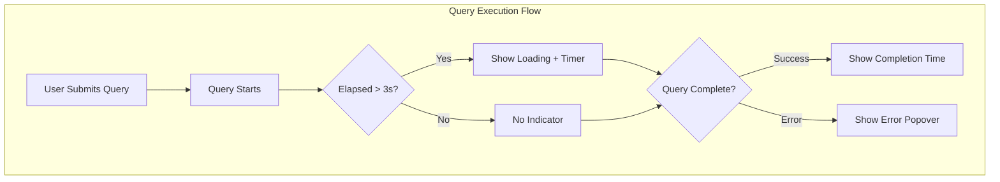

# Dashboards Improvements

## Summary

This release adds a loading indicator with time counter to query results in OpenSearch Dashboards. When queries take longer than 3 seconds, users see a visual loading spinner with elapsed time, improving the user experience during long-running queries.

## Details

### What's New in v2.18.0

The `QueryResult` component now displays query execution status with intelligent timing:

- **Loading indicator**: Appears after 3 seconds of query execution with elapsed time counter
- **Completion time display**: Shows execution time in milliseconds (< 1s) or seconds (≥ 1s)
- **Error handling**: Displays error details in a popover when queries fail

### Technical Changes

#### Architecture Changes



#### New Components

| Component | Description |
|-----------|-------------|
| `QueryResult` | Enhanced component with loading state and time tracking |

#### New Configuration

| Setting | Description | Default |
|---------|-------------|---------|
| `BUFFER_TIME` | Delay before showing loading indicator | 3000 ms |

#### State Management

The component uses React hooks for state management:

- `useState` for popover visibility and elapsed time tracking
- `useEffect` for interval-based time updates (1 second intervals)
- `startTime` property added to `QueryStatus` interface for tracking query start

### Usage Example

The loading indicator automatically appears in the Discover application when running queries:

```typescript
// QueryStatus interface
interface QueryStatus {
  status: ResultStatus;
  body?: { error?: { ... } };
  elapsedMs?: number;
  startTime?: number;  // New in v2.18.0
}

// Status values
enum ResultStatus {
  UNINITIALIZED = 'uninitialized',
  LOADING = 'loading',
  READY = 'ready',
  NO_RESULTS = 'none',
  ERROR = 'error',
}
```

### Display Behavior

| Query Duration | Display |
|----------------|---------|
| < 3 seconds | No loading indicator |
| ≥ 3 seconds | "Loading X s" with spinner |
| Completed < 1s | "Completed in X ms" |
| Completed ≥ 1s | "Completed in X.X s" |
| Error | "Error" button with details popover |

## Limitations

- Loading indicator only appears after 3 second buffer time
- Time counter updates every 1 second (not real-time)
- Only applies to Discover and query-enabled views

## References

### Documentation
- [PR #8212](https://github.com/opensearch-project/OpenSearch-Dashboards/pull/8212): Implementation PR

### Pull Requests
| PR | Description |
|----|-------------|
| [#8212](https://github.com/opensearch-project/OpenSearch-Dashboards/pull/8212) | Add loading indicator and counter to query result |

## Related Feature Report

- [Full feature documentation](../../../../features/opensearch-dashboards/dashboards-improvements.md)
