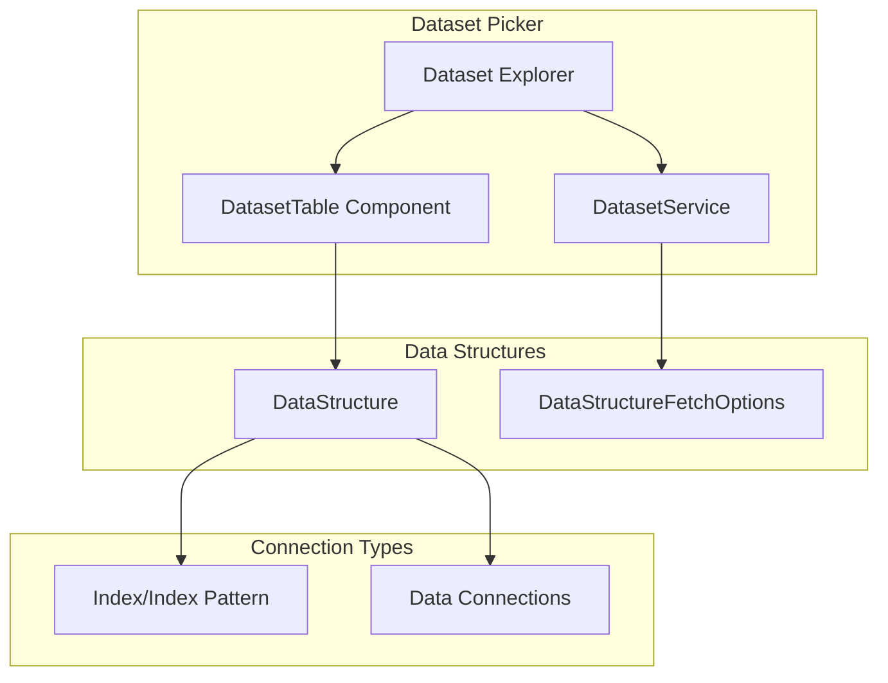

---
tags:
  - domain/core
  - component/dashboards
  - dashboards
  - indexing
  - search
  - security
---
# Data Connections - Dataset Picker Support

## Summary

This release adds support for data connections and multi-select table functionality in the Discover dataset picker. The feature establishes a framework for using external connections (like CloudWatch Logs or Security Lake) in the dataset selector, building on the data-connection saved object type introduced in v2.17.0.

## Details

### What's New in v2.18.0

- **Data Connections Framework**: Sets up the infrastructure for external data connections in the Discover dataset selector
- **Multi-Select Dataset Table**: New `DatasetTable` component enabling selection of multiple datasets simultaneously
- **Pagination Support**: Added pagination token support for large dataset lists
- **Search Functionality**: Integrated search capability within the dataset table

### Technical Changes

#### Architecture Changes



#### New Components

| Component | Description |
|-----------|-------------|
| `DatasetTable` | Multi-select table component for dataset selection with search and pagination |
| `DataStructureFetchOptions` | Interface for fetch options including search and pagination token |

#### New Configuration

| Setting | Description | Default |
|---------|-------------|---------|
| `paginationToken` | Token for paginated results in DataStructure | `undefined` |
| `multiSelect` | Enable multi-select mode in DataStructure | `false` |

#### API Changes

The `DatasetTypeConfig.fetch` method signature was extended:

```typescript
// Before
fetch: (services: IDataPluginServices, path: DataStructure[]) => Promise<DataStructure>;

// After
fetch: (
  services: IDataPluginServices,
  path: DataStructure[],
  options?: DataStructureFetchOptions
) => Promise<DataStructure>;
```

New `DataStructureFetchOptions` interface:

```typescript
interface DataStructureFetchOptions {
  search?: string;        // Search string to filter results
  paginationToken?: string; // Token for paginated results
}
```

### Usage Example

The dataset picker now supports multi-select mode when `multiSelect` is enabled on a DataStructure:

```typescript
// DataStructure with multi-select enabled
const dataStructure: DataStructure = {
  id: 'connections',
  title: 'Data Connections',
  type: 'data-connection',
  multiSelect: true,
  paginationToken: 'next-page-token',
  children: [
    { id: 'conn1', title: 'CloudWatch Logs', type: 'cloudwatch' },
    { id: 'conn2', title: 'Security Lake', type: 'security-lake' }
  ]
};
```

When multi-select is enabled, selecting datasets concatenates their IDs with commas:

```typescript
// Selected: conn1, conn2
// Result: { id: 'conn1,conn2', title: 'CloudWatch Logs,Security Lake', type: 'cloudwatch' }
```

### Migration Notes

- This PR establishes the framework only; specific connection types (CloudWatch, Security Lake) are not included
- Existing dataset picker functionality remains unchanged for single-select scenarios
- The `data-connection` saved object type from PR #7925 is a prerequisite

## Limitations

- No specific external connection types are implemented in this PR (framework only)
- UX is not finalized (as noted in the PR description)
- Multi-select requires all selected items to be of the same type

## References

### Documentation
- [Data Sources Documentation](https://docs.opensearch.org/2.18/dashboards/management/data-sources/): Official documentation
- [PR #8255](https://github.com/opensearch-project/OpenSearch-Dashboards/pull/8255): Main implementation
- [PR #7925](https://github.com/opensearch-project/OpenSearch-Dashboards/pull/7925): Data-connection saved object type (prerequisite)

### Pull Requests
| PR | Description |
|----|-------------|
| [#8255](https://github.com/opensearch-project/OpenSearch-Dashboards/pull/8255) | Support data connections and multi-select table in dataset picker |
| [#7925](https://github.com/opensearch-project/OpenSearch-Dashboards/pull/7925) | Add data-connection saved object type for external connections |

## Related Feature Report

- [Full feature documentation](../../../../features/opensearch-dashboards/opensearch-dashboards-data-connections.md)
