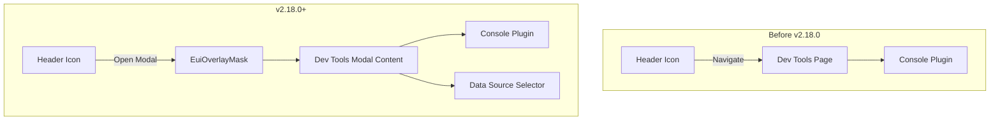

# Dev Tools Modal

## Summary

In v2.18.0, the Dev Tools console has been transformed from a full-page application to a modal overlay. This change allows users to access the Dev Tools console from anywhere in OpenSearch Dashboards without navigating away from their current context, improving workflow efficiency for developers and administrators.

## Details

### What's New in v2.18.0

The Dev Tools console now renders inside a full-page modal overlay instead of requiring navigation to a separate page. Users can open the console by clicking the Dev Tools icon in the header, work with queries, and close the modal to return to their previous location.

### Technical Changes

#### Architecture Changes



#### New Components

| Component | Description |
|-----------|-------------|
| `DevToolsIcon` | Updated to render modal overlay instead of navigating to app |
| `MainApp` | Extracted from `renderApp` for reuse in modal context |
| `EuiOverlayMask` | Full-page modal container with close button |
| `MemoryRouter` | In-memory routing for modal context |

#### UI Changes

| Element | Change |
|---------|--------|
| Top Nav Menu | New layout with `useUpdatedUX` flag for modal context |
| Menu Items | Repositioned with left/right positioning support |
| Network Status Bar | Integrated into top nav for updated UX |
| Close Button | Added at bottom of modal for easy dismissal |

#### New Configuration

| Setting | Description | Default |
|---------|-------------|---------|
| `useUpdatedUX` | Enables modal-optimized UI layout | `true` in modal |
| `MenuItemPosition.LEFT` | Position menu items on left side | - |
| `MenuItemPosition.RIGHT` | Position menu items on right side | - |

### Usage Example

The Dev Tools modal is accessed via the header icon:

1. Click the Dev Tools icon (console icon) in the OpenSearch Dashboards header
2. The modal opens as a full-page overlay
3. Use the console to run queries against OpenSearch
4. Click "Close" button or the X icon to dismiss the modal

```typescript
// Modal is triggered by clicking the DevToolsIcon component
<DevToolsIcon
  core={core}
  devTools={devTools}
  deps={deps}
  title="Dev Tools"
/>
```

### Migration Notes

- No migration required - the feature is automatically enabled with the new navigation UX
- The traditional full-page Dev Tools application remains available for direct navigation
- Modal behavior is controlled by the `home:useNewHomePage` UI setting

## Limitations

- Modal context uses `MemoryRouter`, so browser back/forward navigation doesn't work within the modal
- The modal covers the entire viewport, hiding the underlying page content
- When multiple overlay masks exist, closing the Dev Tools modal may affect scroll behavior

## Related PRs

| PR | Description |
|----|-------------|
| [#7938](https://github.com/opensearch-project/OpenSearch-Dashboards/pull/7938) | Change dev tools to a modal |

## References

- [Dev Tools Documentation](https://docs.opensearch.org/2.18/dashboards/dev-tools/index-dev/): Official documentation
- [Running queries in the Dev Tools console](https://docs.opensearch.org/2.18/dashboards/dev-tools/run-queries/): Query guide

## Related Feature Report

- [Full feature documentation](../../../../features/opensearch-dashboards/dev-tools.md)
