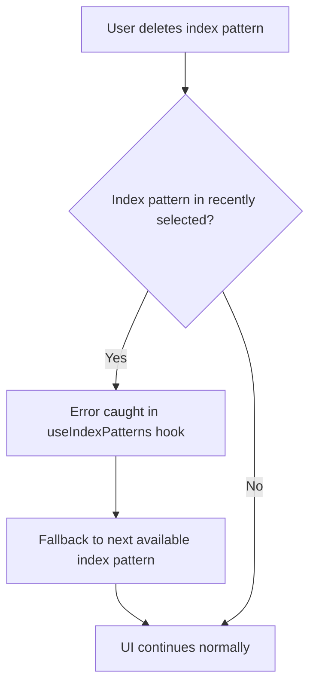

---
tags:
  - dashboards
  - indexing
  - search
  - sql
---

# Discover Bugfixes (2)

## Summary

OpenSearch Dashboards v2.18.0 includes four bug fixes for the Discover application, addressing issues with S3 field support, deleted index pattern handling, time field display, and saved query loading. These fixes improve the stability and usability of Discover, particularly when using the query enhancement feature.

## Details

### What's New in v2.18.0

This release addresses several bugs in the Discover application:

1. **S3 Fields Support**: Added support for S3 fields in Discover 2.0
2. **Deleted Index Pattern Handling**: Fixed UI getting stuck when a selected index pattern is deleted
3. **Time Field Display**: Fixed time field wrapping overlap when changing query languages
4. **Saved Query Loading**: Fixed saved queries not loading properly from assets

### Technical Changes

#### S3 Fields Support (PR #8609)

Added async loaders to field selectors in the sidebar to support S3 data sources:

| Component | Change |
|-----------|--------|
| Field Selectors | Added async loaders for S3 fields |
| Index Pattern | Added `areFieldsLoading` flag to show loading state |
| Dataset Config | Added `supportsTimeFilter` flag |
| Field Types | Added SQL/PPL to OSD field type conversion |

Key improvements:
- On page reload, fields are fetched for selected datasets
- Field type conversion from SQL/PPL to OSD field types
- Loading indicator in sidebar while fields are being fetched

#### Deleted Index Pattern Handling (PR #8659)

Fixed the issue where Discover UI becomes stuck in "Searching" state after deleting an index pattern:

The fix handles the error case in the `useIndexPatterns` hook when query enhancements are enabled, automatically falling back to the next available index pattern.

#### Time Field Display Fix (PR #8755)

Fixed time field wrapping overlap that occurred when changing languages in the query editor:

| Issue | Solution |
|-------|----------|
| Time fields wrapped incorrectly | Added CSS to prevent wrapping |
| Overlap on language change | Applied `white-space: nowrap` style |

Note: A complete solution would require Discover to trigger a re-render on language change.

#### Saved Query Loading Fix (PR #8707)

Fixed the workflow where saved queries were being overwritten during Discover initialization:

**Before fix:**
1. `useSavedQuery` → `populateStateFromSavedQuery` with new saved query
2. `useSearch` effect runs → overwrites query with saved search defaults

**After fix:**
- Proper sequencing ensures saved query state is preserved
- Works correctly in both legacy mode and with query enhancements enabled

### Usage Example

These are bug fixes that require no configuration changes. Users will automatically benefit from:

- S3 data sources showing fields correctly in Discover sidebar
- Graceful handling when index patterns are deleted
- Proper time field display regardless of query language
- Saved queries loading correctly when accessed from assets

## Limitations

- Time field display fix is a workaround; full solution requires Discover re-render capability
- S3 field support requires query enhancements to be enabled

## References

### Documentation
- [Analyzing data in Discover](https://docs.opensearch.org/2.18/dashboards/discover/index-discover/): Official documentation

### Pull Requests
| PR | Description |
|----|-------------|
| [#8609](https://github.com/opensearch-project/OpenSearch-Dashboards/pull/8609) | Add support for S3 fields in Discover |
| [#8659](https://github.com/opensearch-project/OpenSearch-Dashboards/pull/8659) | Fix Discover UI stuck on searching after deleting index pattern |
| [#8755](https://github.com/opensearch-project/OpenSearch-Dashboards/pull/8755) | Fix time field wrapping overlap on language change |
| [#8707](https://github.com/opensearch-project/OpenSearch-Dashboards/pull/8707) | Ensure saved query loaded properly from asset |

### Issues (Design / RFC)
- [Issue #8612](https://github.com/opensearch-project/OpenSearch-Dashboards/issues/8612): Bug report for deleted index pattern issue

## Related Feature Report

- [Full feature documentation](../../../../features/opensearch-dashboards/discover.md)
