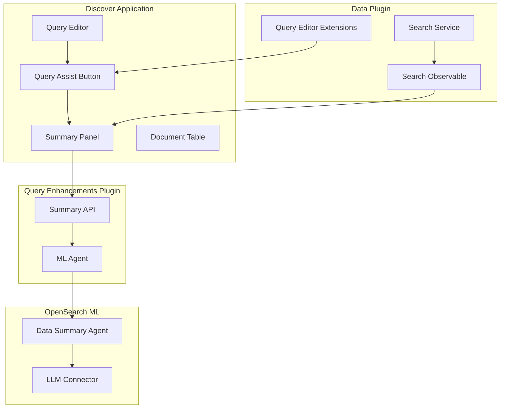

# Discover

## Summary

OpenSearch Dashboards v2.18.0 brings significant enhancements to the Discover application, including a new AI-powered data summary panel, refreshed visual appearance, cache management improvements in the dataset selector, and numerous bug fixes for stability and usability.

## Details

### What's New in v2.18.0

#### Data Summary Panel (Query Assist)
A new AI-powered data summary panel has been added to Discover that uses LLMs to generate insights from query results. When query assist is enabled, users can view automatically generated summaries of their data.

Key components:
- Summary panel displays LLM-generated insights on sample data
- Toggle button on search bar to show/hide query assist
- Error display with feedback buttons (thumbs up/down)
- Requires ML agent configuration for data summarization

#### Updated Visual Appearance
The Discover interface has been refreshed with improved styling:
- Updated color scheme and layout
- Better support for dark mode
- Consistent appearance with `home:useNewHomePage` and `query:enhancements:enabled` settings
- Compressed UI components for data explorer

#### Cache Management in Dataset Selector
The Advanced Dataset Selector now includes cache management features:
- Display of last cache update time
- Refresh cache button to clear session storage
- Improved visibility into data freshness

### Technical Changes

#### Architecture Changes



#### New Components

| Component | Description |
|-----------|-------------|
| Data Summary Panel | Displays LLM-generated summaries of query results |
| Query Assist Button | Toggle button in search bar to show/hide query assist |
| Cache Time Display | Shows last cache update time in dataset selector |
| Cache Refresh Button | Clears session storage cache for datasets |

#### New Configuration

| Setting | Description | Default |
|---------|-------------|---------|
| `queryEnhancements.queryAssist.summary.enabled` | Enable data summary panel | `false` |

### Usage Example

```yaml
# Enable data summary in opensearch_dashboards.yml
queryEnhancements.queryAssist.summary.enabled: true
```

To use the data summary feature:
1. Enable query enhancements in Advanced Settings
2. Navigate to Discover
3. Select PPL as the query language
4. Click the expand button to show query assist and summary panel
5. Execute a query to see the generated summary

### Bug Fixes in v2.18.0

| Issue | Fix |
|-------|-----|
| Infinite scroll stalling | Fixed progress bar observer threshold for PPL/SQL queries |
| Discover hang on empty index pattern | Fixed infinite loop when index pattern ID is empty |
| Dataset selector excessive queries | Prevented too many queries from dataset selector |
| Query input background resize | Fixed background not shrinking on window resize |
| Embeddable _source display | Fixed _source column showing when all columns removed |
| Query/filter sync on refresh | Sync query and filter when refreshing page |
| UI issues in data configurator | Various UI fixes in Discover and data configurator |
| Legacy table cell height | Truncate height of table cell in legacy discover |
| Unsupported languages | Remove unsupported languages for dataset |
| External connections loading | Dataset nav loads external connections and updates namespace |
| Data.search() strategy | Fixed ignoring strategy passed as parameter |

## Limitations

- Data summary requires ML agent configuration with LLM connector
- Summary feature only works with PPL queries when query assist is enabled
- Cache refresh clears all dataset caches, not individual ones

## Related PRs

| PR | Description |
|----|-------------|
| [#8186](https://github.com/opensearch-project/OpenSearch-Dashboards/pull/8186) | Add data summary panel in discover |
| [#8214](https://github.com/opensearch-project/OpenSearch-Dashboards/pull/8214) | Add last updated time and cache refresh button to dataset selector |
| [#8651](https://github.com/opensearch-project/OpenSearch-Dashboards/pull/8651) | Update the appearance of Discover |
| [#8352](https://github.com/opensearch-project/OpenSearch-Dashboards/pull/8352) | Add discover summary error info and button click logic |
| [#7178](https://github.com/opensearch-project/OpenSearch-Dashboards/pull/7178) | Truncate height of table cell in legacy discover |
| [#7609](https://github.com/opensearch-project/OpenSearch-Dashboards/pull/7609) | Dataset nav to load external connections |
| [#8060](https://github.com/opensearch-project/OpenSearch-Dashboards/pull/8060) | Fix row rendering in Discover infinite scroll |
| [#8082](https://github.com/opensearch-project/OpenSearch-Dashboards/pull/8082) | Fix infinite loop cause discover hang |
| [#8100](https://github.com/opensearch-project/OpenSearch-Dashboards/pull/8100) | Remove unsupported languages for dataset |
| [#8166](https://github.com/opensearch-project/OpenSearch-Dashboards/pull/8166) | Fixes UI issues in Discover and data configurator |
| [#8167](https://github.com/opensearch-project/OpenSearch-Dashboards/pull/8167) | Discover Embeddable not showing _source |
| [#8168](https://github.com/opensearch-project/OpenSearch-Dashboards/pull/8168) | Sync query and filter when refreshing discover page |
| [#8222](https://github.com/opensearch-project/OpenSearch-Dashboards/pull/8222) | Update data explorer ui to use compressed components |
| [#8331](https://github.com/opensearch-project/OpenSearch-Dashboards/pull/8331) | Discover query input background not shrink |
| [#8347](https://github.com/opensearch-project/OpenSearch-Dashboards/pull/8347) | Prevent too many queries sent from dataset selector |
| [#8368](https://github.com/opensearch-project/OpenSearch-Dashboards/pull/8368) | Data.search() should not ignore strategy parameter |

## References

- [Issue #8177](https://github.com/opensearch-project/OpenSearch-Dashboards/issues/8177): Feature request for LLM data summary
- [Issue #7626](https://github.com/opensearch-project/OpenSearch-Dashboards/issues/7626): Discover hang bug report
- [Data Summary Documentation](https://docs.opensearch.org/2.18/dashboards/dashboards-assistant/data-summary/): Official docs
- [Analyzing Data in Discover](https://docs.opensearch.org/2.18/dashboards/discover/index-discover/): Official docs

## Related Feature Report

- [Full feature documentation](../../../../features/opensearch-dashboards/discover.md)
