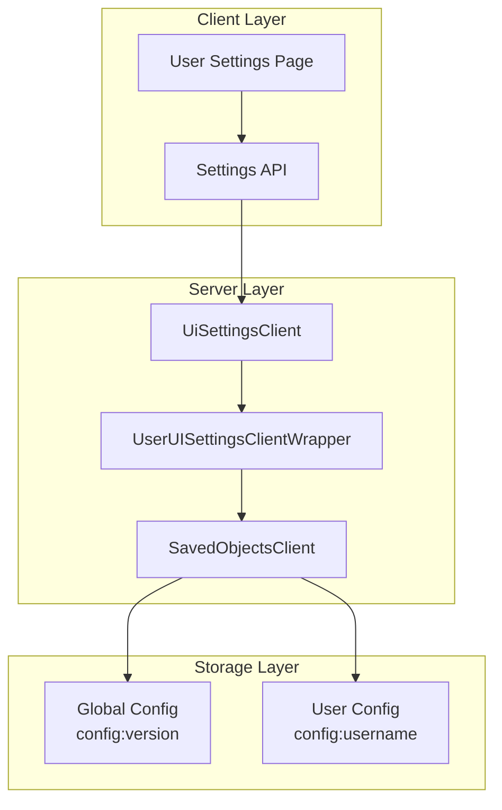

---
tags:
  - dashboards
---

# Experimental Features - User Personal Settings

## Summary

OpenSearch Dashboards v2.18.0 introduces experimental support for user-level personal settings. This feature allows individual users to customize their dashboard preferences without affecting other users' configurations. The implementation includes a new User Settings page, modifications to the uiSettings client to support scoped settings, and a `UserUISettingsClientWrapper` to translate user ID placeholders to actual user identities.

## Details

### What's New in v2.18.0

This release adds the foundation for user-level settings in OpenSearch Dashboards:

1. **User Settings Page**: A new dedicated page for users to configure personal preferences
2. **Scoped UI Settings**: Settings can now be defined with `scope: 'user'` to indicate user-level storage
3. **User ID Translation**: A saved objects client wrapper that translates `<current_user>` placeholders to actual usernames
4. **Permission Control**: When ACL is enabled, user settings are protected with user-specific permissions

### Technical Changes

#### Architecture Changes



#### New Components

| Component | Description |
|-----------|-------------|
| `UserSettingsApp` | React component for the User Settings page |
| `UserUISettingsClientWrapper` | Saved objects client wrapper for user ID translation |
| `UiSettingScope` | Enum defining `GLOBAL` and `USER` scopes |
| `setupUserSettingsPage` | Function to register the user settings page with content management |

#### New Configuration

| Setting | Description | Default |
|---------|-------------|---------|
| `scope` | UiSettings parameter to define setting scope | `UiSettingScope.GLOBAL` |
| `userSettings.enabled` | Capability flag for user settings feature | `false` (enabled when authenticated) |

#### API Changes

The uiSettings client methods now accept an optional `scope` parameter:

```typescript
// Get user-scoped setting
await uiSettings.get(key, UiSettingScope.USER);

// Set user-scoped setting
await uiSettings.set(key, value, UiSettingScope.USER);

// Get all settings (merges global and user)
await uiSettings.getAll();
```

REST API endpoints also support scope via query parameter:

```
GET /api/opensearch-dashboards/settings?scope=user
POST /api/opensearch-dashboards/settings?scope=user
```

### Usage Example

Registering a user-scoped setting:

```typescript
uiSettings.register({
  defaultWorkspace: {
    name: 'Default Workspace',
    value: '',
    description: 'The default workspace to load on login',
    scope: UiSettingScope.USER,
    schema: schema.string(),
  },
});
```

Setting a user preference via API:

```bash
curl -X POST http://localhost:5601/api/opensearch-dashboards/settings \
  -H 'Authorization: Basic <credentials>' \
  -H 'Content-Type: application/json' \
  -H 'osd-xsrf: osd-fetch' \
  -d '{
    "changes": {
      "defaultWorkspace": "my-workspace-id"
    }
  }'
```

### Migration Notes

- This feature requires authentication to be enabled for user-level settings to work
- When security is not enabled, user-scoped settings fall back to global settings
- Existing global settings are not affected by this change
- The feature is marked as experimental and may change in future releases

## Limitations

- User settings require OSD authentication to be enabled
- The User Settings page is only visible when nav groups are enabled
- User settings are stored per username, not per session
- No migration path for existing user preferences from other storage mechanisms

## References

### Documentation
- [Workspace Documentation](https://docs.opensearch.org/2.18/dashboards/workspace/workspace/): OpenSearch Dashboards Workspace docs

### Pull Requests
| PR | Description |
|----|-------------|
| [#7953](https://github.com/opensearch-project/OpenSearch-Dashboards/pull/7953) | [Workspace] Add User level setting |

### Issues (Design / RFC)
- [Issue #7821](https://github.com/opensearch-project/OpenSearch-Dashboards/issues/7821): RFC - User level settings
- [Issue #7909](https://github.com/opensearch-project/OpenSearch-Dashboards/issues/7909): User setting page feature request

## Related Feature Report

- [Full feature documentation](../../../features/opensearch-dashboards/experimental-features.md)
