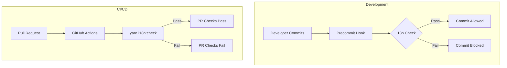

---
tags:
  - domain/core
  - component/dashboards
  - dashboards
---
# i18n & Localization

## Summary

OpenSearch Dashboards v2.18.0 delivers a comprehensive i18n overhaul with preliminary translations for 14 locales, automated validation infrastructure, and systematic fixes for dynamic i18n usage across multiple plugins.

## Details

### What's New in v2.18.0

1. **Preliminary translations** for 14 locales: de-DE, es-419, es-ES, fr-CA, fr-FR, id-ID, it-IT, ja-JP, ko-KR, pt-BR, pt-PT, tr-TR, zh-CN, zh-TW
2. **i18n validation infrastructure**: CI workflow checks and precommit hooks
3. **i18n-check tool enhancements**: Help text, description, and `--ignore-missing-formats` flag
4. **Plugin-specific i18n fixes**: Fixed dynamic i18n usage and identifier issues across 12 plugins

### Technical Changes

#### i18n Validation Infrastructure



#### New Supported Locales

| Locale Code | Language |
|-------------|----------|
| `de-DE` | German (Germany) |
| `es-419` | Spanish (Latin America) |
| `es-ES` | Spanish (Spain) |
| `fr-CA` | French (Canada) |
| `fr-FR` | French (France) |
| `id-ID` | Indonesian |
| `it-IT` | Italian |
| `ja-JP` | Japanese |
| `ko-KR` | Korean |
| `pt-BR` | Portuguese (Brazil) |
| `pt-PT` | Portuguese (Portugal) |
| `tr-TR` | Turkish |
| `zh-CN` | Chinese (Simplified) |
| `zh-TW` | Chinese (Traditional) |

#### i18n Check Options

| Flag | Description | Default |
|------|-------------|---------|
| `--ignore-incompatible` | Ignore mismatched keys in values and tokens | false |
| `--ignore-malformed` | Ignore malformed ICU format usages | false |
| `--ignore-missing` | Ignore missing translations in locale files | false |
| `--ignore-unused` | Ignore unused translations in locale files | false |
| `--ignore-untracked` | Ignore untracked files with i18n labels | false |
| `--ignore-missing-formats` | Ignore missing 'formats' key in locale files | true |

#### Plugins Fixed

| Plugin | Issue Fixed |
|--------|-------------|
| core | Dynamic i18n usage |
| console | Dynamic i18n, duplicate identifiers |
| dataSourceManagement | Dynamic i18n, unprefixed/duplicate identifiers |
| discover | Dynamic i18n |
| queryEnhancements | Dynamic i18n, unprefixed identifiers |
| indexPatternManagement | Dynamic i18n |
| dashboard | Unprefixed identifiers |
| dataSource | Incorrect TopNavControlDescriptionData |
| home | Dynamic i18n |
| opensearchDashboardsReact | Dynamic i18n |
| visTypeVega | Unprefixed identifiers |
| visualize | Duplicate identifiers |
| management | Unprefixed identifiers |
| visAugmenter | Unprefixed/duplicate identifiers |

### Usage Example

```bash
# Validate all i18n usage
yarn i18n:check

# Check with specific options
yarn i18n:check --ignore-missing --ignore-unused

# Extract messages for translation
yarn i18n:extract
```

### Migration Notes

- Run `yarn osd bootstrap` to install the precommit hook
- Existing translation files may need updates for malformed ICU message formats
- i18n check is now part of CI workflow and will fail PRs with invalid translations

## Limitations

- `--ignore-missing-formats` defaults to `true` for backward compatibility
- Precommit hook only validates staged files, not the entire codebase
- Translations are preliminary and may need community refinement

## References

### Documentation
- [OpenSearch Dashboards Repository](https://github.com/opensearch-project/OpenSearch-Dashboards)

### Pull Requests
| PR | Description |
|----|-------------|
| [#8411](https://github.com/opensearch-project/OpenSearch-Dashboards/pull/8411) | Add i18n checks to PR workflows, ignore missing formats, add help text |
| [#8424](https://github.com/opensearch-project/OpenSearch-Dashboards/pull/8424) | Add preliminary translations for 14 locales |
| [#8392](https://github.com/opensearch-project/OpenSearch-Dashboards/pull/8392) | Fix dynamic i18n in core |
| [#8393](https://github.com/opensearch-project/OpenSearch-Dashboards/pull/8393) | Fix dynamic i18n and duplicate identifiers in console plugin |
| [#8394](https://github.com/opensearch-project/OpenSearch-Dashboards/pull/8394) | Fix dynamic i18n and unprefixed/duplicate identifiers in dataSourceManagement |
| [#8396](https://github.com/opensearch-project/OpenSearch-Dashboards/pull/8396) | Fix dynamic i18n in discover plugin |
| [#8397](https://github.com/opensearch-project/OpenSearch-Dashboards/pull/8397) | Fix dynamic i18n and unprefixed identifiers in queryEnhancements |
| [#8398](https://github.com/opensearch-project/OpenSearch-Dashboards/pull/8398) | Fix dynamic i18n in indexPatternManagement plugin |
| [#8401](https://github.com/opensearch-project/OpenSearch-Dashboards/pull/8401) | Fix unprefixed identifiers in dashboard plugin |
| [#8402](https://github.com/opensearch-project/OpenSearch-Dashboards/pull/8402) | Fix incorrect TopNavControlDescriptionData in dataSource |
| [#8403](https://github.com/opensearch-project/OpenSearch-Dashboards/pull/8403) | Fix dynamic i18n in home plugin |
| [#8404](https://github.com/opensearch-project/OpenSearch-Dashboards/pull/8404) | Fix dynamic i18n in opensearchDashboardsReact plugin |
| [#8406](https://github.com/opensearch-project/OpenSearch-Dashboards/pull/8406) | Fix unprefixed identifiers in visTypeVega plugin |
| [#8407](https://github.com/opensearch-project/OpenSearch-Dashboards/pull/8407) | Fix duplicate identifiers in visualize plugin |
| [#8408](https://github.com/opensearch-project/OpenSearch-Dashboards/pull/8408) | Fix unprefixed identifiers in management plugin |
| [#8409](https://github.com/opensearch-project/OpenSearch-Dashboards/pull/8409) | Fix unprefixed/duplicate identifiers in visAugmenter plugin |

## Related Feature Report

- [Full feature documentation](../../../../features/opensearch-dashboards/opensearch-dashboards-i18n-localization.md)
