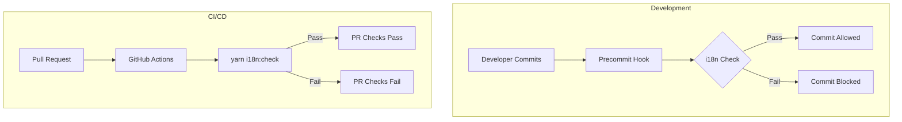

# i18n & Localization Bugfixes

## Summary

OpenSearch Dashboards v2.18.0 includes significant improvements to the internationalization (i18n) infrastructure, fixing malformed translations, adding automated validation workflows, and resolving a language selection bug that caused incorrect query language persistence.

## Details

### What's New in v2.18.0

This release addresses multiple i18n-related issues:

1. **Fixed malformed translations** across multiple locale files (de-DE, es-ES, fr-FR, ko-KR, tr-TR, zh-CN)
2. **Added i18n validation to CI/CD workflows** to prevent future translation issues
3. **Added precommit hook** for local i18n validation during development
4. **Fixed unprefixed i18n identifiers** in examples and plugins
5. **Fixed inconsistent i18n key names** in workspace and examples
6. **Fixed unsupported language selection** from localStorage

### Technical Changes

#### i18n Validation Infrastructure



#### New npm Scripts

| Script | Description |
|--------|-------------|
| `yarn i18n:check` | Validates i18n usage in code and translation files |
| `yarn i18n:extract` | Extracts i18n messages from source code |

#### i18n Check Options

| Flag | Description | Default |
|------|-------------|---------|
| `--ignore-incompatible` | Ignore mismatched keys in values and tokens | false |
| `--ignore-malformed` | Ignore malformed ICU format usages | false |
| `--ignore-missing` | Ignore missing translations in locale files | false |
| `--ignore-unused` | Ignore unused translations in locale files | false |
| `--ignore-untracked` | Ignore untracked files with i18n labels | false |
| `--ignore-missing-formats` | Ignore missing 'formats' key in locale files | true |

#### Translation Fixes

Fixed ICU message format variable casing issues in translation files:

| Locale | Fixed Keys |
|--------|------------|
| de-DE | `labelWarningInfo`, `newToOpenSearchDashboardsDescription` |
| es-ES | `newToOpenSearchDashboardsDescription` |
| fr-FR | `labelErrorInfo`, `savedObjectAddedToContainerSuccessMessageTitle`, `attributeService.saveToLibraryError`, `dashboardWasNotSavedDangerMessage`, `newToOpenSearchDashboardsDescription`, `dashboardExistsDescription` |
| ko-KR | `fieldNotFound`, `labelErrorInfo` |
| tr-TR | `newToOpenSearchDashboardsDescription`, `dashboardExistsDescription` |
| zh-CN | `dashboardWasNotSavedDangerMessage` |

#### Language Selection Fix

Fixed a bug where unsupported query languages cached in localStorage would be incorrectly applied when navigating between applications:

```typescript
// Before: Always used cached language
private getDefaultLanguage() {
  return this.storage.get('userQueryLanguage') || 
    this.uiSettings.get(UI_SETTINGS.SEARCH_QUERY_LANGUAGE);
}

// After: Validates language support before using cached value
private getDefaultLanguage() {
  const lastUsedLanguage = this.storage.get('userQueryLanguage');
  if (lastUsedLanguage && this.isLanguageSupported(lastUsedLanguage)) {
    return lastUsedLanguage;
  }
  return this.uiSettings.get(UI_SETTINGS.SEARCH_QUERY_LANGUAGE);
}
```

### Usage Example

Running i18n validation locally:

```bash
# Check all i18n usage
yarn i18n:check

# Check with specific options
yarn i18n:check --ignore-missing --ignore-unused

# Extract messages for translation
yarn i18n:extract
```

### Migration Notes

- Developers should run `yarn osd bootstrap` to install the precommit hook
- Existing translation files may need updates if they contain malformed ICU message formats
- The i18n check is now part of the CI workflow and will fail PRs with invalid translations

## Limitations

- The `--ignore-missing-formats` flag defaults to `true` to maintain backward compatibility with locale files missing the `formats` object
- Precommit hook only validates staged files, not the entire codebase

## Related PRs

| PR | Description |
|----|-------------|
| [#8411](https://github.com/opensearch-project/OpenSearch-Dashboards/pull/8411) | Add i18n checks to PR workflows, fix malformed translations |
| [#8412](https://github.com/opensearch-project/OpenSearch-Dashboards/pull/8412) | Fix unprefixed i18n identifiers in examples |
| [#8423](https://github.com/opensearch-project/OpenSearch-Dashboards/pull/8423) | Add precommit hook to validate i18n |
| [#8483](https://github.com/opensearch-project/OpenSearch-Dashboards/pull/8483) | Fix inconsistent i18n key names in workspace and examples |
| [#8399](https://github.com/opensearch-project/OpenSearch-Dashboards/pull/8399) | Fix dynamic uses of i18n in visBuilder plugin |
| [#8674](https://github.com/opensearch-project/OpenSearch-Dashboards/pull/8674) | Fix unsupported language selection from localStorage |

## References

- [OpenSearch Dashboards Repository](https://github.com/opensearch-project/OpenSearch-Dashboards)

## Related Feature Report

- [Full feature documentation](../../../../features/opensearch-dashboards/i18n-localization.md)
