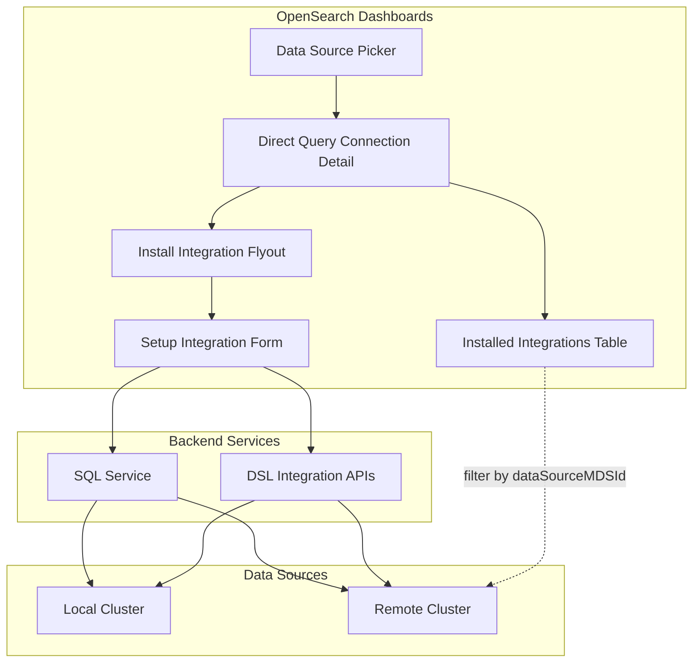

# Multi Data Source (MDS) Support for Integration

## Summary

This release adds Multi Data Source (MDS) support to the Integration feature in OpenSearch Dashboards. Users can now install and manage integrations across multiple connected OpenSearch clusters, enabling centralized observability workflows across distributed environments.

## Details

### What's New in v2.18.0

The Integration feature in the Data Source Management plugin now supports MDS, allowing users to:

- Install integrations on remote clusters selected via the data source picker
- Filter installed integrations by the selected data source
- Execute async queries against remote clusters when setting up integrations
- Associate integration instances with specific data source references

### Technical Changes

#### Architecture Changes



#### New Components

| Component | Description |
|-----------|-------------|
| `dataSourceMDSId` | URL parameter to track selected data source ID |
| `dataSourceMDSLabel` | Label/title of the selected data source cluster |
| `selectedDataSourceId` | Prop passed to integration components for MDS context |
| `selectedClusterName` | Display name of the selected cluster |

#### New Configuration

| Setting | Description | Default |
|---------|-------------|---------|
| `savedObjects` | SavedObjects client passed to DirectQueryDataConnectionDetail | Required when MDS enabled |

#### API Changes

New API endpoints for MDS-aware integration operations:

| Endpoint | Description |
|----------|-------------|
| `/api/dsl/integrations/mapping` | Fetch data source mappings with MDS support |
| `/api/dsl/integrations/refresh` | Refresh index with MDS support |

Modified API calls now include `dataSourceId` query parameter:
- `CONSOLE_PROXY` calls for component template creation
- `CONSOLE_PROXY` calls for index template creation
- Async query execution via `SQLService`

### Usage Example

When MDS is enabled, the integration setup flow:

1. User selects a data source from the picker
2. URL updates with `dataSourceMDSId` parameter
3. Integration list filters to show only integrations for that data source
4. New integrations are created with data source reference

```typescript
// Integration creation request body now includes MDS fields
const createReqBody = {
  dataSourceMDSId: "remote-cluster-id",
  dataSourceMDSLabel: "Remote Cluster",
  name: "nginx-integration",
  indexPattern: "ss4o_logs-nginx-*",
  workflows: ["dashboards"]
};
```

### Migration Notes

- No migration required for existing integrations
- Existing integrations without `references` field will be shown for all data sources
- New integrations created with MDS enabled will have data source references stored

## Limitations

- Integrations created before MDS support do not have data source references
- Saved objects (visualizations, dashboards) created by integrations may not automatically inherit data source references (see [Issue #2061](https://github.com/opensearch-project/dashboards-observability/issues/2061))
- Integration assets need to be manually associated with the correct data source

## Related PRs

| PR | Repository | Description |
|----|------------|-------------|
| [#8008](https://github.com/opensearch-project/OpenSearch-Dashboards/pull/8008) | OpenSearch-Dashboards | Add MDS support for Integration in data source management |
| [#2051](https://github.com/opensearch-project/dashboards-observability/pull/2051) | dashboards-observability | MDS support in Integrations for observability plugin |

## References

- [Issue #1440](https://github.com/opensearch-project/dashboards-observability/issues/1440): Original feature request for MDS in Integrations
- [Issue #2061](https://github.com/opensearch-project/dashboards-observability/issues/2061): Feature request for saved objects assets support
- [Issue #2159](https://github.com/opensearch-project/dashboards-observability/issues/2159): Bug - Integrations doesn't create objects using selected data source
- [Documentation](https://docs.opensearch.org/2.18/dashboards/management/multi-data-sources/): Configuring and using multiple data sources

## Related Feature Report

- [Full feature documentation](../../../../features/multi-plugin/multi-data-source-support.md)
