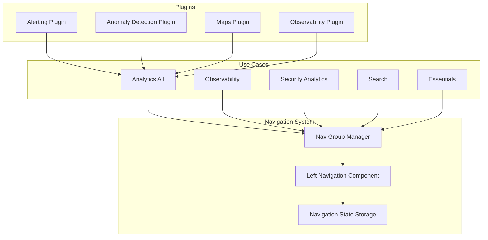

# Navigation Updates

## Summary

OpenSearch Dashboards v2.18.0 introduces significant improvements to the left navigation menu, including flattened menu structure in the Analytics(all) use case, persistent expand/collapse state, improved small screen compatibility, and visual refinements. These changes enhance usability by reducing navigation depth and improving the overall user experience across different screen sizes.

## Details

### What's New in v2.18.0

This release focuses on navigation UX improvements across OpenSearch Dashboards and multiple plugins:

1. **Flattened Navigation in Analytics(all) Use Case**: Multi-level navigation menus are flattened to reduce context switching and confusion
2. **Persistent Navigation State**: The left nav remembers its expanded/collapsed state across sessions
3. **Small Screen Compatibility**: Improved responsive behavior for mobile devices and smaller screens
4. **Visual Refinements**: Updated border styling when the navigation is expanded (shadow replaced with border)
5. **Sample Data Menu**: Re-added the sample data menu item for easier access to sample datasets

### Technical Changes

#### Architecture Changes



#### Key Components

| Component | Description |
|-----------|-------------|
| `CollapsibleNavGroupEnabled` | Controls the new collapsible navigation behavior |
| `showInAllNavGroup` | Property to show links within nav group category for backward compatibility |
| Navigation State Storage | Persists expand/collapse state using browser storage |
| Responsive Nav Handler | Manages navigation behavior on different screen sizes |

#### UI Changes

| Change | Before | After |
|--------|--------|-------|
| Menu Structure | Multi-level nested menus | Flattened single-level menus |
| Expand State | Not persisted | Persisted across sessions |
| Border Style | Shadow effect | Clean border line |
| Small Screen | Limited support | Full responsive support |

### Usage Example

The navigation changes are automatic when `navGroupEnabled` is set. Plugins register their navigation items with the appropriate category:

```typescript
// Plugin registration with flattened category
core.chrome.navGroup.addNavLinksToGroup(
  DEFAULT_NAV_GROUPS.all,
  [{
    id: 'myPlugin',
    category: AppCategory.detect, // Flattened in Analytics(all)
    showInAllNavGroup: true
  }]
);
```

### Migration Notes

- Plugin developers should update their navigation category registrations to align with the flattened structure
- The `showInAllNavGroup` property ensures backward compatibility for existing plugins
- No user action required - changes apply automatically

## Limitations

- Navigation state persistence uses browser local storage, so state is not synced across devices
- Some plugins may need updates to fully support the flattened navigation structure

## Related PRs

| PR | Repository | Description |
|----|------------|-------------|
| [#8332](https://github.com/opensearch-project/OpenSearch-Dashboards/pull/8332) | OpenSearch-Dashboards | Flatten left nav in Analytics(all) use case |
| [#8286](https://github.com/opensearch-project/OpenSearch-Dashboards/pull/8286) | OpenSearch-Dashboards | Remember state when expand/collapse left nav |
| [#8489](https://github.com/opensearch-project/OpenSearch-Dashboards/pull/8489) | OpenSearch-Dashboards | Update border style when new left nav expanded |
| [#8076](https://github.com/opensearch-project/OpenSearch-Dashboards/pull/8076) | OpenSearch-Dashboards | Add sample data menu back |
| [#7962](https://github.com/opensearch-project/OpenSearch-Dashboards/pull/7962) | OpenSearch-Dashboards | Make left nav compatible with small screen |
| [#674](https://github.com/opensearch-project/dashboards-maps/pull/674) | dashboards-maps | Update category to flatten menus |
| [#883](https://github.com/opensearch-project/anomaly-detection-dashboards-plugin/pull/883) | anomaly-detection-dashboards-plugin | Update category to flatten menus |
| [#2182](https://github.com/opensearch-project/dashboards-observability/pull/2182) | dashboards-observability | Update category to flatten menus |
| [#1114](https://github.com/opensearch-project/alerting-dashboards-plugin/pull/1114) | alerting-dashboards-plugin | Update category to flatten menus |

## References

- [OpenSearch Dashboards Quickstart Guide](https://docs.opensearch.org/2.18/dashboards/quickstart/): Documentation on docking/undocking navigation

## Related Feature Report

- [Full feature documentation](../../../features/opensearch-dashboards/navigation.md)
