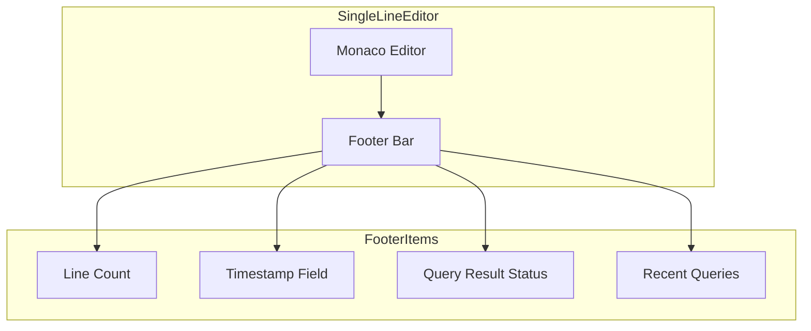
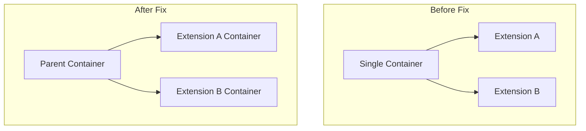

# Query Editor

## Summary

This release item improves the Query Editor in OpenSearch Dashboards with a new footer bar for single-line editors, fixes for query editor extension ordering, and PPL autocomplete improvements. These changes enhance the user experience when writing queries in Discover and other query-enabled interfaces.

## Details

### What's New in v2.18.0

#### Single Line Editor Footer Bar

A new footer bar has been added to the single-line query editor that appears when the editor is focused. This footer provides:

- Line count display
- Timestamp field name from the dataset
- Query result status (loading, success, error)
- Recent queries access button

The footer improves visibility of query execution status and provides quick access to recent queries without switching to the multi-line editor.

#### Query Editor Extensions Ordering Fix

Fixed an issue where query editor extensions were not rendering in the correct order. When React portals were created asynchronously within the same container, the order could not be guaranteed. The fix creates separate pre-ordered containers for each extension.

#### PPL Autocomplete Improvements

Fixed various issues with PPL (Piped Processing Language) autocomplete:

- Improved function suggestions with aggregate functions (avg, count, sum, min, max, var_samp, var_pop, stddev_samp, stddev_pop)
- Fixed field and table name suggestions
- Added proper sorting for keyword suggestions (pipe, comma, operators)
- Keywords now display in lowercase for better readability

### Technical Changes

#### New Components

| Component | Description |
|-----------|-------------|
| `queryEditor__footer` | Footer container for single-line editor |
| `queryEditor__footerItem` | Individual footer item styling |
| `queryEditor__footerSpacer` | Flexible spacer between footer items |

#### Architecture Changes



#### Query Editor Extensions Flow



### Usage Example

The footer bar automatically appears when focusing on the single-line query editor:

```
┌─────────────────────────────────────────────────────────┐
│ source = logs | where status = 200                      │
├─────────────────────────────────────────────────────────┤
│ 1 line  @timestamp  ✓ Completed in 0.5s  Recent queries │
└─────────────────────────────────────────────────────────┘
```

### Error Handling Improvements

The query result component now properly surfaces errors from async search strategies:

- Error messages are displayed with proper formatting
- Status codes are correctly parsed from error responses
- Loading state shows elapsed time during query execution

## Limitations

- Footer bar only appears when the editor is focused (disappears after 500ms blur timeout)
- PPL autocomplete improvements are specific to the PPL language; DQL uses different autocomplete logic

## References

### Documentation
- [Dashboards Query Language (DQL)](https://docs.opensearch.org/2.18/dashboards/dql/): Official DQL documentation
- [Query Workbench](https://docs.opensearch.org/2.18/dashboards/query-workbench/): Query Workbench documentation

### Pull Requests
| PR | Description |
|----|-------------|
| [#8565](https://github.com/opensearch-project/OpenSearch-Dashboards/pull/8565) | Adds editor footer to single line editor on focus |
| [#8045](https://github.com/opensearch-project/OpenSearch-Dashboards/pull/8045) | Fix order of query editor extensions not working |
| [#8087](https://github.com/opensearch-project/OpenSearch-Dashboards/pull/8087) | PPL Autocomplete functions, fields, & table suggestion |

## Related Feature Report

- [Full feature documentation](../../../../features/opensearch-dashboards/query-editor.md)
