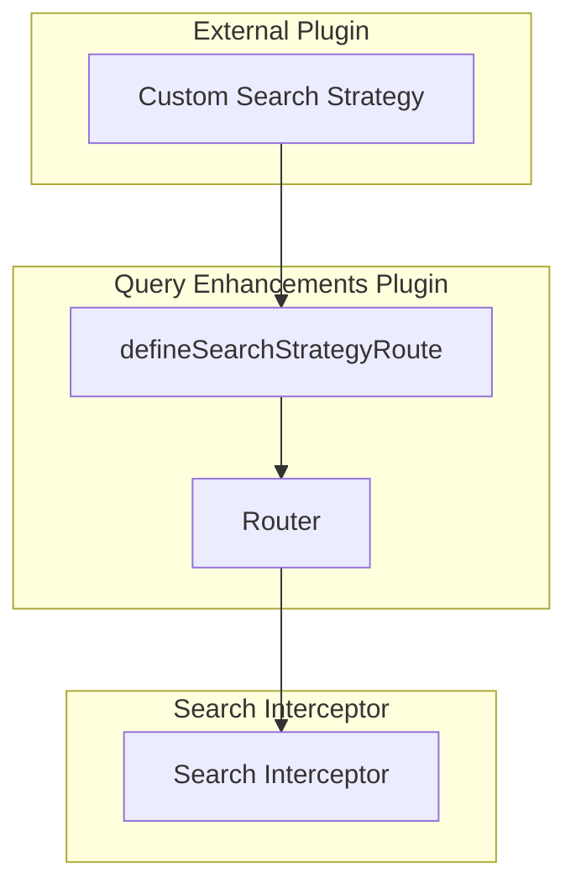

---
tags:
  - domain/core
  - component/dashboards
  - dashboards
  - search
---
# Query Enhancements Bugfixes

## Summary

This release includes bug fixes and improvements for the Query Enhancements plugin in OpenSearch Dashboards v2.18.0. The changes focus on extensibility for custom search strategies, fixing the recent query button behavior, improving module imports for external plugins, and adding keyboard shortcuts for query execution.

## Details

### What's New in v2.18.0

#### Extensibility for Custom Search Strategies

The Query Enhancements plugin now exposes a method to register search strategy routes, enabling external plugins to define custom search strategies with their own API endpoints.



#### Technical Changes

##### New API: defineSearchStrategyRoute

| Component | Description |
|-----------|-------------|
| `defineSearchStrategyRoute` | New method exposed in plugin setup to register custom search strategy routes |
| `defineSearchStrategyRouteProvider` | Factory function that encapsulates logger and router for route registration |

##### Module Export Improvements

| Change | Description |
|--------|-------------|
| `datasets` directory | Now exposed for specific imports from data plugin |
| `data_frames` directory | Now exposed for specific imports from data plugin |

This allows external plugins to import specific modules without pulling in the entire common code:

```typescript
// Before: Required importing complete common code
import { Dataset } from '@opensearch-project/opensearch-dashboards/data/common';

// After: Can import from specific subdirectories
import { Dataset } from '@opensearch-project/opensearch-dashboards/data/common/datasets';
```

##### Recent Query Button Fix

Fixed a bug where clicking the "Run Recent Query" button would incorrectly switch to a different query language instead of preserving the original language context.

##### Keyboard Shortcut for Query Execution

Added `Cmd+Enter` (Mac) / `Ctrl+Enter` (Windows/Linux) keyboard shortcut to execute queries directly from the query editor, improving user productivity.

| Shortcut | Platform | Action |
|----------|----------|--------|
| `Cmd+Enter` | macOS | Execute current query |
| `Ctrl+Enter` | Windows/Linux | Execute current query |

### Usage Example

```typescript
// Registering a custom search strategy route
class MyPlugin {
  setup(core, { queryEnhancements }) {
    const mySearchStrategy = {
      search: async (context, request, options) => {
        // Custom search implementation
        return { body: results };
      }
    };
    
    queryEnhancements.defineSearchStrategyRoute('my-strategy', mySearchStrategy);
  }
}
```

## Limitations

- Custom search strategies must implement the `ISearchStrategy` interface
- The keyboard shortcut only works when the query editor has focus

## References

### Documentation
- [Query Workbench Documentation](https://docs.opensearch.org/2.18/dashboards/query-workbench/): Official query interface documentation

### Pull Requests
| PR | Description |
|----|-------------|
| [#8245](https://github.com/opensearch-project/OpenSearch-Dashboards/pull/8245) | Expose method to register search strategy routes in query enhancement |
| [#8252](https://github.com/opensearch-project/OpenSearch-Dashboards/pull/8252) | Fix running recent query button to work properly |
| [#8299](https://github.com/opensearch-project/OpenSearch-Dashboards/pull/8299) | Expose datasets and data_frames directories for specific imports |
| [#8322](https://github.com/opensearch-project/OpenSearch-Dashboards/pull/8322) | Add keyboard shortcut for running queries |

## Related Feature Report

- Full feature documentation
