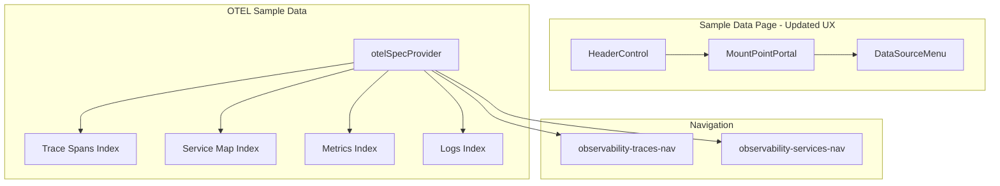

---
tags:
  - domain/core
  - component/dashboards
  - dashboards
  - indexing
  - observability
---
# Sample Data

## Summary

OpenSearch Dashboards v2.18.0 introduces two significant enhancements to the Sample Data feature: an updated UI for the sample data page when the new UX is enabled, and support for OpenTelemetry (OTEL) sample data including logs, traces, and metrics. These changes improve the user experience and provide observability-focused sample datasets for exploring OpenSearch's trace analytics capabilities.

## Details

### What's New in v2.18.0

1. **Updated Sample Data Page UI** (PR #8291)
   - Data source selector moved to top right corner for consistency with other pages
   - Removed duplicate "Sample Data" title
   - Improved layout with `EuiPanel` wrapper when `useUpdatedUX` is enabled
   - Updated breadcrumbs to show "Sample data" instead of "Add data"

2. **OTEL Sample Data Support** (PR #8587)
   - New sample dataset with correlated observability signals
   - Includes traces, metrics, logs, and service maps in OpenTelemetry format
   - Direct navigation links to Trace Analytics and Services views

### Technical Changes

#### Architecture Changes



#### New Components

| Component | Description |
|-----------|-------------|
| `otelSpecProvider` | Provider function for OTEL sample dataset registration |
| `MountPointPortal` | Portal component for rendering DataSourceMenu in header |
| `HeaderControl` | Navigation UI component for page description |

#### New OTEL Data Indices

| Index Name | Description | Time Fields |
|------------|-------------|-------------|
| `otel-v1-apm-span-sample` | Trace span data | startTime, endTime, traceGroupFields.endTime |
| `otel-v1-apm-service-map-sample` | Service dependency map | - |
| `ss4o_metrics-otel-sample` | Metrics data | @timestamp, exemplar.time, startTime, time, observedTimestamp |
| `ss4o_logs-otel-sample` | Log data | time, observedTime |

#### New Configuration

| Setting | Description | Default |
|---------|-------------|---------|
| `home:useNewHomePage` | Enable updated UX for sample data page | false |
| `indexName` (DataIndexSchema) | Optional custom index name for sample data | - |
| `newPath` (AppLinkSchema) | Alternative app path for new navigation | - |
| `appendDatasourceToPath` (AppLinkSchema) | Append datasource ID to navigation path | false |

### Usage Example

```typescript
// OTEL sample data app links configuration
const appLinks: AppLinkSchema[] = [
  {
    path: 'observability-traces#/traces',
    icon: 'apmTrace',
    label: 'View traces',
    newPath: 'observability-traces-nav#/traces',
    appendDatasourceToPath: true,
  },
  {
    path: 'observability-traces#/services',
    icon: 'graphApp',
    label: 'View services',
    newPath: 'observability-services-nav#/services',
    appendDatasourceToPath: true,
  },
];
```

### Migration Notes

- Enable `home:useNewHomePage` in UI settings to use the updated sample data page UI
- OTEL sample data does not include a default dashboard; users navigate directly to Trace Analytics

## Limitations

- Updated UI only visible when `useUpdatedUX` flag is enabled
- OTEL sample data has no associated dashboard (overviewDashboard is empty)
- OTEL data requires Observability plugin for full functionality

## References

### Documentation
- [OpenSearch Dashboards Quickstart](https://docs.opensearch.org/2.18/dashboards/quickstart/): Adding sample data

### Pull Requests
| PR | Description |
|----|-------------|
| [#8291](https://github.com/opensearch-project/OpenSearch-Dashboards/pull/8291) | Update sample data page UI when useUpdatedUX enabled |
| [#8587](https://github.com/opensearch-project/OpenSearch-Dashboards/pull/8587) | Add support for OTEL sample data - logs, traces and metrics |

### Issues (Design / RFC)
- [Issue #8312](https://github.com/opensearch-project/OpenSearch-Dashboards/issues/8312): Update Sample Data Page UI for New Updated UX

## Related Feature Report

- [Full feature documentation](../../../features/opensearch-dashboards/opensearch-dashboards-sample-data.md)
