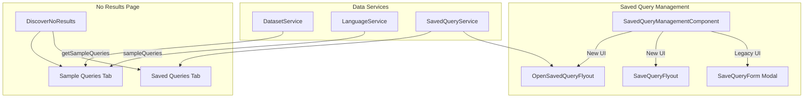

---
tags:
  - dashboards
  - search
---

# Saved Query UX

## Summary

OpenSearch Dashboards v2.18.0 introduces a redesigned user experience for saved queries in Discover. The new UI uses flyouts instead of modals, providing more space for searching, categorizing, and managing saved queries. Additionally, sample queries and saved queries are now displayed on the "No Results" page to help users get started with query syntax.

## Details

### What's New in v2.18.0

1. **New Flyout-Based UI for Saved Queries**: Replaces the previous modal-based interface with flyouts that offer more surface area for query management
2. **Sample Queries on No Results Page**: When a search returns no results, users now see sample queries and their saved queries to help construct valid queries
3. **Templates Tab**: Saved queries can be marked as templates, which appear in a separate "Templates" tab and cannot be deleted from the UI
4. **Dataset Association**: Saved queries can now optionally include the data source/dataset information
5. **Enhanced Search and Filtering**: The Open Query flyout includes search, pagination, and filtering by language and dataset type

### Technical Changes

#### Architecture Changes



#### New Components

| Component | Description |
|-----------|-------------|
| `OpenSavedQueryFlyout` | Flyout for browsing and opening saved queries with search, filtering, and pagination |
| `SaveQueryFlyout` | Flyout for saving new queries or updating existing ones |
| `SavedQueryCard` | Card component displaying saved query details with Monaco editor preview |
| `DeleteSavedQueryConfirmationModal` | Reusable confirmation modal for query deletion |

#### New Configuration

| Setting | Description | Default |
|---------|-------------|---------|
| `data.savedQueriesNewUI.enabled` | Enable the new flyout-based saved query UI | `false` |

The new UI is enabled when both `data.savedQueriesNewUI.enabled` is `true` AND query enhancements are enabled (`uiSettings.get(UI_SETTINGS.QUERY_ENHANCEMENTS_ENABLED)`).

#### API Changes

**SavedQueryAttributes** - New fields added:

| Field | Type | Description |
|-------|------|-------------|
| `isTemplate` | `boolean` | If true, query appears in Templates tab and cannot be updated/deleted from UI |
| `query.dataset` | `Dataset` | Optional dataset information associated with the saved query |

**DatasetTypeConfig** - New method:

| Method | Description |
|--------|-------------|
| `getSampleQueries(dataset, language)` | Returns sample queries for the dataset type |

**LanguageConfig** - New field:

| Field | Type | Description |
|-------|------|-------------|
| `sampleQueries` | `SampleQuery[]` | Array of sample queries for the language |

### Usage Example

**Enable the new saved query UI:**

```yaml
# opensearch_dashboards.yml
data.savedQueriesNewUI.enabled: true
```

**Sample queries are automatically provided for each language:**

- **DQL/Lucene**: Field searches, phrase matching, wildcard queries, field existence checks
- **SQL**: SELECT queries with LIKE, WHERE, and IS NOT NULL clauses
- **PPL**: Basic source queries

### Migration Notes

- The new UI is opt-in via configuration; existing deployments continue using the modal-based UI
- Existing saved queries are fully compatible with the new UI
- The `isTemplate` field is optional and defaults to `false` for existing queries

## Limitations

- Template queries cannot be edited or deleted through the UI (by design)
- Sample queries are limited to 5 displayed on the No Results page
- The new UI requires query enhancements to be enabled

## References

### Documentation
- [Discover Documentation](https://docs.opensearch.org/2.18/dashboards/discover/index-discover/): Official Discover documentation
- [PR #8469](https://github.com/opensearch-project/OpenSearch-Dashboards/pull/8469): Main implementation of new saved query UI
- [PR #8616](https://github.com/opensearch-project/OpenSearch-Dashboards/pull/8616): Sample queries on no results page

### Pull Requests
| PR | Description |
|----|-------------|
| [#8469](https://github.com/opensearch-project/OpenSearch-Dashboards/pull/8469) | Enhances the saved query UX with flyout-based interface |
| [#8616](https://github.com/opensearch-project/OpenSearch-Dashboards/pull/8616) | Adds sample queries and saved queries to Discover no results page |

## Related Feature Report

- [Full feature documentation](../../../../features/opensearch-dashboards/opensearch-dashboards-saved-query-ux.md)
