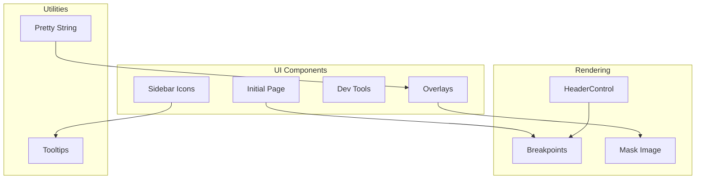

---
tags:
  - domain/core
  - component/dashboards
  - dashboards
---
# UI/UX Bugfixes

## Summary

OpenSearch Dashboards v2.18.0 includes 8 UI/UX bug fixes addressing sidebar tooltips, initial page layout, navigation grouping, overlay positioning, object display formatting, Chrome 129 compatibility, OUI breakpoint handling, and HeaderControl rendering issues.

## Details

### What's New in v2.18.0

This release addresses various UI/UX issues across the Dashboards interface:

1. **Sidebar Icon Tooltips**: Added tooltips for sidebar icon buttons to improve accessibility and discoverability
2. **Initial Page UI**: Fixed layout issues including vertical centering, spacing, and external link icons
3. **Dev Tools Navigation**: Removed dev tools from the data administration nav group (standalone application)
4. **Overlay Positioning**: Fixed tooltip and dropdown positioning on pages with feature headers
5. **Object Display**: Switched to `@osd/std` for consistent object prettification
6. **Chrome 129 Fix**: Temporary workaround for Chrome's mask-image rendering bug
7. **OUI Breakpoints**: Updated OSD to respect new OUI breakpoints (xxl, xxxl)
8. **HeaderControl Rendering**: Fixed HeaderControl not rendering when not mounted in initial render

### Technical Changes

#### Architecture Changes



#### Key Fixes

| Fix | Component | Description |
|-----|-----------|-------------|
| Sidebar Tooltips | CollapsibleNavGroupEnabled | Added `EuiToolTip` wrapper for icon buttons |
| Initial Page | Home Plugin | Removed vertical centering, added top padding, fixed spacing |
| Dev Tools Nav | Console Plugin | Removed nav group registration for dev tools |
| Overlay Offsets | Feature Header | Changed margin to padding to fix absolute positioning |
| Pretty String | @osd/std | Use standard library for object display |
| Chrome 129 | CSS | Added `contain: paint` for mask-image elements |
| OUI Breakpoints | Core | Handle xxl/xxxl breakpoints as xl equivalent |
| HeaderControl | Application | Added `useObservableValue` hook for reactive updates |

### Usage Example

The HeaderControl fix introduces a new pattern for subscribing to observable updates:

```typescript
// Before: Controls not re-rendered after initial mount
const controls = application.currentRightControls$;

// After: Using useObservableValue for reactive updates
import { useObservableValue } from '@osd/std';

const controls = useObservableValue(application.currentRightControls$);
// Component now re-renders when controls change
```

### Migration Notes

No migration required. These are bug fixes that improve existing functionality.

## Limitations

- Chrome 129 fix is temporary; may be removed when Chrome fixes the underlying issue
- OUI breakpoint handling treats xxl/xxxl as xl (no distinct behavior for larger screens)

## References

### Documentation
- [OUI PR #1414](https://github.com/opensearch-project/oui/pull/1414): Chrome 129 fix in OUI

### Pull Requests
| PR | Description |
|----|-------------|
| [#8216](https://github.com/opensearch-project/OpenSearch-Dashboards/pull/8216) | Add tooltips for sidebar icon buttons |
| [#8217](https://github.com/opensearch-project/OpenSearch-Dashboards/pull/8217) | Fix initial page UI issues |
| [#8218](https://github.com/opensearch-project/OpenSearch-Dashboards/pull/8218) | Remove nav group for dev tools |
| [#8223](https://github.com/opensearch-project/OpenSearch-Dashboards/pull/8223) | Fix overlay offsets on pages with feature header |
| [#8232](https://github.com/opensearch-project/OpenSearch-Dashboards/pull/8232) | Use @osd/std to prettify objects for display |
| [#8274](https://github.com/opensearch-project/OpenSearch-Dashboards/pull/8274) | Temporary fix for Chrome 129 mask-image bug |
| [#8320](https://github.com/opensearch-project/OpenSearch-Dashboards/pull/8320) | Update OSD to respect new OUI breakpoints |
| [#8335](https://github.com/opensearch-project/OpenSearch-Dashboards/pull/8335) | Fix HeaderControl not rendered if not mount in initial rendering |

### Issues (Design / RFC)
- [Issue #8211](https://github.com/opensearch-project/OpenSearch-Dashboards/issues/8211): Pretty string display issue
- [Issue #8250](https://github.com/opensearch-project/OpenSearch-Dashboards/issues/8250): Chrome 129 mask-image rendering
- [Issue #8313](https://github.com/opensearch-project/OpenSearch-Dashboards/issues/8313): HeaderControl rendering issue

## Related Feature Report

- [Full feature documentation](../../../../features/opensearch-dashboards/dashboards-ui-ux-fixes.md)
