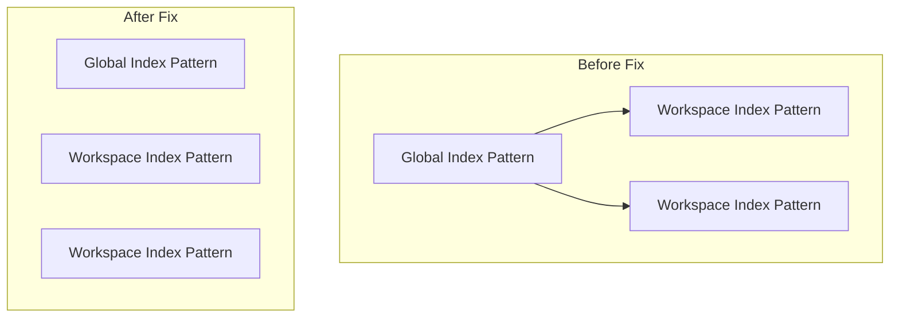

---
tags:
  - domain/core
  - component/dashboards
  - dashboards
  - indexing
  - search
---
# Workspace Bugfixes

## Summary

OpenSearch Dashboards v2.18.0 includes 13 bug fixes for the Workspace feature, addressing UI/UX issues, page crashes, permission handling, and navigation problems. These fixes improve the stability and usability of workspaces for multi-tenant environments.

## Details

### What's New in v2.18.0

This release focuses on stabilizing the Workspace feature with fixes across several areas:

1. **UI/UX Improvements**: Workspace selector styling, alignment, and hover behavior
2. **Page Crash Fixes**: Resolved crashes in overview pages and assets page
3. **Permission Handling**: Fixed issues with non-admin users and permission revocation
4. **Navigation & URLs**: Fixed short URL generation and inspect button navigation
5. **Index Pattern Handling**: Corrected default index pattern behavior in workspaces

### Bug Fixes by Category

#### UI/UX Fixes

| PR | Issue | Fix |
|----|-------|-----|
| [#8435](https://github.com/opensearch-project/OpenSearch-Dashboards/pull/8435) | What's New card cluttering workspace overview | Removed What's New card from workspace overview page |
| [#8541](https://github.com/opensearch-project/OpenSearch-Dashboards/pull/8541) | Workspace selector jumps on hover/click | Fixed CSS positioning to prevent visual jumping |
| [#8592](https://github.com/opensearch-project/OpenSearch-Dashboards/pull/8592) | Workspace selector style inconsistency | Aligned workspace selector style with data source selector, added mobile support, sorted by recently visited |
| [#8649](https://github.com/opensearch-project/OpenSearch-Dashboards/pull/8649) | Search bar and workspace selector misalignment | Adjusted workspace selector to align with left nav items, improved search bar popup behavior |

#### Page Crash Fixes

| PR | Issue | Fix |
|----|-------|-----|
| [#8524](https://github.com/opensearch-project/OpenSearch-Dashboards/pull/8524) | Analytics/Essential use case overview crashed | Removed unused `collaboratorTypes` service dependency that caused `this` context error |
| [#8581](https://github.com/opensearch-project/OpenSearch-Dashboards/pull/8581) | Assets page crashed when clicking "Copy assets" with empty table | Disabled "Copy all" button when no saved objects exist |
| [#8648](https://github.com/opensearch-project/OpenSearch-Dashboards/pull/8648) | Assets page crashed after permission revocation | Added error handling for copy operation when `library_write` permission is revoked |
| [#8606](https://github.com/opensearch-project/OpenSearch-Dashboards/pull/8606) | Dashboard rendered with duplicate visualizations | Fixed content management to prevent duplicate visualization rendering |

#### Permission & Access Fixes

| PR | Issue | Fix |
|----|-------|-----|
| [#8445](https://github.com/opensearch-project/OpenSearch-Dashboards/pull/8445) | Hidden use case features not accessible | Restored access to hidden features (getting started, overview, custom features) after use case selector refactor |
| [#8675](https://github.com/opensearch-project/OpenSearch-Dashboards/pull/8675) | Non-workspace admin triggered defaultIndex update error | Prevented non-admin users from updating default index setting |
| [#8718](https://github.com/opensearch-project/OpenSearch-Dashboards/pull/8718) | Index pattern issues with global vs workspace scope | Fixed workspace default index pattern to not extend from global setting, hidden "Set as default" button for global index patterns |

#### Navigation & Update Fixes

| PR | Issue | Fix |
|----|-------|-----|
| [#8570](https://github.com/opensearch-project/OpenSearch-Dashboards/pull/8570) | Navigate away modal shown after successful update | Fixed state management to not show navigation warning after workspace detail/collaborator updates |
| [#8719](https://github.com/opensearch-project/OpenSearch-Dashboards/pull/8719) | Short URLs missing workspace info | Fixed short URL generation to include workspace context for visualizations, dashboards, and index patterns |

### Technical Changes

#### Workspace Selector Improvements

The workspace selector received multiple styling and behavior fixes:

- Background color now uses `euiSideNavBackgroundColor` for consistency
- Workspaces sorted by most recently visited, then alphabetically
- Mobile display issues resolved
- Hover/click jump behavior eliminated

#### Index Pattern Scope Isolation

Workspace default index patterns no longer inherit from global settings, preventing permission errors when users lack access to global index patterns.

## References

### Documentation
- [Workspace Documentation](https://docs.opensearch.org/2.18/dashboards/workspace/workspace/): Official workspace feature documentation
- [Getting Started with Workspaces](https://docs.opensearch.org/2.18/dashboards/workspace/index/): Introduction to workspaces in v2.18
- [Workspaces APIs](https://docs.opensearch.org/2.18/dashboards/workspace/apis/): API reference for workspace operations

### Pull Requests
| PR | Description |
|----|-------------|
| [#8435](https://github.com/opensearch-project/OpenSearch-Dashboards/pull/8435) | Remove What's New card in workspace overview |
| [#8445](https://github.com/opensearch-project/OpenSearch-Dashboards/pull/8445) | Fix use case hidden features not accessible |
| [#8524](https://github.com/opensearch-project/OpenSearch-Dashboards/pull/8524) | Fix Analytics/Essential use case overview crash |
| [#8541](https://github.com/opensearch-project/OpenSearch-Dashboards/pull/8541) | Fix workspace selector jump on hover/click |
| [#8570](https://github.com/opensearch-project/OpenSearch-Dashboards/pull/8570) | Fix workspace update navigation modal issue |
| [#8581](https://github.com/opensearch-project/OpenSearch-Dashboards/pull/8581) | Disable copy all button when no saved objects |
| [#8592](https://github.com/opensearch-project/OpenSearch-Dashboards/pull/8592) | Fix workspace selector style alignment |
| [#8606](https://github.com/opensearch-project/OpenSearch-Dashboards/pull/8606) | Fix duplicate visualizations in dashboard |
| [#8648](https://github.com/opensearch-project/OpenSearch-Dashboards/pull/8648) | Fix assets page crash after permission revocation |
| [#8649](https://github.com/opensearch-project/OpenSearch-Dashboards/pull/8649) | Finetune search bar and workspace selector style |
| [#8675](https://github.com/opensearch-project/OpenSearch-Dashboards/pull/8675) | Fix non-workspace admin defaultIndex update |
| [#8718](https://github.com/opensearch-project/OpenSearch-Dashboards/pull/8718) | Fix index pattern issues |
| [#8719](https://github.com/opensearch-project/OpenSearch-Dashboards/pull/8719) | Generate short URL with workspace info |

## Related Feature Report

- Full Workspace documentation
