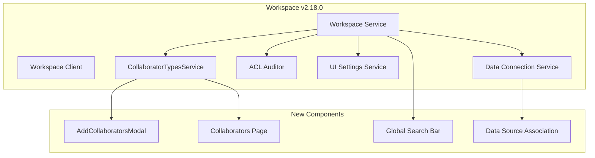

---
tags:
  - domain/core
  - component/dashboards
  - dashboards
  - search
---
# Workspace

## Summary

OpenSearch Dashboards v2.18.0 introduces significant workspace enhancements including workspace-level UI settings, collaborator management system, data connection integration, global search bar, and ACL auditing. These changes improve multi-tenant workspace isolation and team collaboration capabilities.

## Details

### What's New in v2.18.0

This release adds 26 feature enhancements and 14 bug fixes to the Workspace feature:

**Key Feature Additions:**
- Workspace-level UI settings with isolation from global settings
- Collaborator management system with customizable collaborator types
- Data connection integration for workspace-scoped data sources
- Global search bar in left navigation
- ACL auditor for permission bypass detection
- Dedicated collaborators page for workspace member management

### Technical Changes

#### Architecture Changes



#### New Components

| Component | Description |
|-----------|-------------|
| `WorkspaceCollaboratorTypesService` | Service for registering custom collaborator types |
| `AddCollaboratorsModal` | Modal component for adding users/groups to workspace |
| `WorkspaceCollaboratorsPage` | Dedicated page for managing workspace collaborators |
| `ACLAuditor` | Audits saved object client calls for ACL bypass |
| `GlobalSearchBar` | Search bar in left nav for searching pages across workspaces |

#### New Configuration

| Setting | Description | Default |
|---------|-------------|---------|
| `savedObjects.permission.enabled` | Enable permission control for ACL auditor | `false` |
| `opensearchDashboards.dashboardAdmin.users` | Users designated as dashboard admins | `[]` |

#### API Changes

New `WorkspacePluginSetup` interface:

```typescript
export interface WorkspaceCollaboratorType {
  id: string;
  name: string;
  buttonLabel: string;
  getDisplayedType?: (collaborator: WorkspaceCollaborator) => boolean;
  onAdd: ({ onAddCollaborators }: OnAddOptions) => Promise<void>;
}

export interface WorkspacePluginSetup {
  setCollaboratorTypes: (collaboratorTypes: WorkspaceCollaboratorType[]) => void;
  getAddCollaboratorsModal: () => typeof AddCollaboratorsModal;
}
```

### Usage Example

Register custom collaborator types:

```typescript
// In plugin setup
workspaceSetup.setCollaboratorTypes([
  {
    id: 'user',
    name: 'User',
    buttonLabel: 'Add Users',
    onAdd: async ({ onAddCollaborators }) => {
      // Custom user addition logic
    }
  },
  {
    id: 'group',
    name: 'Group', 
    buttonLabel: 'Add Groups',
    onAdd: async ({ onAddCollaborators }) => {
      // Custom group addition logic
    }
  }
]);
```

Enable ACL auditor:

```yaml
savedObjects.permission.enabled: true
workspace.enabled: true
opensearchDashboards.dashboardAdmin.users: ["admin"]
```

### Migration Notes

- Workspace-level UI settings are now isolated from global settings when workspace is enabled
- `defaultIndex` pattern becomes workspace-scoped when workspace is enabled
- Collaborators can no longer be added during workspace creation (moved to post-creation flow)
- At least one data source is now required during workspace creation

## Limitations

- ACL auditor only logs bypass attempts; does not block operations
- Global search bar does not yet support searching saved objects
- Collaborator types must be registered during plugin setup phase

## References

### Documentation
- [Workspace Documentation](https://docs.opensearch.org/2.18/dashboards/workspace/workspace/): Official v2.18 workspace documentation
- [Workspace ACLs](https://docs.opensearch.org/2.18/dashboards/workspace/workspace-acl/): Access control documentation
- [Workspaces APIs](https://docs.opensearch.org/2.18/dashboards/workspace/apis/): API reference

### Pull Requests
| PR | Description |
|----|-------------|
| [#8500](https://github.com/opensearch-project/OpenSearch-Dashboards/pull/8500) | Workspace-level UI settings and hide non-global settings |
| [#8594](https://github.com/opensearch-project/OpenSearch-Dashboards/pull/8594) | Add workspace collaborators page |
| [#8486](https://github.com/opensearch-project/OpenSearch-Dashboards/pull/8486) | Add WorkspaceCollaboratorTypesService and AddCollaboratorsModal |
| [#8557](https://github.com/opensearch-project/OpenSearch-Dashboards/pull/8557) | Add ACL auditor |
| [#8538](https://github.com/opensearch-project/OpenSearch-Dashboards/pull/8538) | Add global search bar into left nav |
| [#8013](https://github.com/opensearch-project/OpenSearch-Dashboards/pull/8013) | Integrate workspace with data connections frontend |
| [#8200](https://github.com/opensearch-project/OpenSearch-Dashboards/pull/8200) | Update workspace server for data connection type |
| [#8501](https://github.com/opensearch-project/OpenSearch-Dashboards/pull/8501) | Add collaborator table to workspace detail page |
| [#8520](https://github.com/opensearch-project/OpenSearch-Dashboards/pull/8520) | Remove collaborators in workspace creation page |
| [#8461](https://github.com/opensearch-project/OpenSearch-Dashboards/pull/8461) | Require at least one data source in workspace creation |
| [#8545](https://github.com/opensearch-project/OpenSearch-Dashboards/pull/8545) | Refactor data source list page with association |
| [#8620](https://github.com/opensearch-project/OpenSearch-Dashboards/pull/8620) | Add data-connection type support for association modal |
| [#8641](https://github.com/opensearch-project/OpenSearch-Dashboards/pull/8641) | Response forbidden error for non-permitted workspaces |
| [#8607](https://github.com/opensearch-project/OpenSearch-Dashboards/pull/8607) | Limit workspace colors |

## Related Feature Report

- [Full feature documentation](../../../../features/opensearch-dashboards/opensearch-dashboards-workspace.md)
