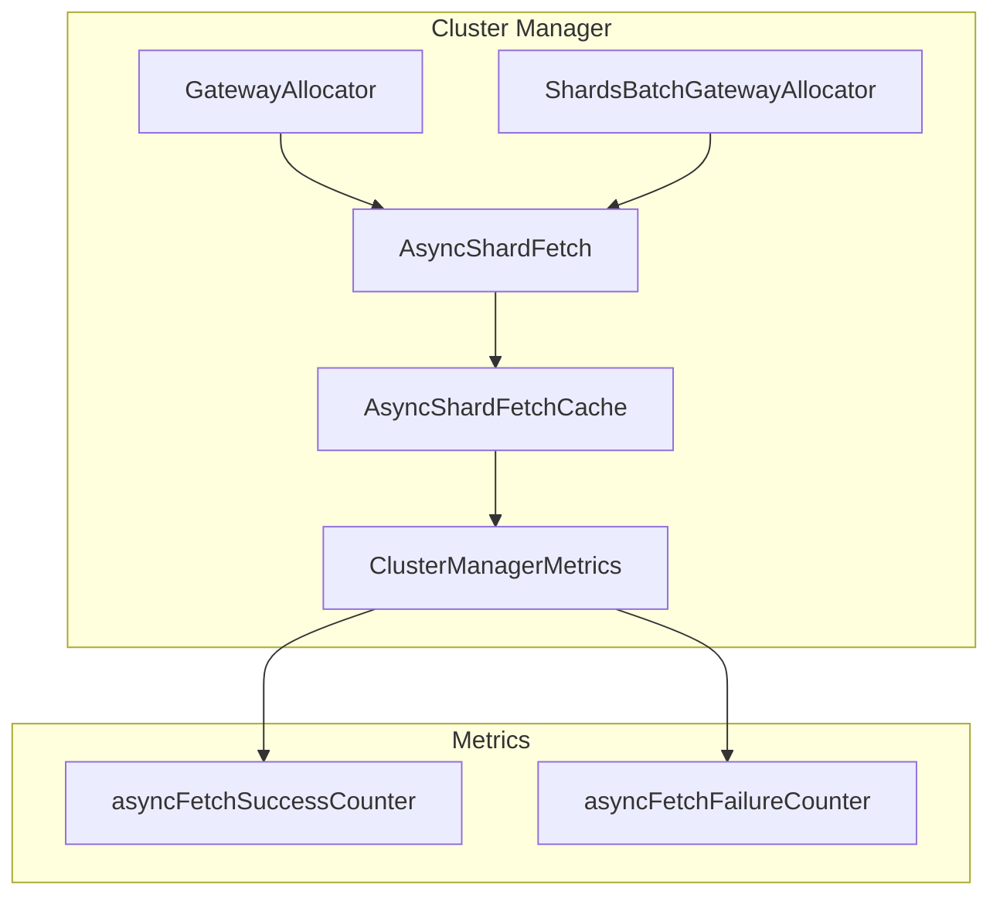

---
tags:
  - domain/core
  - component/server
  - indexing
  - observability
---
# Async Shard Fetch Metrics

## Summary

This release adds OpenTelemetry (OTel) counter metrics for async shard fetch operations, enabling operators to monitor the success and failure rates of shard metadata fetching during cluster operations like node joins and restarts. These metrics provide visibility into the cluster manager's shard allocation process.

## Details

### What's New in v2.18.0

Two new counter metrics have been added to the `ClusterManagerMetrics` class to track async shard fetch operations:

- `async.fetch.success.count`: Counts successful async shard fetch operations
- `async.fetch.failure.count`: Counts failed async shard fetch operations

### Technical Changes

#### Architecture Changes



#### New Components

| Component | Description |
|-----------|-------------|
| `asyncFetchSuccessCounter` | Counter metric tracking successful async fetch operations |
| `asyncFetchFailureCounter` | Counter metric tracking failed async fetch operations |

#### New Metrics

| Metric Name | Description | Unit |
|-------------|-------------|------|
| `async.fetch.success.count` | Number of successful async shard fetches | count |
| `async.fetch.failure.count` | Number of failed async shard fetches | count |

### Implementation Details

The metrics are incremented in `AsyncShardFetchCache`:

- **Success counter**: Incremented in `processResponses()` with the count of successful responses
- **Failure counter**: Incremented in `processFailures()` with the count of failed node exceptions

The `ClusterManagerMetrics` instance is now injected through the dependency chain:
- `ClusterModule` binds `ClusterManagerMetrics` as a singleton
- `GatewayAllocator` receives it via constructor injection
- `ShardsBatchGatewayAllocator` receives it via constructor injection
- `AsyncShardFetch` and `AsyncShardBatchFetch` pass it to their cache implementations

### Usage Example

To view these metrics, enable the OpenSearch metrics framework:

```yaml
# opensearch.yml
opensearch.experimental.feature.telemetry.enabled: true
telemetry.feature.metrics.enabled: true
```

The metrics will be exported via the configured telemetry exporter (e.g., `LoggingMetricExporter` or `OtlpGrpcMetricExporter`).

### Migration Notes

No migration required. The metrics are automatically available when the telemetry feature is enabled.

## Limitations

- Metrics require the experimental telemetry feature to be enabled
- Metrics are aggregated counts and do not include per-shard or per-node breakdowns
- No histogram or latency metrics are included in this change

## References

### Documentation
- [Metrics Framework Documentation](https://docs.opensearch.org/2.18/monitoring-your-cluster/metrics/getting-started/): Official docs for metrics framework

### Pull Requests
| PR | Description |
|----|-------------|
| [#15976](https://github.com/opensearch-project/OpenSearch/pull/15976) | Add success and failure count OTel metrics for async shard fetch |

### Issues (Design / RFC)
- [Issue #8098](https://github.com/opensearch-project/OpenSearch/issues/8098): META - Cluster Manager Async Shard Fetch Revamp
- [Issue #5098](https://github.com/opensearch-project/OpenSearch/issues/5098): Async shard fetches taking up GBs of memory

## Related Feature Report

- [Full feature documentation](../../../features/opensearch/opensearch-async-shard-fetch-metrics.md)
