---
tags:
  - domain/core
  - component/server
  - search
---
# Cluster State Management

## Summary

This release fixes a bug in cluster state management where the committed voting configuration could become stale during remote cluster state publication. The fix updates the `lastSeenClusterState` in the commit phase to ensure voting configuration consistency across cluster state updates.

## Details

### What's New in v2.18.0

The change addresses a coordination metadata mismatch issue that occurs during remote cluster state publication when voting configuration changes.

### Technical Changes

#### Problem Background

Coordination metadata contains two voting configurations:
- **Accepted voting configuration**: Sent during the publish phase when voting configuration changes
- **Committed voting configuration**: Set by each node using the accepted voting configuration during the commit phase

When a voting configuration change occurs:
1. The changed accepted voting configuration is sent in the publish phase
2. Follower nodes apply this cluster state on the `lastSeenClusterState` in `PublicationTransportHandler`
3. In the commit phase, each node sets the committed voting configuration using the accepted voting configuration

The issue arises when the next cluster state is published without any voting configuration diff. This update uses `lastSeenClusterState` again to apply the diff, causing the committed voting configuration to retain an older value.

#### Solution

```mermaid
graph TB
    subgraph "Before Fix"
        A1[Publish Phase] --> B1[Apply on lastSeenClusterState]
        B1 --> C1[Commit Phase]
        C1 --> D1[Set committed config]
        D1 --> E1[Next Publish]
        E1 --> F1[Apply diff on stale lastSeenClusterState]
        F1 --> G1[Committed config mismatch]
    end
    
    subgraph "After Fix"
        A2[Publish Phase] --> B2[Apply on lastSeenClusterState]
        B2 --> C2[Commit Phase]
        C2 --> D2[Set committed config]
        D2 --> E2[Update lastSeenClusterState]
        E2 --> F2[Next Publish]
        F2 --> G2[Apply diff on updated lastSeenClusterState]
        G2 --> H2[Committed config consistent]
    end
```



The fix updates `lastSeenClusterState` in the commit phase, ensuring subsequent cluster state updates apply diffs on the correct base state.

#### Code Changes

| Component | Change |
|-----------|--------|
| `Coordinator.handleApplyCommit()` | Added `Consumer<ClusterState> updateLastSeen` parameter to update lastSeenClusterState after commit |
| `PublicationTransportHandler` | Changed handler signature from `BiConsumer` to `TriConsumer` to pass `updateLastSeen` callback |
| `PublicationTransportHandler.updateLastSeen()` | New private method to update `lastSeenClusterState` |

#### Key Implementation

In `Coordinator.java`:
```java
private void handleApplyCommit(
    ApplyCommitRequest applyCommitRequest,
    Consumer<ClusterState> updateLastSeen,
    ActionListener<Void> applyListener
) {
    synchronized (mutex) {
        coordinationState.get().handleCommit(applyCommitRequest);
        final ClusterState committedState = hideStateIfNotRecovered(
            coordinationState.get().getLastAcceptedState());
        applierState = mode == Mode.CANDIDATE 
            ? clusterStateWithNoClusterManagerBlock(committedState) 
            : committedState;
        clusterApplier.setPreCommitState(applierState);
        updateLastSeen.accept(coordinationState.get().getLastAcceptedState());
        // ... rest of method
    }
}
```

In `PublicationTransportHandler.java`:
```java
private void updateLastSeen(final ClusterState clusterState) {
    lastSeenClusterState.set(clusterState);
}
```

### Impact

This fix is particularly important for clusters using remote cluster state publication, where coordination metadata is not sent in every diff (unlike local publication). Without this fix, clusters could experience voting configuration inconsistencies after voting configuration changes.

## Limitations

- This is a bug fix with no new configuration options
- Only affects clusters using remote cluster state publication

## References

### Documentation
- [Remote Cluster State Documentation](https://docs.opensearch.org/2.18/tuning-your-cluster/availability-and-recovery/remote-store/remote-cluster-state/)

### Pull Requests
| PR | Description |
|----|-------------|
| [#16215](https://github.com/opensearch-project/OpenSearch/pull/16215) | Update last seen cluster state in commit phase |

## Related Feature Report

- Full feature documentation
