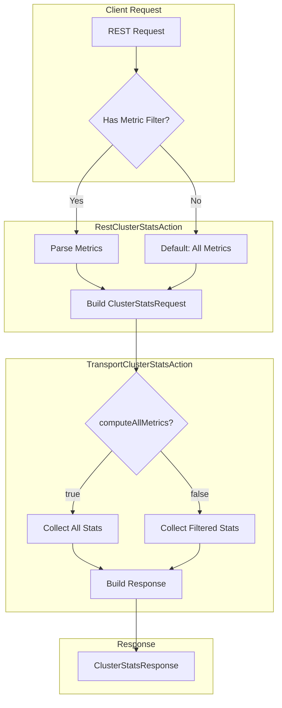

# Cluster Stats API - URI Path Filtering

## Summary

OpenSearch v2.18.0 introduces URI path filtering support for the Cluster Stats API, allowing clients to request specific metrics without fetching the entire stats response. This improves API performance by reducing response payload size and server-side computation.

## Details

### What's New in v2.18.0

The Cluster Stats API now supports filtering metrics through URI path parameters. Previously, the API returned all cluster statistics regardless of what information was needed. With this enhancement, clients can specify exactly which node-level and index-level metrics they want to retrieve.

### Technical Changes

#### New API Endpoints

| Endpoint | Description |
|----------|-------------|
| `/_cluster/stats/{metric}/nodes/{nodeId}` | Filter by node metrics |
| `/_cluster/stats/{metric}/{index_metric}/nodes/{nodeId}` | Filter by both node and index metrics |

#### Supported Metrics

**Node Metrics:**

| Metric | Description |
|--------|-------------|
| `os` | Operating system statistics (load, memory) |
| `process` | Process statistics (open file descriptors, CPU usage) |
| `jvm` | JVM statistics (heap usage, threads) |
| `fs` | File system usage statistics |
| `plugins` | OpenSearch plugins information |
| `ingest` | Ingest pipeline statistics |
| `network_types` | Transport and HTTP network types |
| `discovery_types` | Node discovery methods |
| `packaging_types` | OpenSearch distribution information |
| `indices` | Index statistics (requires index_metric for filtering) |

**Index Metrics (when `indices` metric is requested):**

| Metric | Description |
|--------|-------------|
| `shards` | Shard count and distribution |
| `docs` | Document count and deleted documents |
| `store` | Storage size information |
| `fielddata` | Field data cache statistics |
| `query_cache` | Query cache statistics |
| `completion` | Completion suggester statistics |
| `segments` | Lucene segment statistics |
| `mappings` | Field type mappings information |
| `analysis` | Analyzer configuration statistics |

#### Architecture Changes



#### New Components

| Component | Description |
|-----------|-------------|
| `ClusterStatsRequest.Metric` | Enum defining available node-level metrics |
| `ClusterStatsRequest.IndexMetric` | Enum defining available index-level metrics |
| `computeAllMetrics` flag | Controls whether to compute all metrics or filter |

### Usage Example

**Request specific node stats only:**
```bash
GET /_cluster/stats/os,jvm/nodes/_all
```

**Request specific index stats:**
```bash
GET /_cluster/stats/indices/docs,segments/nodes/_all
```

**Request both node and index stats with filtering:**
```bash
GET /_cluster/stats/indices,os,jvm/shards/nodes/_all
```

**Response for filtered request:**
```json
{
  "_nodes": {"total": 1, "successful": 1, "failed": 0},
  "cluster_name": "opensearch-cluster",
  "cluster_uuid": "abc123",
  "timestamp": 1728897551016,
  "status": "green",
  "nodes": {
    "count": {"total": 1, "cluster_manager": 1, "data": 1},
    "versions": ["2.18.0"],
    "os": {
      "available_processors": 12,
      "allocated_processors": 12,
      "mem": {"total_in_bytes": 17179869184, "free_percent": 23}
    },
    "jvm": {
      "max_uptime_in_millis": 495233,
      "mem": {"heap_used_in_bytes": 106676736, "heap_max_in_bytes": 536870912}
    }
  }
}
```

### Migration Notes

- Existing API calls without metric filters continue to work unchanged
- The `_all` keyword can be used to request all metrics within a category
- Invalid metric names result in a 400 Bad Request with descriptive error message

## Limitations

- Metric filtering is only available in OpenSearch 2.18.0 and later (3.0.0+)
- Rolling upgrades require all nodes to be on compatible versions before using filtered endpoints
- The `_all` keyword cannot be combined with individual metrics in the same request

## Related PRs

| PR | Description |
|----|-------------|
| [#15938](https://github.com/opensearch-project/OpenSearch/pull/15938) | URI path filtering support in cluster stats API |

## References

- [Cluster Stats API Documentation](https://docs.opensearch.org/2.18/api-reference/cluster-api/cluster-stats/)
- [PR #14447](https://github.com/opensearch-project/OpenSearch/pull/14447): Original motivation for performance improvements

## Related Feature Report

- [Full feature documentation](../../../features/opensearch/cluster-stats-api.md)
