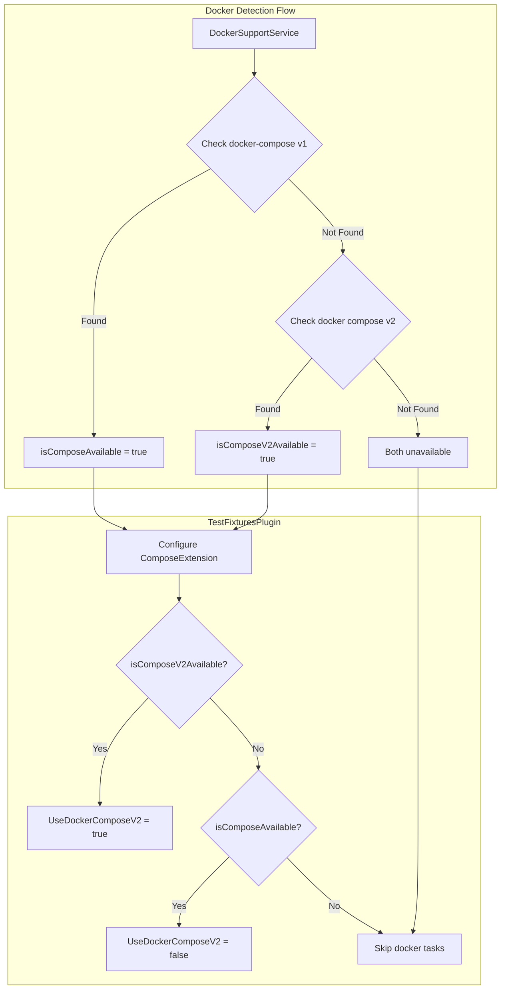

# Docker Compose v2 Support

## Summary

This release adds support for Docker Compose v2 in the TestFixturesPlugin, enabling developers to run integration tests that depend on Docker containers on systems where only Docker Compose v2 (`docker compose` without hyphen) is available. Previously, tests would be skipped on systems without the legacy `docker-compose` binary.

## Details

### What's New in v2.18.0

The TestFixturesPlugin now detects and supports both Docker Compose v1 (`docker-compose`) and Docker Compose v2 (`docker compose`). This change ensures that Gradle tasks relying on Docker test fixtures are no longer skipped on modern systems where only Docker Compose v2 is installed.

### Technical Changes

#### Architecture Changes



#### New Components

| Component | Description |
|-----------|-------------|
| `isComposeV2Available` | New field in `DockerAvailability` class to track Docker Compose v2 availability |
| Docker Compose v2 detection | Runs `docker compose version` to check for v2 support |

#### Code Changes

The `DockerSupportService.java` was updated to:
1. Add `isComposeV2Available` field to `DockerAvailability` class
2. Check for Docker Compose v2 by running `docker compose version`
3. Report both v1 and v2 availability status

The `TestFixturesPlugin.java` was updated to:
1. Prefer Docker Compose v2 when available
2. Fall back to Docker Compose v1 if v2 is not available
3. Skip tasks only when neither version is available

### Usage Example

No configuration changes are required. The plugin automatically detects the available Docker Compose version:

```bash
# On systems with Docker Compose v2 only
./gradlew :plugins:repository-gcs:test

# Previously: Task would be skipped with "docker-compose unavailable"
# Now: Task runs successfully using "docker compose" command
```

### Migration Notes

No migration required. This is a backward-compatible change that adds support for Docker Compose v2 while maintaining support for v1.

## Limitations

- Requires Docker to be installed and running
- Docker Compose v2 detection requires Docker CLI with compose plugin

## Related PRs

| PR | Description |
|----|-------------|
| [#16049](https://github.com/opensearch-project/OpenSearch/pull/16049) | Add support for docker compose v2 in TestFixturesPlugin |

## References

- [Issue #16050](https://github.com/opensearch-project/OpenSearch/issues/16050): Bug report for docker-compose v1 dependency
- [Docker Compose v2 Migration](https://docs.docker.com/compose/releases/migrate/): Official Docker documentation on v1 to v2 migration

## Related Feature Report

- [Full feature documentation](../../../features/opensearch/docker-compose-v2-support.md)
