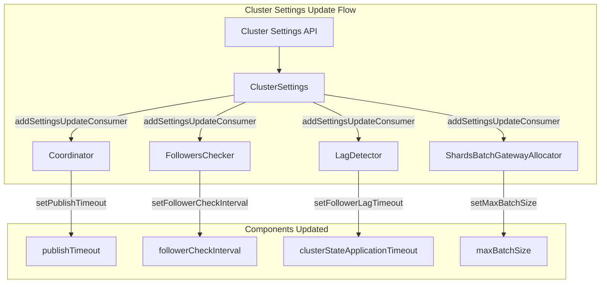

---
tags:
  - domain/core
  - component/server
  - indexing
---
# Dynamic Settings

## Summary

This release makes multiple cluster-level settings dynamic, allowing operators to tune them at runtime without restarting nodes. This is particularly useful for larger clusters where default values may not be optimal.

## Details

### What's New in v2.18.0

Four cluster settings that were previously static (node-scope only) are now dynamic:

| Setting | Description | Default | Min |
|---------|-------------|---------|-----|
| `cluster.fault_detection.follower_check.interval` | Interval between follower health checks from cluster manager | 1000ms | 100ms |
| `cluster.publish.timeout` | Timeout for cluster state publication | 30000ms | 1ms |
| `cluster.follower_lag.timeout` | Timeout before removing lagging nodes | 90000ms | 1ms |
| `cluster.allocator.gateway.batch_size` | Batch size for shard allocation | 2000 | 1 |

Additionally, the maximum value for `cluster.fault_detection.follower_check.timeout` was increased from 60s to 150s.

### Technical Changes

#### Architecture Changes



#### Modified Components

| Component | Change |
|-----------|--------|
| `Coordinator` | Added `setPublishTimeout()` method and settings consumer |
| `FollowersChecker` | Added `setFollowerCheckInterval()` method and settings consumer |
| `LagDetector` | Added `setFollowerLagTimeout()` method, accepts `ClusterSettings` in constructor |
| `ShardsBatchGatewayAllocator` | Added `setMaxBatchSize()` method and settings consumer |

#### Setting Property Changes

Each setting was updated to include `Setting.Property.Dynamic`:

```java
// Before
Setting.Property.NodeScope

// After
Setting.Property.NodeScope,
Setting.Property.Dynamic
```

### Usage Example

Update settings dynamically via the Cluster Settings API:

```json
PUT /_cluster/settings
{
  "persistent": {
    "cluster.fault_detection.follower_check.interval": "2s",
    "cluster.publish.timeout": "60s",
    "cluster.follower_lag.timeout": "120s",
    "cluster.allocator.gateway.batch_size": 3000
  }
}
```

### Migration Notes

No migration required. Existing clusters will continue using default values. Settings can be tuned at runtime as needed for larger clusters.

## Limitations

- Settings changes take effect immediately but may not affect in-progress operations
- Very low values for timeout settings can cause cluster instability
- The `follower_check.timeout` maximum is now 150s (increased from 60s)

## References

### Documentation
- [Cluster Settings Documentation](https://docs.opensearch.org/2.18/install-and-configure/configuring-opensearch/cluster-settings/): Official cluster settings reference

### Pull Requests
| PR | Description |
|----|-------------|
| [#16347](https://github.com/opensearch-project/OpenSearch/pull/16347) | Make multiple settings dynamic for tuning on larger clusters |

## Related Feature Report

- Full feature documentation
