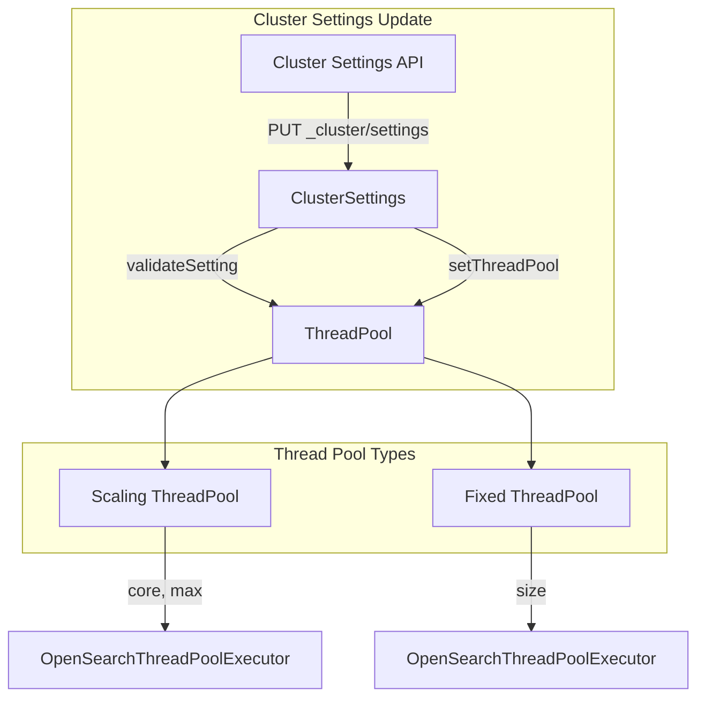

---
tags:
  - indexing
---

# Dynamic Threadpool Resize

## Summary

OpenSearch v2.18.0 introduces the ability to dynamically resize thread pool sizes at runtime without requiring a node restart. This feature allows operators to adjust thread pool configurations through cluster settings API, enabling real-time tuning of thread pools based on workload demands.

## Details

### What's New in v2.18.0

This release adds a new cluster setting `cluster.thread_pool.<pool_name>.<setting>` that allows dynamic modification of thread pool sizes for all core thread pools.

### Technical Changes

#### Architecture Changes



#### New Configuration

| Setting | Description | Applicable Pool Types |
|---------|-------------|----------------------|
| `cluster.thread_pool.<name>.size` | Thread pool size | Fixed, Fixed Auto Queue |
| `cluster.thread_pool.<name>.core` | Core pool size | Scaling |
| `cluster.thread_pool.<name>.max` | Maximum pool size | Scaling |

#### Supported Thread Pools

**Scaling Thread Pools** (configurable via `core` and `max`):
- `generic`, `management`, `flush`, `refresh`, `warmer`, `snapshot`, `snapshot_deletion`
- `fetch_shard_started`, `fetch_shard_store`, `translog_transfer`, `remote_purge`
- `remote_refresh_retry`, `remote_recovery`, `remote_state_read`

**Fixed Thread Pools** (configurable via `size`):
- `get`, `analyze`, `write`, `listener`, `force_merge`, `system_read`, `system_write`
- `translog_sync`, `remote_state_checksum`

### Usage Example

```json
// Resize scaling thread pool (snapshot)
PUT _cluster/settings
{
  "transient": {
    "cluster.thread_pool.snapshot.core": "2",
    "cluster.thread_pool.snapshot.max": "5"
  }
}

// Resize fixed thread pool (get)
PUT _cluster/settings
{
  "transient": {
    "cluster.thread_pool.get.size": "10"
  }
}
```

### Validation Rules

- Thread pool name must be a valid core thread pool
- For scaling pools: `core` must be ≤ `max`, both must be positive
- For fixed pools: `size` must be positive
- Invalid configurations are rejected with `IllegalArgumentException`

### Migration Notes

No migration required. This is a new capability that can be used immediately after upgrading to v2.18.0. Existing static configurations in `opensearch.yml` continue to work as before.

## Limitations

- Only core thread pools defined in OpenSearch can be resized
- Plugin-defined thread pools are not supported
- Queue sizes cannot be modified dynamically (only thread counts)
- Changes are applied per-node; cluster-wide settings propagate to all nodes

## References

### Documentation
- [CAT Thread Pool API](https://docs.opensearch.org/2.18/api-reference/cat/cat-thread-pool/): Monitor thread pool status
- [Nodes Info API](https://docs.opensearch.org/2.18/api-reference/nodes-apis/nodes-info/): View thread pool configuration
- [PR #16236](https://github.com/opensearch-project/OpenSearch/pull/16236): Main implementation

### Pull Requests
| PR | Description |
|----|-------------|
| [#16236](https://github.com/opensearch-project/OpenSearch/pull/16236) | Add support to dynamically resize threadpools size |

## Related Feature Report

- [Full feature documentation](../../../features/opensearch/opensearch-dynamic-threadpool-resize.md)
