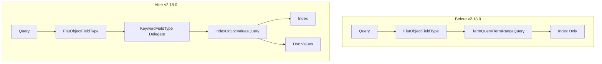

---
tags:
  - indexing
  - performance
  - search
---

# Flat Object Query Optimization

## Summary

This release optimizes query performance for `flat_object` fields by using `IndexOrDocValuesQuery` to dynamically choose between index-based and doc_values-based query execution. The implementation also delegates query generation to the underlying `KeywordFieldType`, reducing code duplication and ensuring flat object fields benefit from the same query optimizations as keyword fields.

## Details

### What's New in v2.18.0

The `flat_object` field type now uses `IndexOrDocValuesQuery` for multiple query types, allowing OpenSearch to dynamically select the most efficient query execution path based on the data characteristics.

### Technical Changes

#### Architecture Changes



#### New Components

| Component | Description |
|-----------|-------------|
| `KeywordFieldType.rewriteForDocValue()` | New protected method to rewrite values for doc_values queries |
| `FlatObjectFieldType.valueFieldType()` | Helper method to select appropriate keyword field type for queries |

#### Query Delegation

The `FlatObjectFieldType` now delegates query generation to its underlying `KeywordFieldType` subfields:

| Query Type | Delegation Target |
|------------|-------------------|
| `termsQuery` | `valueFieldType().termsQuery()` |
| `prefixQuery` | `valueFieldType().prefixQuery()` |
| `regexpQuery` | `valueFieldType().regexpQuery()` |
| `fuzzyQuery` | `valueFieldType().fuzzyQuery()` |
| `rangeQuery` | `valueFieldType().rangeQuery()` |
| `wildcardQuery` | `valueFieldType().wildcardQuery()` |

#### Wildcard Query Support

Previously, wildcard queries on `flat_object` fields threw a `QueryShardException`. This release enables wildcard query support by delegating to the keyword field type.

### Usage Example

```json
// Create index with flat_object field
PUT /test-index
{
  "mappings": {
    "properties": {
      "issue": {
        "properties": {
          "labels": {
            "type": "flat_object"
          }
        }
      }
    }
  }
}

// Index document
PUT /test-index/_doc/1
{
  "issue": {
    "labels": {
      "number": 1,
      "name": "abc0",
      "status": 1
    }
  }
}

// Wildcard query (now supported)
GET /test-index/_search
{
  "query": {
    "wildcard": {
      "issue.labels.name": "abc*"
    }
  }
}

// Range query (now optimized with IndexOrDocValuesQuery)
GET /test-index/_search
{
  "query": {
    "range": {
      "issue.labels.status": {
        "gte": 0,
        "lte": 2
      }
    }
  }
}
```

### Migration Notes

- No migration required
- Existing queries will automatically benefit from the optimization
- Wildcard queries on flat_object fields are now supported (previously threw an exception)

## Limitations

- Query optimization depends on both index and doc_values being enabled
- Performance improvement varies based on data distribution and query selectivity

## References

### Documentation
- [Flat object documentation](https://docs.opensearch.org/2.18/field-types/supported-field-types/flat-object/): Official docs

### Blog Posts
- [Use flat object in OpenSearch](https://opensearch.org/blog/flat-object/): Blog post

### Pull Requests
| PR | Description |
|----|-------------|
| [#14383](https://github.com/opensearch-project/OpenSearch/pull/14383) | Flat object field use IndexOrDocValuesQuery to optimize query |

### Issues (Design / RFC)
- [Issue #11537](https://github.com/opensearch-project/OpenSearch/issues/11537): Feature request for IndexOrDocValuesQuery support
- [Issue #11635](https://github.com/opensearch-project/OpenSearch/issues/11635): Bug report for code duplication in query generation

## Related Feature Report

- [Full feature documentation](../../../features/opensearch/flat-object-field.md)
