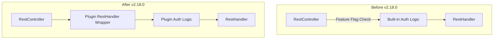

# Identity Feature Flag Removal

## Summary

This release removes the experimental `opensearch.experimental.feature.identity.enabled` feature flag from OpenSearch, making the Identity plugin architecture always available without requiring explicit enablement. The change simplifies the codebase by removing feature-flagged code paths and moves authentication logic from the core RestController to the identity-shiro plugin.

## Details

### What's New in v2.18.0

The Identity feature flag removal consists of two main changes:

1. **RestController Cleanup (PR #15430)**: Removed identity-related feature-flagged code from the RestController, delegating authentication to identity plugins via `ActionPlugin.getRestHandlerWrapper`.

2. **Feature Flag Removal (PR #16024)**: Completely removed the `IDENTITY` feature flag from `FeatureFlags.java` and related settings.

### Technical Changes

#### Architecture Changes



#### Removed Components

| Component | Location | Description |
|-----------|----------|-------------|
| `IDENTITY` constant | `FeatureFlags.java` | Feature flag string constant |
| `IDENTITY_SETTING` | `FeatureFlags.java` | Boolean setting for the flag |
| `handleAuthenticateUser()` | `RestController.java` | Built-in authentication method |
| `RestTokenExtractor` | `server` module | Token extraction (moved to identity-shiro) |

#### New Components

| Component | Location | Description |
|-----------|----------|-------------|
| `ShiroTokenExtractor` | `identity-shiro` plugin | Token extraction from REST requests |
| `AuthcRestHandler` | `ShiroIdentityPlugin` | REST handler wrapper for authentication |

#### API Changes

The `RestController` constructor no longer requires `IdentityService`:

```java
// Before
new RestController(headers, wrapper, client, circuitBreaker, usageService, identityService);

// After
new RestController(headers, wrapper, client, circuitBreaker, usageService);
```

### Usage Example

Identity plugins now implement authentication via `ActionPlugin.getRestHandlerWrapper`:

```java
public class ShiroIdentityPlugin extends Plugin implements IdentityPlugin, ActionPlugin {
    
    @Override
    public UnaryOperator<RestHandler> getRestHandlerWrapper(ThreadContext threadContext) {
        return AuthcRestHandler::new;
    }
    
    class AuthcRestHandler extends RestHandler.Wrapper {
        @Override
        public void handleRequest(RestRequest request, RestChannel channel, NodeClient client) 
                throws Exception {
            AuthToken token = ShiroTokenExtractor.extractToken(request);
            if (token != null) {
                ShiroSubject subject = (ShiroSubject) getCurrentSubject();
                subject.authenticate(token);
            }
            super.handleRequest(request, channel, client);
        }
    }
}
```

### Migration Notes

- **No user action required**: The feature flag removal is transparent to users
- **Plugin developers**: Identity plugins should use `ActionPlugin.getRestHandlerWrapper` for authentication instead of relying on core RestController
- **Configuration**: Remove any `opensearch.experimental.feature.identity.enabled` settings from `opensearch.yml` (no longer recognized)

## Limitations

- The `IdentityService` class is now marked as `@InternalApi` instead of `@ExperimentalApi`
- Identity plugins are loaded unconditionally (no feature flag gating)

## Related PRs

| PR | Description |
|----|-------------|
| [#15430](https://github.com/opensearch-project/OpenSearch/pull/15430) | Remove identity-related feature flagged code from the RestController |
| [#16024](https://github.com/opensearch-project/OpenSearch/pull/16024) | Remove Identity FeatureFlag |

## References

- [Issue #4439](https://github.com/opensearch-project/security/issues/4439): Remove Identity feature flag
- [Issue #238](https://github.com/opensearch-project/opensearch-plugins/issues/238): Plugin adoption of new system index mechanism
- [Blog: Introducing identity and access control for OpenSearch](https://opensearch.org/blog/introducing-identity/)

## Related Feature Report

- [Full feature documentation](../../../../features/opensearch/identity-feature-flag-removal.md)
