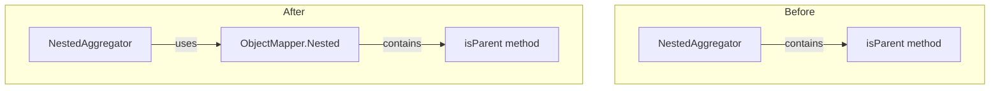

---
tags:
  - domain/core
  - component/server
  - search
---
# Nested Aggregations

## Summary

This release fixes a critical bug that caused infinite loops when executing nested aggregations with deep-level nested objects. The bug was introduced in v2.16.0 and caused queries with multi-level nested aggregations to hang indefinitely.

## Details

### What's New in v2.18.0

Fixed an infinite loop bug in the `NestedAggregator` class that occurred when performing aggregations on deeply nested objects (3+ levels of nesting).

### Technical Changes

#### Bug Description

The issue occurred when executing nested aggregations that traverse multiple levels of nested objects. The `isParent` method in `NestedAggregator` had a logic error where the `childObjectMapper` variable was not being updated during parent traversal, causing an infinite loop.

**Before (buggy code):**
```java
private boolean isParent(ObjectMapper parentObjectMapper, ObjectMapper childObjectMapper, MapperService mapperService) {
    if (parentObjectMapper == null) {
        return false;
    }
    ObjectMapper parent;
    do {
        parent = childObjectMapper.getParentObjectMapper(mapperService);
        // Bug: childObjectMapper never updated, causing infinite loop
    } while (parent != null && parent != parentObjectMapper);
    return parentObjectMapper == parent;
}
```

**After (fixed code):**
```java
public static boolean isParent(ObjectMapper parentObjectMapper, ObjectMapper childObjectMapper, MapperService mapperService) {
    if (parentObjectMapper == null || childObjectMapper == null) {
        return false;
    }

    ObjectMapper parent = childObjectMapper.getParentObjectMapper(mapperService);
    while (parent != null && parent != parentObjectMapper) {
        childObjectMapper = parent;  // Fix: update childObjectMapper
        parent = childObjectMapper.getParentObjectMapper(mapperService);
    }
    return parentObjectMapper == parent;
}
```

#### Architecture Changes

The `isParent` method was moved from `NestedAggregator` to `ObjectMapper.Nested` as a static utility method, making it reusable and easier to test.



#### Changed Files

| File | Change |
|------|--------|
| `ObjectMapper.java` | Added static `isParent` method to `Nested` inner class |
| `NestedAggregator.java` | Removed local `isParent` method, now imports from `ObjectMapper.Nested` |
| `ObjectMapperTests.java` | Added unit tests for `isParent` method |
| `410_nested_aggs.yml` | Added REST API integration test |

### Usage Example

The following query now works correctly without hanging:

```json
POST supplier/_search
{
  "aggregations": {
    "reference_aggregation": {
      "nested": {
        "path": "references"
      },
      "aggregations": {
        "references.key": {
          "terms": {
            "field": "references.key"
          },
          "aggregations": {
            "referenceValueProperties": {
              "nested": {
                "path": "references.value.referenceValueProperties"
              },
              "aggregations": {
                "propertyName": {
                  "terms": {
                    "field": "references.value.referenceValueProperties.propertyName"
                  }
                }
              }
            }
          }
        }
      }
    }
  }
}
```

### Migration Notes

No migration required. This is a bug fix that restores expected behavior for nested aggregations.

## Limitations

- This fix addresses the infinite loop issue but does not change the fundamental behavior of nested aggregations
- Performance of deeply nested aggregations depends on the data structure and cardinality

## References

### Documentation
- [Nested Aggregations Documentation](https://docs.opensearch.org/2.18/aggregations/bucket/nested/): Official documentation

### Pull Requests
| PR | Description |
|----|-------------|
| [#15931](https://github.com/opensearch-project/OpenSearch/pull/15931) | Fix infinite loop in nested agg |

### Issues (Design / RFC)
- [Issue #15914](https://github.com/opensearch-project/OpenSearch/issues/15914): Original bug report - Deep level aggregations query hang the request

## Related Feature Report

- [Full feature documentation](../../../features/opensearch/opensearch-nested-aggregations.md)
