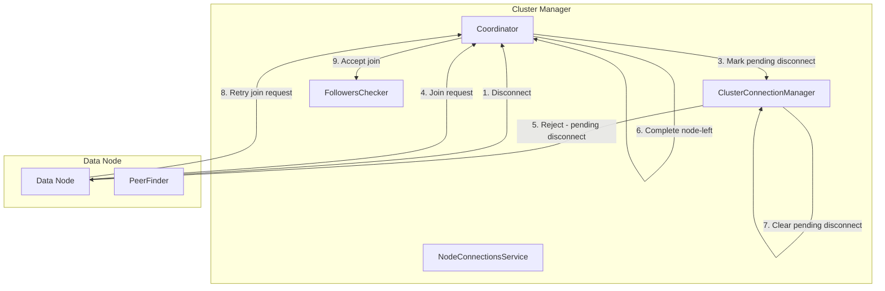

---
tags:
  - domain/core
  - component/server
  - search
---
# Node Join/Leave Race Condition Fix

## Summary

This release fixes a critical race condition in the node-join and node-left processing loop that could prevent nodes from rejoining the cluster indefinitely. The fix introduces a pending disconnection tracking mechanism that rejects join requests from nodes that have an ongoing node-left task, ensuring clean state transitions.

## Details

### What's New in v2.18.0

A race condition existed where a node could send a join request to the cluster manager while a node-left task was still being processed. This caused an infinite loop of node-join and node-left tasks, preventing the node from ever successfully joining the cluster.

### Technical Changes

#### Architecture Changes



#### New Components

| Component | Description |
|-----------|-------------|
| `pendingDisconnections` | Set in `ClusterConnectionManager` tracking nodes with ongoing node-left tasks |
| `setPendingDisconnection()` | Method to mark a node as pending disconnect before cluster state publish |
| `clearPendingDisconnections()` | Method to clear pending disconnections after commit or on cluster manager failover |

#### Key Code Changes

| Class | Change |
|-------|--------|
| `ClusterConnectionManager` | Added `pendingDisconnections` set and methods to manage it |
| `Coordinator` | Marks nodes as pending disconnect before publish, clears on failover |
| `NodeConnectionsService` | Exposes methods to set/clear pending disconnections |
| `TransportService` | Delegates pending disconnection management to connection manager |
| `Discovery` | Added `setNodeConnectionsService()` interface method |

### Usage Example

The fix is automatic and requires no configuration changes. The race condition is now handled internally:

```
Timeline (Before Fix):
1. Node disconnects → node-left task queued
2. Node sends join request → accepted (connection reused)
3. node-left task wipes connection
4. node-join task fails (NodeNotConnectedException)
5. Loop repeats indefinitely

Timeline (After Fix):
1. Node disconnects → node-left task queued
2. Node marked as pending disconnect
3. Node sends join request → REJECTED (pending disconnect)
4. node-left task completes, clears pending disconnect
5. Node retries join request → accepted
6. Node successfully joins cluster
```

### Migration Notes

No migration required. This is a bug fix that improves cluster stability automatically.

## Limitations

- The `pendingDisconnections` set is only maintained on the active cluster manager node
- If a disconnect is initiated while a connect is in progress, callers must ensure proper sequencing

## References

### Documentation
- [Cluster Settings Documentation](https://docs.opensearch.org/2.18/install-and-configure/configuring-opensearch/cluster-settings/): Cluster manager timeout settings

### Pull Requests
| PR | Description |
|----|-------------|
| [#15521](https://github.com/opensearch-project/OpenSearch/pull/15521) | Fix for race condition in node-join/node-left loop |

### Issues (Design / RFC)
- [Issue #4874](https://github.com/opensearch-project/OpenSearch/issues/4874): Original bug report - Race in node-left and node-join can prevent node from joining the cluster indefinitely

## Related Feature Report

- Full feature documentation
