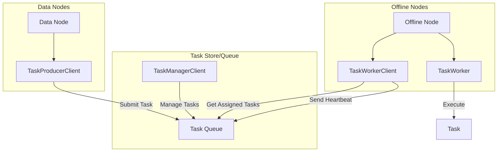

---
tags:
  - indexing
  - search
---

# Offline Nodes

## Summary

OpenSearch v2.18.0 introduces the foundational `offline-tasks` library, providing the core abstractions and interfaces needed to run background tasks on dedicated offline nodes. This feature enables workload segregation by offloading resource-intensive background operations (like segment merges, snapshots, and garbage collection) from data nodes to dedicated offline nodes, improving predictability and scalability of core indexing and search operations.

## Details

### What's New in v2.18.0

This release adds the initial `offline-tasks` library (`libs/task-commons`) containing:

- Core task management interfaces and abstractions
- Task lifecycle management (creation, assignment, execution, completion)
- Worker node abstractions for task execution
- Plugin interfaces for extensibility

### Technical Changes

#### Architecture Changes



#### New Components

| Component | Description |
|-----------|-------------|
| `Task` | Core task entity with lifecycle timestamps, status, and worker assignment |
| `TaskId` | Unique identifier for tasks |
| `TaskParams` | Base class for task-specific parameters |
| `TaskStatus` | Enum: UNASSIGNED, ASSIGNED, ACTIVE, SUCCESS, FAILED, CANCELLED |
| `TaskType` | Enum: MERGE, SNAPSHOT (extensible) |
| `TaskManagerClient` | Interface for task CRUD operations and assignment |
| `TaskProducerClient` | Interface for submitting new tasks |
| `TaskWorkerClient` | Interface for workers to get assigned tasks and send heartbeats |
| `TaskWorker` | Interface for task execution |
| `WorkerNode` | Represents a worker node in the offline fleet |
| `TaskManagerClientPlugin` | Plugin interface for custom TaskManagerClient implementations |
| `TaskWorkerPlugin` | Plugin interface for custom TaskWorker implementations |

#### New Configuration

| Setting | Description | Default |
|---------|-------------|---------|
| `opensearch.experimental.feature.task.background.enabled` | Feature flag to enable background task execution | `false` |

### Usage Example

The library provides abstractions that can be implemented for different queue backends:

```java
// Submit a task from a data node
TaskProducerClient producer = getTaskProducerClient();
Task task = Task.Builder.builder(
    new TaskId("merge-123"),
    TaskStatus.UNASSIGNED,
    new MergeTaskParams(...),
    TaskType.MERGE,
    System.currentTimeMillis()
).build();
producer.submitTask(task);

// Worker node picks up and executes tasks
TaskWorkerClient workerClient = getTaskWorkerClient();
List<Task> assignedTasks = workerClient.getAssignedTasks(new TaskListRequest());
for (Task task : assignedTasks) {
    taskWorker.executeTask(task);
    workerClient.sendTaskHeartbeat(task.getTaskId(), System.currentTimeMillis());
}
```

### Migration Notes

This is an experimental feature gated behind a feature flag. To enable:

1. Set `opensearch.experimental.feature.task.background.enabled=true` in `opensearch.yml`
2. Implement `TaskManagerClientPlugin` to provide a task queue backend
3. Implement `TaskWorkerPlugin` for specific task types (e.g., merge operations)

## Limitations

- **Experimental**: This feature is marked as experimental and APIs may change
- **Foundation only**: v2.18.0 provides only the library abstractions; actual offline node functionality requires additional implementation
- **No built-in queue**: Users must implement their own task queue backend (system index, Kafka, etc.)
- **Remote Store required**: Offline nodes are designed for Remote Store enabled clusters

## References

### Pull Requests
| PR | Description |
|----|-------------|
| [#13574](https://github.com/opensearch-project/OpenSearch/pull/13574) | Adds offline-tasks library containing various interfaces for Offline Background Tasks |

### Issues (Design / RFC)
- [Issue #13575](https://github.com/opensearch-project/OpenSearch/issues/13575): Add a new library containing required abstractions to run Offline Background Tasks
- [Issue #13554](https://github.com/opensearch-project/OpenSearch/issues/13554): Design Proposal - Offline Background Tasks
- [Issue #12361](https://github.com/opensearch-project/OpenSearch/issues/12361): RFC - Offline Background Tasks
- [Issue #12725](https://github.com/opensearch-project/OpenSearch/issues/12725): META - Phase #1 Offline Background Tasks
- [Issue #12727](https://github.com/opensearch-project/OpenSearch/issues/12727): Feature Request - Background Tasks

## Related Feature Report

- [Full feature documentation](../../../features/opensearch/opensearch-offline-nodes.md)
