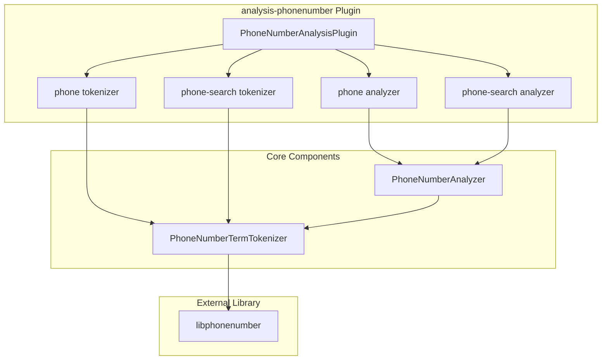

---
tags:
  - indexing
  - search
---

# Phone Analyzer

## Summary

OpenSearch 2.18.0 introduces a new `analysis-phonenumber` plugin that provides dedicated analyzers and tokenizers for parsing and searching phone numbers. The plugin uses Google's `libphonenumber` library to handle the complex task of phone number parsing across different international formats.

## Details

### What's New in v2.18.0

This release adds a new plugin (`analysis-phonenumber`) with two analyzers and two tokenizers specifically designed for phone number fields:

- **`phone` analyzer**: Index analyzer that generates n-grams for flexible matching
- **`phone-search` analyzer**: Search analyzer that produces basic tokens without n-grams
- **`phone` tokenizer**: Tokenizer for indexing with n-gram generation
- **`phone-search` tokenizer**: Tokenizer for search without n-gram generation

### Technical Changes

#### Architecture



#### New Components

| Component | Description |
|-----------|-------------|
| `PhoneNumberAnalysisPlugin` | Main plugin class registering analyzers and tokenizers |
| `PhoneNumberAnalyzer` | Analyzer wrapping the tokenizer |
| `PhoneNumberAnalyzerProvider` | Provider for the analyzer |
| `PhoneNumberTermTokenizer` | Core tokenizer using libphonenumber |
| `PhoneNumberTermTokenizerFactory` | Factory for creating tokenizers |

#### New Configuration

| Setting | Description | Default |
|---------|-------------|---------|
| `phone-region` | ISO 3166 country code for parsing local numbers | `ZZ` (unknown) |

### Usage Example

```json
PUT /contacts
{
  "settings": {
    "analysis": {
      "analyzer": {
        "phone-ch": {
          "type": "phone",
          "phone-region": "CH"
        },
        "phone-search-ch": {
          "type": "phone-search",
          "phone-region": "CH"
        }
      }
    }
  },
  "mappings": {
    "properties": {
      "phone_number": {
        "type": "text",
        "analyzer": "phone-ch",
        "search_analyzer": "phone-search-ch"
      }
    }
  }
}
```

### Token Generation

The `phone` analyzer generates n-grams for flexible partial matching:

```
Input: "+41 60 555 12 34"
Tokens: ["+41 60 555 12 34", "6055512", "41605551", "416055512", "6055", "41605551234", ...]
```

The `phone-search` analyzer generates only basic tokens:

```
Input: "+41 60 555 12 34"
Tokens: ["+41 60 555 12 34", "41 60 555 12 34", "41605551234", "605551234", "41"]
```

### Installation

```bash
./bin/opensearch-plugin install analysis-phonenumber
```

## Limitations

- Not designed for finding phone numbers in large text documents
- Should be used on fields containing only phone numbers
- Collects entire field content into memory (unsuitable for large field values)
- `phone-email` analyzer from elasticsearch-phone is not ported (can be added if needed)

## References

### Documentation
- [Documentation](https://docs.opensearch.org/2.18/analyzers/supported-analyzers/phone-analyzers/): Phone number analyzers
- [libphonenumber](https://github.com/google/libphonenumber): Google's phone number parsing library
- [Falsehoods about phone numbers](https://github.com/google/libphonenumber/blob/master/FALSEHOODS.md): Why phone number parsing is complex

### Pull Requests
| PR | Description |
|----|-------------|
| [#15915](https://github.com/opensearch-project/OpenSearch/pull/15915) | Implement phone number analyzer |

### Issues (Design / RFC)
- [Issue #11326](https://github.com/opensearch-project/OpenSearch/issues/11326): RFC for new plugin with normalizer & analyzer for phone numbers

## Related Feature Report

- [Full feature documentation](../../../../features/opensearch/phone-analyzer.md)
