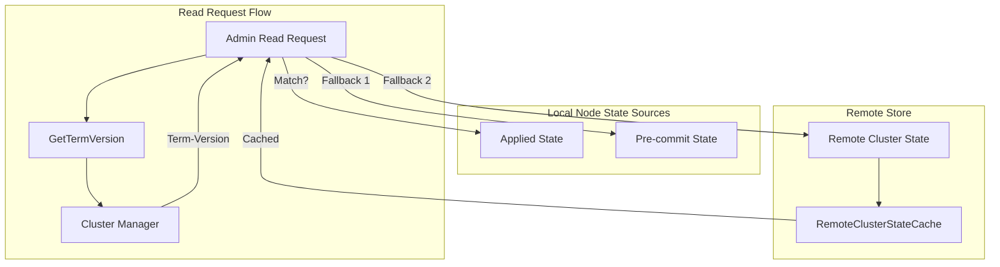

---
tags:
  - domain/core
  - component/server
  - performance
---
# Remote Cluster State Fallback

## Summary

This release adds a fallback mechanism for cluster state retrieval when there's a term-version mismatch between nodes. When a node's locally applied cluster state doesn't match the cluster manager's committed state, the node can now fall back to either the locally cached pre-commit state or download the cluster state from remote storage, reducing unnecessary full cluster state transfers from the cluster manager.

## Details

### What's New in v2.18.0

This enhancement addresses a performance issue in large clusters where cluster state appliers may take significant time (up to ~18 seconds in 1000-node clusters) to commit the cluster state. During this period, read requests on nodes would fetch the entire cluster state from the cluster manager due to term-version mismatches.

The new fallback mechanism provides three sources for cluster state retrieval:

1. **Applied State**: The locally committed cluster state (existing behavior)
2. **Pre-commit State**: The cluster state that has been published but not yet applied locally
3. **Remote Cluster State**: Download from remote storage when remote publication is enabled

### Technical Changes

#### Architecture Changes



#### New Components

| Component | Description |
|-----------|-------------|
| `RemoteClusterStateCache` | In-memory cache for remote cluster state based on term-version, avoiding redundant downloads |
| `preCommitState` | New atomic reference in `ClusterApplierService` storing the published but uncommitted cluster state |
| `isStatePresentInRemote` | New field in `GetTermVersionResponse` indicating if state can be downloaded from remote |

#### New Configuration

| Setting | Description | Default |
|---------|-------------|---------|
| `opensearch.experimental.optimization.termversion.precommit.enabled` | Feature flag to enable pre-commit state usage for term-version checks | `false` |

### State Retrieval Logic

The new `getStateFromLocalNode` method in `TransportClusterManagerNodeAction` implements the fallback chain:

```java
// 1. Check applied state
if (termVersion.equals(new ClusterStateTermVersion(appliedState))) {
    return appliedState;
}

// 2. Check pre-commit state
if (preCommitState != null && termVersion.equals(new ClusterStateTermVersion(preCommitState))) {
    return preCommitState;
}

// 3. Fallback to remote cluster state (if enabled)
if (remoteClusterStateService != null && termVersionResponse.isStatePresentInRemote()) {
    ClusterState clusterStateFromRemote = remoteClusterStateService.getClusterStateForManifest(...);
    return clusterStateFromRemote;
}
```

### Usage Example

Enable the feature flag and remote cluster state:

```yaml
# opensearch.yml
opensearch.experimental.optimization.termversion.precommit.enabled: true
cluster.remote_store.state.enabled: true
cluster.remote_store.publication.enabled: true
```

### Migration Notes

This is a backward-compatible enhancement. No migration is required. The feature is gated behind an experimental feature flag and only activates when remote cluster state publication is enabled.

## Limitations

- The pre-commit state feature is experimental and requires explicit feature flag enablement
- Remote cluster state fallback only works when remote publication is enabled on all nodes
- The cache stores only the most recent cluster state by term-version

## References

### Documentation
- [Remote Cluster State Documentation](https://docs.opensearch.org/2.18/tuning-your-cluster/availability-and-recovery/remote-store/remote-cluster-state/)

### Pull Requests
| PR | Description |
|----|-------------|
| [#15424](https://github.com/opensearch-project/OpenSearch/pull/15424) | Fallback on Term-Version check mismatch - Remote cluster-state |

### Issues (Design / RFC)
- [Issue #15414](https://github.com/opensearch-project/OpenSearch/issues/15414): Feature request for leveraging ClusterState from Publish phase

## Related Feature Report

- Full feature documentation
