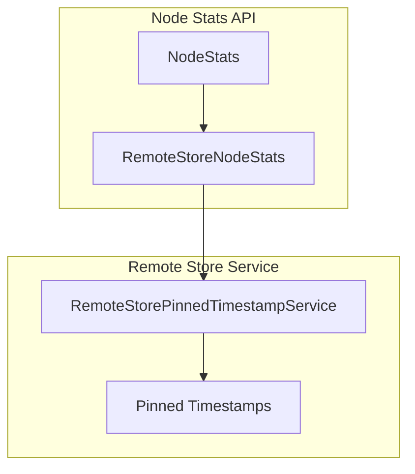

---
tags:
  - domain/core
  - component/server
  - observability
  - search
---
# Remote Store Metrics

## Summary

OpenSearch 2.18.0 introduces a new `REMOTE_STORE` metric in the Node Stats API response. This enhancement adds node-level remote store statistics, starting with the timestamp of the last successful fetch of pinned timestamps from the `RemoteStorePinnedTimestampService`. This metric helps operators monitor and identify any lags in the pinned timestamp fetching process for remote-backed storage clusters.

## Details

### What's New in v2.18.0

This release adds a new metric category `remote_store` to the Node Stats API, providing visibility into remote store operations at the node level.

### Technical Changes

#### Architecture Changes



#### New Components

| Component | Description |
|-----------|-------------|
| `RemoteStoreNodeStats` | New class that holds node-level remote store statistics |
| `REMOTE_STORE` metric | New metric enum value in `NodesStatsRequest.Metric` |

#### New Configuration

The `remote_store` metric is available through the Node Stats API:

```bash
GET _nodes/stats/remote_store
```

#### API Response

The new `remote_store` section in the Node Stats API response:

```json
{
  "nodes": {
    "<node_id>": {
      "remote_store": {
        "last_successful_fetch_of_pinned_timestamps": 1694171633644
      }
    }
  }
}
```

| Field | Description |
|-------|-------------|
| `last_successful_fetch_of_pinned_timestamps` | Unix timestamp (milliseconds) of the last successful fetch of pinned timestamps by the `RemoteStorePinnedTimestampService` |

### Usage Example

Query remote store metrics for all nodes:

```bash
GET _nodes/stats/remote_store
```

Query remote store metrics along with other metrics:

```bash
GET _nodes/stats/remote_store,indices
```

### Migration Notes

- This is a new additive feature with no breaking changes
- The metric is only populated when `cluster.remote_store.pinned_timestamps.enabled` is set to `true`
- Backward compatibility is ensured through version checks

## Limitations

- Currently only includes the `last_successful_fetch_of_pinned_timestamps` metric
- The metric is only meaningful for remote-backed storage clusters with pinned timestamps enabled
- Additional remote store metrics may be added in future releases

## References

### Documentation
- [Remote Store Stats API](https://docs.opensearch.org/2.18/tuning-your-cluster/availability-and-recovery/remote-store/remote-store-stats-api/): Shard-level remote store statistics
- [Nodes Stats API](https://docs.opensearch.org/2.18/api-reference/nodes-apis/nodes-stats/): Node statistics API documentation

### Pull Requests
| PR | Description |
|----|-------------|
| [#15611](https://github.com/opensearch-project/OpenSearch/pull/15611) | Add new metric REMOTE_STORE to NodeStats API response |

### Issues (Design / RFC)
- [Issue #15896](https://github.com/opensearch-project/OpenSearch/issues/15896): Feature request for adding pinned timestamps to node stats

## Related Feature Report

- [Full feature documentation](../../../features/opensearch/opensearch-remote-store-metrics.md)
