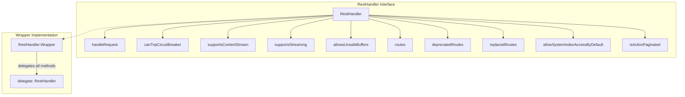

---
tags:
  - search
---

# RestHandler Improvements

## Summary

This release improves the `RestHandler.Wrapper` class to ensure complete delegation of all interface methods to the wrapped handler. Previously, when new methods were added to the `RestHandler` interface, the `Wrapper` class could miss delegating those methods, causing unexpected behavior. This fix adds missing delegation methods and introduces a reflection-based test to prevent future regressions.

## Details

### What's New in v2.18.0

The `RestHandler.Wrapper` class now properly delegates two methods that were previously missing:

- `isActionPaginated()` - Indicates whether the handler supports paginated responses
- `supportsStreaming()` - Indicates whether the handler supports request/response streaming

### Technical Changes

#### Architecture



#### New Delegated Methods

| Method | Description | Added in v2.18.0 |
|--------|-------------|------------------|
| `isActionPaginated()` | Returns whether the action supports pagination | ✓ |
| `supportsStreaming()` | Returns whether streaming is supported | ✓ |

#### Code Changes

The `RestHandler.Wrapper` class was updated to include:

```java
@Override
public boolean isActionPaginated() {
    return delegate.isActionPaginated();
}

@Override
public boolean supportsStreaming() {
    return delegate.supportsStreaming();
}
```

### Test Coverage

A new reflection-based test was added to `BaseRestHandlerTests` that:

1. Discovers all overridable methods in the `RestHandler` interface
2. Invokes each method on a `RestHandler.Wrapper` instance
3. Verifies that each method call is delegated to the wrapped handler
4. Ensures no additional interactions occur

This test will automatically fail if future changes to `RestHandler` add new methods without updating `Wrapper`.

### Background

This fix was prompted by [PR #14718](https://github.com/opensearch-project/OpenSearch/pull/14718) which added the `isActionPaginated()` method to support pagination for the `_cat/indices` API. That PR modified the `RestHandler` interface but did not update the `RestHandler.Wrapper` class, which could cause issues for plugins using the wrapper pattern.

## Limitations

- This is an internal API improvement; no user-facing changes
- Plugins extending `RestHandler.Wrapper` should ensure they also delegate any custom methods

## References

### Documentation
- [PR #16154](https://github.com/opensearch-project/OpenSearch/pull/16154): Main implementation
- [RestHandler.java](https://github.com/opensearch-project/OpenSearch/blob/2.18/server/src/main/java/org/opensearch/rest/RestHandler.java): Source code

### Pull Requests
| PR | Description |
|----|-------------|
| [#16154](https://github.com/opensearch-project/OpenSearch/pull/16154) | Ensure RestHandler.Wrapper delegates all implementations |
| [#14718](https://github.com/opensearch-project/OpenSearch/pull/14718) | Implementing pagination for _cat/indices API (caused the issue) |
| [#1004](https://github.com/opensearch-project/OpenSearch/pull/1004) | Original introduction of RestHandler.Wrapper |

## Related Feature Report

- [Full feature documentation](../../../../features/opensearch/opensearch-resthandler-wrapper.md)
