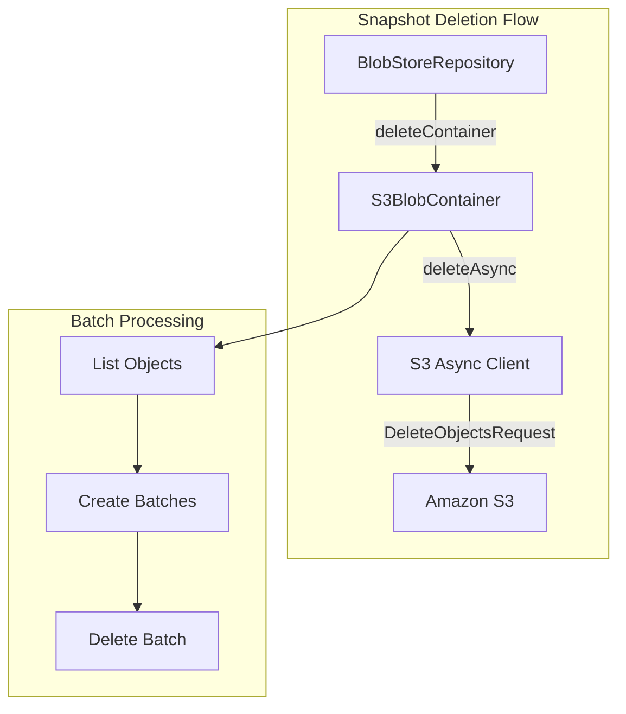

---
tags:
  - indexing
  - performance
---

# S3 Async Deletion

## Summary

This release introduces asynchronous deletion support for the S3 repository plugin (`repository-s3`). The feature uses the AWS S3 async client for delete operations during snapshot deletion, improving performance and reducing port exhaustion issues in high-load scenarios.

## Details

### What's New in v2.18.0

- Added async deletion methods to `S3BlobContainer` using the S3 async client
- Introduced a new cluster setting `cluster.snapshot.async-deletion.enable` to control async deletion behavior
- Created `S3AsyncDeleteHelper` utility class for managing batched async delete operations
- Extended `AsyncMultiStreamBlobContainer` interface with async delete methods

### Technical Changes

#### Architecture Changes



#### New Components

| Component | Description |
|-----------|-------------|
| `S3AsyncDeleteHelper` | Utility class for executing batched async delete operations |
| `deleteAsync()` | New method in `S3BlobContainer` for async container deletion |
| `deleteBlobsAsyncIgnoringIfNotExists()` | New method for async blob deletion ignoring missing blobs |

#### New Configuration

| Setting | Description | Default |
|---------|-------------|---------|
| `cluster.snapshot.async-deletion.enable` | Enable/disable async deletion for S3 repositories | `true` |

### Usage Example

The async deletion is enabled by default. To disable it:

```yaml
# opensearch.yml
cluster.snapshot.async-deletion.enable: false
```

Or dynamically via API:

```json
PUT _cluster/settings
{
  "persistent": {
    "cluster.snapshot.async-deletion.enable": false
  }
}
```

### Migration Notes

- Async deletion is enabled by default in v2.18.0
- Existing snapshot deletion workflows will automatically use async deletion when enabled
- No changes required to existing repository configurations
- The setting can be toggled dynamically without cluster restart

## Limitations

- Async deletion is only available for S3 repositories (not other repository types)
- The feature requires the S3 async client to be properly configured
- Batch size for deletions is controlled by the existing `bulk_deletes_size` setting

## References

### Documentation
- [Snapshot Management](https://docs.opensearch.org/2.18/tuning-your-cluster/availability-and-recovery/snapshots/snapshot-management/): OpenSearch snapshot documentation
- [PR #15621](https://github.com/opensearch-project/OpenSearch/pull/15621): Main implementation PR

### Pull Requests
| PR | Description |
|----|-------------|
| [#15621](https://github.com/opensearch-project/OpenSearch/pull/15621) | Add support for async deletion in S3BlobContainer |

## Related Feature Report

- [S3 Repository](../../../features/opensearch/opensearch-s3-repository.md)
